Hooks: Pre-commit, pre-push


 

 

 

Every time a particular event occurs within a repository, they let you
customize its internal behavior and triggered customizable actions at
key points in the development lifecycle.

 

So if you have any sensitive information like access keys, access tokens
as a set of keys, these are

often lead to accidental good comments so precommitment can be installed
on a workstation to avoid that.So this hoax usually work on a project
based approach for filtering the sensitive data.

And if the developers want, they can still bypass the.

 

So you have various tools in the market which helps us with
precommitment push.

So one of the tools is Talisman, which is an open source tool created by
Thoughtworks.

So Talisman is an open source tool which can be used to hook your
repository to ensure that potential

secret or sensitive information does not leave the developers
workstations.

It validates the outgoing change for things that look suspicious, like a
potential password, tokens,

private keys, etc..

It can also be used as a repository history scanner to detect secrets
that have already been checked

in so that you can take an informed decision to safeguard the secrets.

 

 

 

\# Download the talisman installer script

curl <https://thoughtworks.github.io/talisman/install.sh> \>
\~/install-talisman.sh

chmod +x \~/install-talisman.sh

 

\# Install to a single project

cd my-git-project

\# as a pre-push hook

\~/install-talisman.sh

\# or as a pre-commit hook

\~/install-talisman.sh pre-commit

 

 

\## Create sec_files

mkdir sec_files && cd sec_files

echo \"username=sidd-harth\" \> file1

echo \"secure-password123\" \> password.txt

echo \"apikey=AizaSyCqhjgrPtr_La56sdUkjfav_laCqhjgrPtr_2s\" \> file2

echo \"base64encodedsecret=cGFzc3dvcmQtaXMtcXdlcnR5MTIzCg==\" \> file3

 

 

oot@master-node:/home/dai/devsecops# git commit -m \"add\"

Talisman Scan: 12 / 12
\<\-\-\-\-\-\-\-\-\-\-\-\-\-\-\-\-\-\-\-\-\-\-\-\-\-\-\-\-\-\-\-\-\-\-\-\-\-\-\-\-\-\-\-\-\-\-\-\-\-\-\-\-\-\-\-\-\-\-\-\--\>
100.00%

 

Talisman Report:

+\-\-\-\-\-\-\-\-\-\-\-\-\-\-\-\-\-\-\-\-\-\-\--+\-\-\-\-\-\-\-\-\-\-\-\-\-\-\-\-\-\-\-\-\-\-\-\-\-\-\-\-\-\-\-\-\-\-\-\-\-\-\-\-\-\-\-\-\-\-\-\-\-\-\-\-\--+\-\-\-\-\-\-\-\-\--+

\| FILE \| ERRORS \| SEVERITY \|

+\-\-\-\-\-\-\-\-\-\-\-\-\-\-\-\-\-\-\-\-\-\-\--+\-\-\-\-\-\-\-\-\-\-\-\-\-\-\-\-\-\-\-\-\-\-\-\-\-\-\-\-\-\-\-\-\-\-\-\-\-\-\-\-\-\-\-\-\-\-\-\-\-\-\-\-\--+\-\-\-\-\-\-\-\-\--+

\| sec_files/password.txt \| The file name \| low \|

\| \| \"sec_files/password.txt\" \| \|

\| \| failed checks against the \| \|

\| \| pattern password \| \|

+\-\-\-\-\-\-\-\-\-\-\-\-\-\-\-\-\-\-\-\-\-\-\--+\-\-\-\-\-\-\-\-\-\-\-\-\-\-\-\-\-\-\-\-\-\-\-\-\-\-\-\-\-\-\-\-\-\-\-\-\-\-\-\-\-\-\-\-\-\-\-\-\-\-\-\-\--+\-\-\-\-\-\-\-\-\--+

\| sec_files/file3 \| Expected file to not to contain \| high \|

\| \| base64 encoded texts such as: \| \|

\| \| base64encodedsecret=cGFzc3dvcmQtaXMtcXdlcnR5MTI\... \| \|

+\-\-\-\-\-\-\-\-\-\-\-\-\-\-\-\-\-\-\-\-\-\-\--+\-\-\-\-\-\-\-\-\-\-\-\-\-\-\-\-\-\-\-\-\-\-\-\-\-\-\-\-\-\-\-\-\-\-\-\-\-\-\-\-\-\-\-\-\-\-\-\-\-\-\-\-\--+\-\-\-\-\-\-\-\-\--+

\| sec_files/file3 \| Potential secret pattern : \| low \|

\| \| base64encodedsecret=cGFzc3dvcmQtaXMtcXdlcnR5MTIzCg== \| \|

+\-\-\-\-\-\-\-\-\-\-\-\-\-\-\-\-\-\-\-\-\-\-\--+\-\-\-\-\-\-\-\-\-\-\-\-\-\-\-\-\-\-\-\-\-\-\-\-\-\-\-\-\-\-\-\-\-\-\-\-\-\-\-\-\-\-\-\-\-\-\-\-\-\-\-\-\--+\-\-\-\-\-\-\-\-\--+

\| sec_files/file2 \| Potential secret pattern : \| low \|

\| \| apikey=AizaSyCqhjgrPtr_La56sdUkjfav_laCqhjgrPtr_2s \| \|

+\-\-\-\-\-\-\-\-\-\-\-\-\-\-\-\-\-\-\-\-\-\-\--+\-\-\-\-\-\-\-\-\-\-\-\-\-\-\-\-\-\-\-\-\-\-\-\-\-\-\-\-\-\-\-\-\-\-\-\-\-\-\-\-\-\-\-\-\-\-\-\-\-\-\-\-\--+\-\-\-\-\-\-\-\-\--+

 

 

If you are absolutely sure that you want to ignore the above files from
talisman detectors, consider pasting the following format in .talismanrc
file in the project root

 

fileignoreconfig:

\- filename: sec_files/password.txt

checksum:
f1cfc4e74637c1399a305acaf7991724f54503ec159d4f6ad969cacdfb8e04c8

\- filename: sec_files/file3

checksum:
b058bbb84595454d550863a6ae7fd501863acd9692ec3cc699bc6f76dd0e38a5

\- filename: sec_files/file2

checksum:
b39b1a7ab78830bc35571285a210d1d0b0aa2b213caf2fea02cee664c473b237

version: \"\"

 

Talisman done in 111.668199ms

root@master-node:/home/dai/devsecops# git push

Username for \' <https://github.com'>: hiep98

Password for \' <https://hiep98@github.com'>:

Talisman Scan: 0
\<\...\...\...\...\...\...\...\...\...\...\...\...\...\...\...\...\...\...\...\...\...\...\...\...\>
?%

Talisman done in 29.34035ms

Everything up-to-date

 

 

 

igorn:

 

Talisman done in 69.02484ms

root@master-node:/home/dai/devsecops# cat .talismanrc

fileignoreconfig:

\- filename: sec_files/password.txt

checksum:
f1cfc4e74637c1399a305acaf7991724f54503ec159d4f6ad969cacdfb8e04c8

\- filename: sec_files/file3

checksum:
b058bbb84595454d550863a6ae7fd501863acd9692ec3cc699bc6f76dd0e38a5

 

 

root@master-node:/home/dai/devsecops# git add .

root@master-node:/home/dai/devsecops# git commit -m \"addd2\"

Talisman Scan: 15 / 15
\<\-\-\-\-\-\-\-\-\-\-\-\-\-\-\-\-\-\-\-\-\-\-\-\-\-\-\-\-\-\-\-\-\-\-\-\-\-\-\-\-\-\-\-\-\-\-\-\-\-\-\-\-\-\-\-\-\-\-\-\--\>
100.00%

Talisman Report:

+\-\-\-\-\-\-\-\-\-\-\-\-\-\-\-\--+\-\-\-\-\-\-\-\-\-\-\-\-\-\-\-\-\-\-\-\-\-\-\-\-\-\-\-\-\-\-\-\-\-\-\-\-\-\-\-\-\-\-\-\-\-\-\-\-\-\-\--+\-\-\-\-\-\-\-\-\--+

\| FILE \| ERRORS \| SEVERITY \|

+\-\-\-\-\-\-\-\-\-\-\-\-\-\-\-\--+\-\-\-\-\-\-\-\-\-\-\-\-\-\-\-\-\-\-\-\-\-\-\-\-\-\-\-\-\-\-\-\-\-\-\-\-\-\-\-\-\-\-\-\-\-\-\-\-\-\-\--+\-\-\-\-\-\-\-\-\--+

\| sec_files/file2 \| Potential secret pattern : \| low \|

\| \| apikey=AizaSyCqhjgrPtr_La56sdUkjfav_laCqhjgrPtr_2s \| \|

+\-\-\-\-\-\-\-\-\-\-\-\-\-\-\-\--+\-\-\-\-\-\-\-\-\-\-\-\-\-\-\-\-\-\-\-\-\-\-\-\-\-\-\-\-\-\-\-\-\-\-\-\-\-\-\-\-\-\-\-\-\-\-\-\-\-\-\--+\-\-\-\-\-\-\-\-\--+

 

 

If you are absolutely sure that you want to ignore the above files from
talisman detectors, consider pasting the following format in .talismanrc
file in the project root

 

fileignoreconfig:

\- filename: sec_files/file2

checksum:
b39b1a7ab78830bc35571285a210d1d0b0aa2b213caf2fea02cee664c473b237

version: \"\"

 

 

 

Mutation tests


 

 

                \## Add PITest Mutation Plugin in pom.xml

        *\<!\--                   PITest Mutation Plugin                
  \--\>*

        \<plugin\>

        \<groupId\>org.pitest\</groupId\>

        \<artifactId\>pitest-maven\</artifactId\>

        \<version\>1.5.0\</version\>

        \<dependencies\>

            \<dependency\>

                \<groupId\>org.pitest\</groupId\>

                \<artifactId\>pitest-junit5-plugin\</artifactId\>

                \<version\>0.12\</version\>

            \</dependency\>

        \</dependencies\>

        \<configuration\>

            \<mutationThreshold\>70\</mutationThreshold\> \## test fail
if output less than 70%

            \<outputFormats\>

                \<outputFormat\>XML\</outputFormat\> \## export report
at XML

                \<outputFormat\>HTML\</outputFormat\>

            \</outputFormats\>

        \</configuration\>

        \</plugin\>

    \</build\>

 

 

 

 

add code below before build stage:

 

stage(\'Mutation Tests - PIT\') {

            steps {

              sh \"mvn org.pitest:pitest-maven:mutationCoverage\"

            }

            post {

              always {

                pitmutation mutationStatsFile:
\'\*\*/target/pit-reports/\*\*/mutations.xml\'

              }

            }

       

 

This is a Jenkins pipeline code snippet that defines a stage called
\"Mutation Tests - PIT\" which runs a mutation testing tool called
Pitest.

The **\`steps\`** block describes the task to be performed in this
stage. In this case, it runs the **\`mvn\`** command which executes the
Pitest maven plugin to generate mutation coverage report.

\`org.pitest:pitest-maven:mutationCoverage\`: This is the specific goal
being executed using the Pitest Maven plugin. The \`mutationCoverage\`
goal is used to run the mutation tests and generate the mutation
coverage report.

The **\`post\`** block defines a post-build action to be executed after
the completion of the **\`steps\`** block. The **\`always\`** block is a
post-build action that runs whether the previous steps succeeded or not.

The **\`pitmutation\`** command within the **\`always\`** block is a
Jenkins plugin that parses the **\`mutations.xml\`** file generated by
Pitest to calculate the mutation coverage statistics. The
**\`mutationStatsFile\`** argument tells the plugin where to find the
XML file.

Overall, this stage runs a mutation testing tool and generates a report
using the Pitest maven plugin, followed by calculating and displaying
the mutation coverage statistics using the Jenkins **\`pitmutation\`**
plugin.

 

*From \< <https://voicegpt.us/chatgpt/6400bcdbc4eb9c0d23a91ba9>\>*

 

push new source code, jenkins have logs:

 

\[ERROR\] Failed to execute goal
org.pitest:pitest-maven:1.5.0:mutationCoverage(default-cli) on project
numeric: Mutation score of 40 is below threshold of 70-\> \[Help 1\]

 

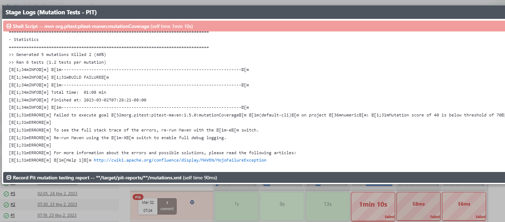{width="10.21875in" height="4.5in"}

 

{width="10.260416666666666in"
height="3.1041666666666665in"}

 

{width="10.333333333333334in"
height="5.739583333333333in"}

 

 

 

 

Change 3 test case become like below:

 

\@Test

    public void smallerThanOrEqualToFiftyMessage() throws Exception {

       
this.mockMvc.perform(get(\"/compare/50\")).andDo(print()).andExpect(status().isOk())

                .andExpect(content().string(\"Smaller than or equal to
50\"));

    }

    \@Test

    public void greaterThanFiftyMessage() throws Exception {

       
this.mockMvc.perform(get(\"/compare/51\")).andDo(print()).andExpect(status().isOk())

                .andExpect(content().string(\"Greater than 50\"));

    }

   

    \@Test

    public void welcomeMessage() throws Exception {

       
this.mockMvc.perform(get(\"/\")).andDo(print()).andExpect(status().isOk())

                .andExpect(content().string(\"Kubernetes DevSecOps\"));

    }

 

This is a JUnit test case written in Java that uses the Spring MVC Test
framework.

The **\`@Test\`** annotation indicates that this method is a test case.

The name of the method **\`welcomeMessage()\`** is meant to describe the
behavior being tested.

The **\`throws Exception\`** in the signature of the method indicate
that this test may throw a generic **\`Exception\`**.

The **\`this.mockMvc.perform(get(\"/\"))\`** is a method call in which
we send an HTTP GET request to the application\'s root URL **\`/\`**.

The **\`andDo(print())\`** method is used to print the result of the
request in the console.

The **\`andExpect(status().isOk())\`** method verifies that the response
status code is 200 (OK).

The **\`andExpect(content().string(\"Kubernetes DevSecOps\"))\`** method
verifies that the response body contains the exact string \"Kubernetes
DevSecOps\".

Overall, this test case is checking that the application\'s Welcome page
displays the correct message \"Kubernetes DevSecOps\".

 

ll /var/lib/jenkins/workspace/devsecops-app-num/target/pit-reports/

total 12

drwxr-xr-x 3 jenkins jenkins 4096 Mar 2 21:49 ./

drwxr-xr-x 11 jenkins jenkins 4096 Mar 2 21:49 ../

drwxr-xr-x 3 jenkins jenkins 4096 Mar 2 21:49 202303022149/

 

 

 

SAST


 

> docker run -d \--name sonarqube -e
> SONAR_ES_BOOTSTRAP_CHECKS_DISABLE=true -p 9000:9000 sonarqube:latest
>
>  
>
>  
>
> sonarqube docker run cannot access port 9000 in website
>
>  
>
>  
>
>  
>
> docker run \--network=host -e SONAR_HOST_URL=\'http://127.0.0.1:9000\'
> \--user=\"\$(id -u):\$(id -g)\" -v \"\$PWD:/usr/src\"
> sonarsource/sonar-scanner-cli
>
> docker run -d \--name sonarqube -e
> SONAR_ES_BOOTSTRAP_CHECKS_DISABLE=true -p 9000:9000 sonarqube:lts
>
>  
>
> docker run \--name sonarqube -d -p 9000:9000 sonarqube:lts
>
>  
>
>  
>
> docker logs sonarqube -f
>
>  
>
>  
>
> docker run -d \--name sonarqube -e
> SONAR_ES_BOOTSTRAP_CHECKS_DISABLE=true -p 9000:9000 sonarqube:latest
>
>  
>
> *From \< <https://docs.sonarqube.org/9.6/try-out-sonarqube/>\>*
>
>  
>
>  
>
> Reference to read more detail
>
> <https://docs.sonarqube.org/latest/setup-and-upgrade/install-the-server/>
>
> [Java test coverage
> (sonarqube.org)](https://docs.sonarqube.org/latest/analyzing-source-code/test-coverage/java-test-coverage/)
>
>  
>
>  
>
>  
>
> stage(\'Docker Build and Push\') {
>
>             steps {
>
>               withDockerRegistry(\[credentialsId: \"docker-hub\", url:
> \"\"\]) {
>
>                 sh \'printenv\'
>
>                 sh \'docker build -t
> nthiep1998/numeric-app:\"\"\$GIT_COMMIT\"\" .\'
>
>                 sh \'docker push
> nthiep1998/numeric-app:\"\"\$GIT_COMMIT\"\"\'
>
>               }
>
>             }    
>
>         }
>
>  
>
>  
>
>  
>
>  
>
>  
>
> mvn clean verify sonar:sonar \\
>
> -Dsonar.projectKey=numeric-app \\
>
> -Dsonar.host.url=http://192.168.126.132:9000 \\
>
> -Dsonar.login=sqp_76f368be3de38b7cbc9eedcd1f14798bc1a19397
>
>  
>
>  
>
>  
>
>  

# SONARQUBE QUALITY GATES

>  

## Generate a token in SonarQube, please follow these steps:

>  
>
> Log in to your SonarQube instance as an administrator.
>
>  
>
> Click on your user avatar in the top-right corner and select \"My
> Account\" from the dropdown menu.
>
>  
>
> Click on \"Security\" in the left-hand navigation menu.
>
>  
>
> Click on \"Generate Tokens\" in the \"Tokens\" section.
>
>  
>
> Enter a name for your token in the \"Name\" field.
>
>  
>
> Select the appropriate permissions for your token in the
> \"Permissions\" field (e.g. \"Execute Analysis\" for a token to be
> used with a CI/CD pipeline).
>
>  
>
> Click on the \"Generate\" button to generate your token.
>
> Copy the token value into that is displayed on the screen and store it
> in a safe place, as it will not be displayed again.
>
>  
>
> ![Projects Issues Rules Quality Profiles Quality Gates Administration
> Q Search for projects A Tokens Administrator Profile Security
> Notifications Projects Administrator My Account Log out If you want to
> enforce security by not providing credentials of a real SonarQube user
> to run your code scan or to invoke web services, you can provide a
> IJser Token as a replacement of the user logim This will increase the
> security of pur installation by not letting your analysis users
> password going through pur networlc Generate Tokens Name
> jenkins-quality-gatel Type Project Analysis Token Project Select
> Project Expires in 30 days O New token \"jenkins-quality-gate\" has
> been created Make sure copy it now, Vou won\'t be able to see it
> again! Copy Name sqp_d2cd4a38b1e5e14fb7a8a9abf6f99627e816ff93 Type
> Project Project Project numeric numeric Last use 1 day ago Never C
> reated Analyze \"numeric jenkins-quality-gate March 6, March 8, 2023
> 2023 Expiration April 5, 2023 April 7, 2023 Revoke Revoke
> ](./images/media/image4.png){width="6.708333333333333in"
> height="3.3541666666666665in"}
>
>  
>
>  

## Create Global credential in jenkins:

>  
>
> Click on \"Credentials\" in the main menu.
>
>  
>
> Click on the \"System\" tab at the top of the screen and then \"Global
> credentials\" under the \"System\" category.
>
>  
>
> Click on the \"Add Credentials\" link on the left-hand side.
>
>  
>
> Select \"Secret text\" and copy the token value into in the fields
> provided.
>
>  
>
> Optionally, you can set a \"Description\" to help identify the
> credential later.
>
>  
>
> Click on the \"OK\" button to save the credentials.
>
>  
>
> Note: Global credentials are available to all Jenkins jobs and
> pipelines. Use them with caution and ensure that you have proper
> security measures in place to restrict access to these credentials.
>
>  
>
> {width="7.291666666666667in"
> height="2.9895833333333335in"}
>
>  
>
>  

# Setup credential:

>  
>
> Click on \"Manage Jenkins\" and select \"Configure System\".
>
>  
>
> {width="3.78125in"
> height="1.96875in"}
>
>  
>
> Scroll down to the \"SonarQube\" section and click on the \"Add
> SonarQube\" button.
>
>  
>
> Enter a name for your SonarQube server in the \"Name\" field.
>
>  
>
> Enter the URL of your SonarQube server in the \"Server URL\" field.
>
>  
>
> Select on the \"Credentials\" under the \"Server authentication
> token\" section.
>
>  
>
> Click on the \"OK\" button to save the credentials.
>
> 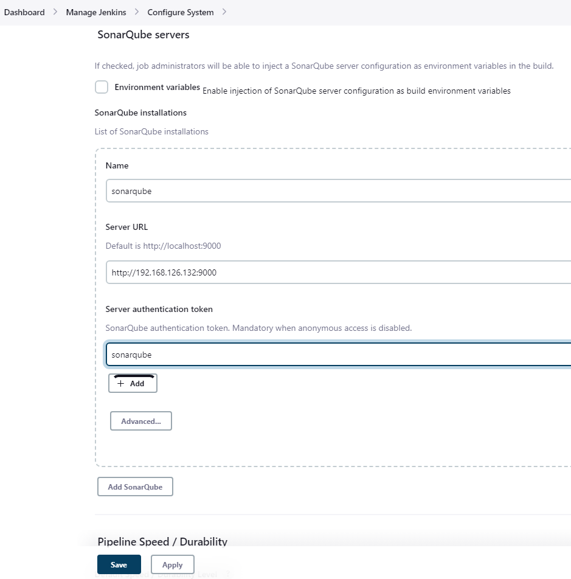{width="6.322916666666667in"
> height="6.40625in"}
>
>  
>
>  
>
> Click on the \"Administration\" button in the left-hand panel and
> select \"Webhooks\" from the dropdown menu.
>
>  
>
>  
>
>  
>
> 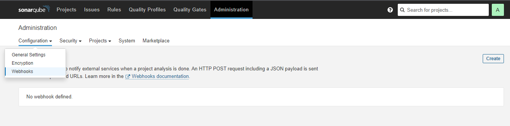{width="8.114583333333334in"
> height="2.0in"}
>
>  
>
>  
>
> Click on the \"Create\" button to create a new webhook.

1.   

2.  Enter a name for your webhook in the \"Name\" field.

3.   

4.  Enter the URL of the endpoint that will receive the webhook in the
    \"URL\" field.

5.   

6.  Click on the \"Create\" button to create the webhook.

>  
>
> That\'s it! Your SonarQube webhook is now created and will send data
> to the specified endpoint for the selected events.
>
>  
>
> 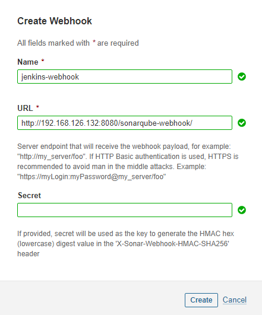{width="4.59375in" height="5.53125in"}
>
>  
>
>  
>
>  
>
>  
>
>  
>
> reference:
> <https://docs.sonarqube.org/latest/analyzing-source-code/scanners/jenkins-extension-sonarqube/>
>
>  
>
>  
>
>  
>
> stage(\'SonarQube - SAST\') {
>
>       steps {
>
>         withSonarQubeEnv(\'SonarQube\') {
>
>           sh \"mvn sonar:sonar -Dsonar.projectKey=numeric-application
> -Dsonar.host.url=http://devsecops-demo.eastus.cloudapp.azure.com:9000
> -Dsonar.login=0925129cf435c63164d3e63c9f9d88ea9f9d7f05\"
>
>         }
>
>         timeout(time: 2, unit: \'MINUTES\') {
>
>           script {
>
>             waitForQualityGate abortPipeline: true
>
>           }
>
>         }
>
>       }
>
>     }
>
>  
>
>  
>
> stage(\'SonarQube - SAST\') {
>
>       steps {
>
>         withSonarQubeEnv(\'SonarQube\') {
>
>           sh \"mvn sonar:sonar -Dsonar.projectKey=numeric-application
> -Dsonar.host.url=http://devsecops-demo.eastus.cloudapp.azure.com:9000 
>       }
>
>         timeout(time: 2, unit: \'MINUTES\') {
>
>           script {
>
>             waitForQualityGate abortPipeline: true
>
>           }
>
>         }
>
>       }
>
>     }
>
>  
>
>  
>
> ![numeric Overview Issues main O Security Hotspots March 8, 2023
> version Measures Code Activity MEASURES New Code Since March 6, 2023
> Started 1 day ago - New augs Project Settings • QUALITY GATE STATUS O
> Failed 1 conditims fäled The quality gate used by this project does
> not comply with Clean as You Code. Fixing this qualty qate will help
> you achieve a Clean Code state t? Leam why 1 condition(s) failed on
> overall code 13 Code Smells is greater than 12 Overall Code Project
> Information Reliability Security 0 New Vulnerabilities New Security
> Hotspots O Added Debt Coverage on O New Lines to cover Reviewed New
> Code Smells Duplications on O New Lines Security Review
> Maintainability
> ](./images/media/image10.png){width="9.572916666666666in"
> height="5.135416666666667in"}
>
>  
>
> Remove import code below:
>
>  
>
> import org.springframework.beans.factory.annotation.Autowired;
>
> import org.springframework.beans.factory.annotation.Value;
>
> import org.springframework.boot.web.client.RestTemplateBuilder;
>
> import org.springframework.context.annotation.Bean;
>
>  
>
>  
>
>  
>
> 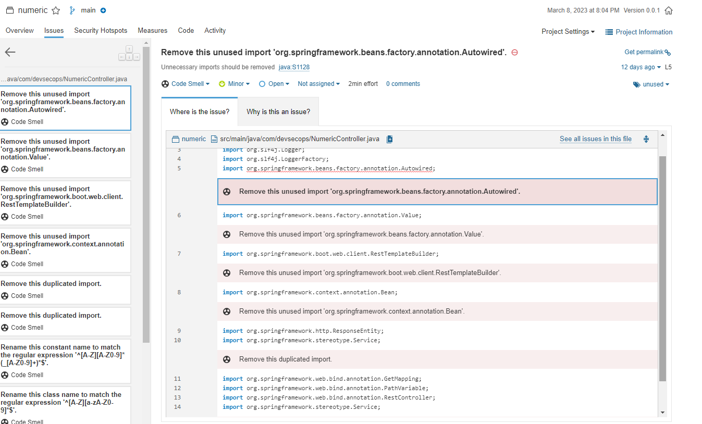{width="7.760416666666667in"
> height="4.6875in"}
>
>  
>
> ![numeric main O Overview Issues Security Hotspots QUALITY GATE STATUS
> O Passed Al cmdtnns passed \_ March 8, 2023 version Measures Code
> Activity MEASURES New Code Since March 6, 2023 Started 1 day ago - New
> augs Project Settings • Overall Code The quality gate used by this
> project does not comply with Clean as You Code. Fixing this qualty
> qate will help you achieve a Clean Code state t? Leam why Project
> Information Reliability Security 0 New Vulnerabilities New Security
> Hotspots O Added Debt Coverage on O New Lines to cover Reviewed New
> Code Smells Duplications on O New Lines Security Review
> Maintainability ](./images/media/image12.png){width="7.75in"
> height="4.34375in"}
>
>  
>
>  
>
>  
>
>  

 

 

SCA


 

# OWASP dependency-check

is an open-source software composition analysis (SCA) tool that helps
identify known vulnerabilities in a project\'s dependencies. It scans
the project dependencies, including both direct and transitive
dependencies, and checks them against a database of known
vulnerabilities in commonly used third-party libraries and frameworks.

It does this by determining if there is a Common Platform Enumeration
(CPE) identifier for a given dependency. If found, it will generate a
report linking to the associated CVE entries.

 

OWASP dependency-check provides an easy way for developers and security
teams to identify and address potential security risks in their
projects\' dependencies, helping to prevent the exploitation of known
vulnerabilities by attackers.

 

When scanning for vulnerabilities, OWASP dependency-check uses a number
of techniques to determine if a vulnerability is present, such as
checking library version numbers and analyzing the code within the
libraries. The tool also provides an indication of the severity level of
each vulnerability found based on the Common Vulnerability Scoring
System (CVSS) score, ranging from low to critical.

In addition to identifying vulnerabilities, OWASP dependency check can
also provide recommendations on how to remediate these vulnerabilities,
including instructions on how to upgrade to a patched version of the
affected library, or how to mitigate the vulnerability through
configuration changes or code changes.

 

The tool supports multiple programming languages such as Java, .NET,
Ruby, Python, and Node.js, among others. It generates a report that
lists all the vulnerabilities found in the project\'s dependencies,
including details about the vulnerability, severity level, and potential
impact on the project.

 

 

\<plugin\>

        \<groupId\>org.owasp\</groupId\>

        \<artifactId\>dependency-check-maven\</artifactId\>

        \<version\>8.1.2\</version\>

        \<configuration\>

            \<format\>ALL\</format\>

            \<failBuildOnCVSS\>6\</failBuildOnCVSS\>  *\<!\-- fail the
build for CVSS greater than or equal to 6 \--\>*

        \</configuration\>

\</plugin\>

 

 

{width="7.40625in"
height="1.8958333333333333in"}

 

 

stage(\'Vulnerability Scan\'){

      steps {

        sh \"mvn dependency-check:check\"

      }

      post {

        always {

          dependencyCheckPublisher pattern:
\'target/dependency-check-report.xml\'

        }

      }

    }

 

 

 

![Dashboard Status devsecops-app-num Changes Console Output Edit Build
Information Delete build \'#29\' Git Build Data Test Result Coverage
Report PIT Mutation Report Dependency-Check Open Blue Ocean Restart from
Stage Replay Pipeline Steps Workspaces Previous Build Dependency-Check
Dependency-Check Results SEVERITY DISTRIBUTION File Name
hibernate-validator-6.O.18.Final.jar jackson -date bind-2.10.0.jar
jackson -date bind-2.10.0.jar jackson -date bind-2.10.0.jar jackson
-date bind-2.10.0.jar log4j-api-2.12.1 jar logback-core- 1.2.3.jer
snakeyaml snakeyaml snakeyaml -1.2Sjar -1.2Sjar -1.2Sjar Vulnerability
CVE-2020-10693 CVE-2020-2S649 CVE-2020-36S18 CVE-2022-42003
CVE-2022-42004 CVE-2020-9488 CVE-2021-42SSO CVE-2022-1471 CVE-2017-18640
CVE-2022-2S8S7 1 of 10 Severity Medium High High High High Medium High
High High Search Weakness CWE-20 CWE-611 CWE-787 CWE-S02 CWE-S02 CWE-29S
CWE-S02 CWE-S02 CWE-776 CWE-400
](./images/media/image14.png){width="9.40625in"
height="3.8333333333333335in"}

 

 

\<version\>2.3.12.RELEASE\</version\>

 

 

 

 

 

Trivy - scan docker image


 

> docker run -v /var/run/docker.sock:/var/run/docker.sock -v
> \$HOME/Library/Caches:/root/.cache/ aquasec/trivy:0.38.2 image
> python:3.4-alpine
>
>  
>
>  
>
>  
>
> docker run \--rm -v \$HOME/Library/Caches:/root/.cache/ aquasec/trivy
> python:3.4-alpine
>
>  
>
>  
>
>  
>
> *#!/bin/bash*
>
> dockerImageName=\$(awk \'NR==1 {print \$2}\' Dockerfile)
>
> echo \$dockerImageName
>
> docker run \--rm -v \$WORKSPACE:/root/.cache/ aquasec/trivy:0.17.2 -q
> image \--exit-code 0 \--severity HIGH \--light \$dockerImageName
>
> docker run \--rm -v \$WORKSPACE:/root/.cache/ aquasec/trivy:0.17.2 -q
> image \--exit-code 1 \--severity CRITICAL \--light \$dockerImageName
>
>     *\# Trivy scan result processing*
>
>     exit_code=\$?
>
>     echo \"Exit Code : \$exit_code\"
>
>     *\# Check scan results*
>
>     if \[\[ \"\${exit_code}\" == 1 \]\]; then
>
>         echo \"Image scanning failed. Vulnerabilities found\"
>
>         exit 1;
>
>     else
>
>         echo \"Image scanning passed. No CRITICAL vulnerabilities
> found\"
>
>     fi;
>
>  
>
>  
>
> The code **\`\$(awk \'NR==1 {print \$2}\' Dockerfile)\`** runs an
> **\`awk\`** command in a shell script context, where:

-   **\`awk\`** is a command line utility used for text processing and
    pattern matching

-   **\`\'NR==1 {print \$2}\'\`** is the **\`awk\`** program provided as
    an argument, which performs the following actions:

-   **\`NR==1\`** selects the first record in the input (i.e., the first
    line of the file)

-   **\`{print \$2}\`** prints the second field (i.e., a word or a
    substring separated by whitespace) of the selected record

-   **\`Dockerfile\`** is the file being processed by **\`awk\`**

> Overall, the command **\`\$(awk \'NR==1 {print \$2}\' Dockerfile)\`**
> extracts the second word in the first line of the **\`Dockerfile\`**
> and returns it as a string value. The **\`\$()\`** syntax is a Bash
> command substitution that evaluates the enclosed command and
> substitutes the output as a string.
>
>  
>
>  
>
>  
>
>  
>
> Update pipeline
>
>  
>
> stage(\'Vulnerability Scan - docker\'){
>
>       steps {
>
>         parallel(
>
>            \"Dependency Scan\": {
>
>             sh \"mvn dependency-check:check\"
>
>           },
>
>           \"Trivy Scan\": {
>
>             sh \"bash trivy-scan1.sh\"
>
>           }
>
>         )
>
>       }
>
>     }
>
>  
>
> Result
>
>  
>
> 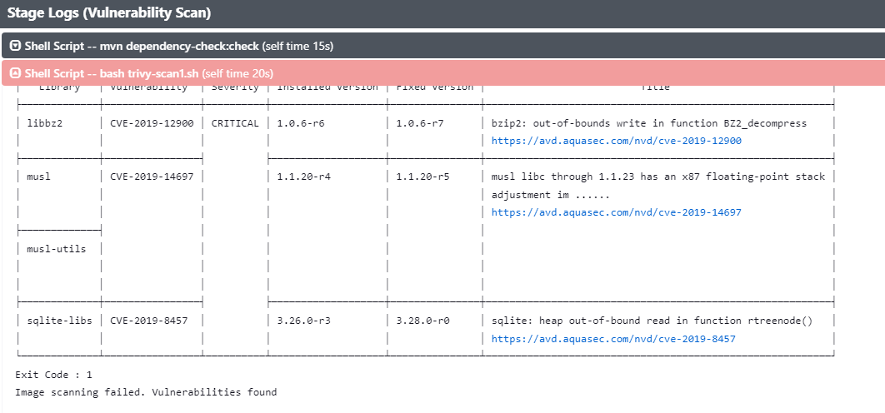{width="6.90625in"
> height="3.2291666666666665in"}
>
> │ ├────────────────┤ │ │
> ├──────────────────────────────────────────────────────────────┤\
> │ │ CVE-2020-14593 │ │ │ │ OpenJDK: Incomplete bounds checks in Affine
> Transformations │\
> │ │ │ │ │ │ (2D, 8240119) │\
> │ │ │ │ │ │ <https://avd.aquasec.com/nvd/cve-2020-14593> │\
> │ ├────────────────┤ │
> ├───────────────┼──────────────────────────────────────────────────────────────┤\
> │ │ CVE-2020-2604 │ │ │ 8.242.08-r0 │ OpenJDK: Serialization filter
> changes via jdk.serialFilter │\
> │ │ │ │ │ │ property modification (Serialization, 8231422) │\
> │ │ │ │ │ │ <https://avd.aquasec.com/nvd/cve-2020-2604> │\
> │ ├────────────────┤ │
> ├───────────────┼──────────────────────────────────────────────────────────────┤\
> │ │ CVE-2020-2803 │ │ │ 8.252.09-r0 │ OpenJDK: Incorrect bounds checks
> in NIO Buffers (Libraries, │\
> │ │ │ │ │ │ 8234841) │\
> │ │ │ │ │ │ <https://avd.aquasec.com/nvd/cve-2020-2803> │\
> │ ├────────────────┤ │ │
> ├──────────────────────────────────────────────────────────────┤\
> │ │ CVE-2020-2805 │ │ │ │ OpenJDK: Incorrect type checks in
> MethodType.readObject() │\
> │ │ │ │ │ │ (Libraries, 8235274) │\
> │ │ │ │ │ │ <https://avd.aquasec.com/nvd/cve-2020-2805> │\
> ├───────────────────┼────────────────┤
> ├───────────────────┼───────────────┼──────────────────────────────────────────────────────────────┤\
> │ sqlite-libs │ CVE-2019-19244 │ │ 3.26.0-r3 │ 3.28.0-r2 │ sqlite:
> allows a crash if a sub-select uses both DISTINCT │\
> │ │ │ │ │ │ and window\... │\
> │ │ │ │ │ │ <https://avd.aquasec.com/nvd/cve-2019-19244> │\
> │ ├────────────────┤ │
> ├───────────────┼──────────────────────────────────────────────────────────────┤\
> │ │ CVE-2019-5018 │ │ │ 3.28.0-r0 │ sqlite: Use-after-free in window
> function leading to remote │\
> │ │ │ │ │ │ code execution │\
> │ │ │ │ │ │ <https://avd.aquasec.com/nvd/cve-2019-5018> │\
> │ ├────────────────┤ │
> ├───────────────┼──────────────────────────────────────────────────────────────┤\
> │ │ CVE-2020-11655 │ │ │ 3.28.0-r3 │ sqlite: malformed window-function
> query leads to DoS │\
> │ │ │ │ │ │ <https://avd.aquasec.com/nvd/cve-2020-11655> │\
> └───────────────────┴────────────────┴──────────┴───────────────────┴───────────────┴──────────────────────────────────────────────────────────────┘
>
> openjdk:8-jdk-alpine (alpine 3.9.4)\
> ===================================\
> Total: 4 (CRITICAL: 4)
>
> ┌─────────────┬────────────────┬──────────┬───────────────────┬───────────────┬──────────────────────────────────────────────────────────┐\
> │ Library │ Vulnerability │ Severity │ Installed Version │ Fixed
> Version │ Title │\
> ├─────────────┼────────────────┼──────────┼───────────────────┼───────────────┼──────────────────────────────────────────────────────────┤\
> │ libbz2 │ CVE-2019-12900 │ CRITICAL │ 1.0.6-r6 │ 1.0.6-r7 │ bzip2:
> out-of-bounds write in function BZ2_decompress │\
> │ │ │ │ │ │ <https://avd.aquasec.com/nvd/cve-2019-12900> │\
> ├─────────────┼────────────────┤
> ├───────────────────┼───────────────┼──────────────────────────────────────────────────────────┤\
> │ musl │ CVE-2019-14697 │ │ 1.1.20-r4 │ 1.1.20-r5 │ musl libc through
> 1.1.23 has an x87 floating-point stack │\
> │ │ │ │ │ │ adjustment im \...\... │\
> │ │ │ │ │ │ <https://avd.aquasec.com/nvd/cve-2019-14697> │\
> ├─────────────┤ │ │ │ │ │\
> │ musl-utils │ │ │ │ │ │\
> │ │ │ │ │ │ │\
> │ │ │ │ │ │ │\
> ├─────────────┼────────────────┤
> ├───────────────────┼───────────────┼──────────────────────────────────────────────────────────┤\
> │ sqlite-libs │ CVE-2019-8457 │ │ 3.26.0-r3 │ 3.28.0-r0 │ sqlite: heap
> out-of-bound read in function rtreenode() │\
> │ │ │ │ │ │ <https://avd.aquasec.com/nvd/cve-2019-8457> │\
> └─────────────┴────────────────┴──────────┴───────────────────┴───────────────┴──────────────────────────────────────────────────────────┘\
> Exit Code : 1\
> Image scanning failed. Vulnerabilities found
>
>  
>
> *From \< <http://192.168.126.132:8080/job/devsecops-app-num/>\>*
>
>  
>
>  
>
> we try run trivy to find vulnerability with the same os docker image
> like: openjdk, openjdk8, adoptopenjdk/openjdk8:alpine-slim
>
>  
>
> docker run \--rm -v \$WORKSPACE:/root/.cache/ aquasec/trivy:0.17.2 -q
> image \--exit-code 0 \--severity HIGH \--light \$dockerImageName
>
>  
>
> And after have result with zero vulnerability. We update dockerfile to
> fix vulnerability
>
>  
>
> FROM adoptopenjdk/openjdk8:alpine-slim
>
> EXPOSE *8080*
>
> ARG JAR_FILE=*target/\*.jar*
>
> ADD \${JAR_FILE} *app.jar*
>
> ENTRYPOINT *\[*\"java\"*,*\"-jar\"*,*\"/app.jar\"*\]*
>
>  
>
> Update docker build command in build stage to fix error relate trivy:
>
>  
>
> stage(\'Docker Build and Push\') {
>
>       steps {
>
>         withDockerRegistry(\[credentialsId: \"docker-hub\", url:
> \"\"\]) {
>
>           sh \'printenv\'
>
>           sh \'sudo docker build -t
> nthiep1998/numeric-app:\"\"\$GIT_COMMIT\"\" .\'
>
>           sh \'docker push
> nthiep1998/numeric-app:\"\"\$GIT_COMMIT\"\"\'
>
>         }
>
>       }
>
>     }
>
>  
>
>  
>
>  
>
> Final Result
>
>  
>
> ![v/ \< 77 Branch: --- Commit: Vulnerability Scan / Trivy Scan - 27s v
> bash trivy-scanl.sh --- Shell Script + bash trivy-scanl.sh
> adoptopenjdk/openjdk8 : alpine- s lim @ 2m 58s @ 4 minutes ago Start
> Changes by nthiep1998 Started by GitHub push by hiep98 Pipeline
> Kubernetes Deployment\... Changes End Tests Artifacts Build Artifact
> Mutation Tests - Unit Tests SonarQube - SAST Docker Build and Push
> Vulnerability Scan Dependency Scan Tri\" scan x 26s
> adoptopenjdk/openjdk8: alpine-slim (alpine 3.14.9) Total: ø (HIG: e)
> adoptopenjdk/openjdk8: alpine-slim (alpine 3.14.9) Total: ø (CRITICAL:
> e) Exit Code : Image scanning passed. No CRITICAL vulnerabilities
> found ](./images/media/image16.png){width="10.958333333333334in"
> height="4.03125in"}

 

 

OPA - docker


 

> Open Policy Agent, also known as OPA, is a popular open source policy
> engine that provides a unified policy language and framework that can
> be used across different layers of the technology stack. The OPA
> project was started in 2016 by Styra, Inc. and has quickly gained
> popularity in the cloud-native and DevOps communities.
>
> In December 2020, the Open Policy Agent project announced that it was
> becoming a part of the Cloud Native Computing Foundation (CNCF), the
> leading open source organization that hosts and governs many popular
> cloud-native projects such as Kubernetes, Prometheus, and Envoy.
>
> As a CNCF-hosted project, OPA will continue to evolve and innovate
> with the help of the larger open source community, while also
> benefiting from the governance and organizational support provided by
> the CNCF.
>
> Overall, the Open Policy Agent Foundation represents an important step
> forward in the development and adoption of policy-as-code approaches
> for governing modern cloud-native and DevOps environments.
>
>  
>
> OPA.REGO file:
>
>  
>
>  
>
> package main
>
>  
>
> \# Do Not store secrets in ENV variables
>
> secrets_env = \[
>
> \"passwd\",
>
> \"password\",
>
> \"pass\",
>
> \"secret\",
>
> \"key\",
>
> \"access\",
>
> \"api_key\",
>
> \"apikey\",
>
> \"token\",
>
> \"tkn\"
>
> \]
>
>  
>
> deny\[msg\] {
>
> input\[i\].Cmd == \"env\"
>
> val := input\[i\].Value
>
> contains(lower(val\[\_\]), secrets_env\[\_\])
>
> msg = sprintf(\"Line %d: Potential secret in ENV key found: %s\", \[i,
> val\])
>
> }
>
>  
>
> \# Only use trusted base images
>
> deny\[msg\] {
>
> input\[i\].Cmd == \"from\"
>
> val := split(input\[i\].Value\[0\], \"/\")
>
> count(val) \> 1
>
> msg = sprintf(\"Line %d: use a trusted base image\", \[i\])
>
> }
>
>  
>
> \# Do not use \'latest\' tag for base imagedeny\[msg\] {
>
> deny\[msg\] {
>
> input\[i\].Cmd == \"from\"
>
> val := split(input\[i\].Value\[0\], \":\")
>
> contains(lower(val\[1\]), \"latest\")
>
> msg = sprintf(\"Line %d: do not use \'latest\' tag for base images\",
> \[i\])
>
> }
>
>  
>
> \# Avoid curl bashing
>
> deny\[msg\] {
>
> input\[i\].Cmd == \"run\"
>
> val := concat(\" \", input\[i\].Value)
>
> matches := regex.find_n(\"(curl\|wget)\[\^\|\^\>\]\*\[\|\>\]\",
> lower(val), -1)
>
> count(matches) \> 0
>
> msg = sprintf(\"Line %d: Avoid curl bashing\", \[i\])
>
> }
>
>  
>
> \# Do not upgrade your system packages
>
> warn\[msg\] {
>
> input\[i\].Cmd == \"run\"
>
> val := concat(\" \", input\[i\].Value)
>
> matches :=
> regex.match(\".\*?(apk\|yum\|dnf\|apt\|pip).+?(install\|\[dist-\|check-\|group\]?up\[grade\|date\]).\*\",
> lower(val))
>
> matches == true
>
> msg = sprintf(\"Line: %d: Do not upgrade your system packages: %s\",
> \[i, val\])
>
> }
>
>  
>
> \# Do not use ADD if possible
>
> deny\[msg\] {
>
> input\[i\].Cmd == \"add\"
>
> msg = sprintf(\"Line %d: Use COPY instead of ADD\", \[i\])
>
> }
>
>  
>
> \# Any user\...
>
> any_user {
>
> input\[i\].Cmd == \"user\"
>
> }
>
>  
>
> deny\[msg\] {
>
> not any_user
>
> msg = \"Do not run as root, use USER instead\"
>
> }
>
>  
>
> \# \... but do not root
>
> forbidden_users = \[
>
> \"root\",
>
> \"toor\",
>
> \"0\"
>
> \]
>
>  
>
> deny\[msg\] {
>
> command := \"user\"
>
> users := \[name \| input\[i\].Cmd == command; name :=
> input\[i\].Value\]
>
> lastuser := users\[count(users)-1\]
>
> contains(lower(lastuser\[\_\]), forbidden_users\[\_\])
>
> msg = sprintf(\"Line %d: Last USER directive (USER %s) is forbidden\",
> \[input.Line, lastuser\])
>
> }
>
>  
>
> \# Do not sudo
>
> deny\[msg\] {
>
> input\[i\].Cmd == \"run\"
>
> val := concat(\" \", input\[i\].Value)
>
> contains(lower(val), \"sudo\")
>
> msg = sprintf(\"Line %d: Do not use \'sudo\' command\", \[i\])
>
> }
>
>  
>
> \# Use multi-stage builds
>
> default multi_stage = false
>
> multi_stage = true {
>
> input\[i\].Cmd == \"copy\"
>
> val := concat(\" \", input\[i\].Flags)
>
> contains(lower(val), \"\--from=\")
>
> }
>
> deny\[msg\] {
>
> multi_stage == false
>
> msg = sprintf(\"You COPY, but do not appear to use multi-stage
> builds\...\", \[\])
>
> }
>
>  
>
> The first rule prohibits storing secrets in environment variables. It
> will trigger a deny message if any of the specified strings (i.e.,
> \"passwd\", \"password\", \"pass\", etc.) are found in an **\`ENV\`**
> key.
>
> The second rule ensures that only trusted base images are used. It
> reports any Dockerfiles that use base images from sources that are not
> in the form of a Docker registry.
>
> The third rule prohibits the use of the \"latest\" tag for base
> images.
>
> The fourth rule alert any use curl in a docker container.
>
> The fifth rule warns against upgrading system packages in Dockerfiles.
>
> The sixth rule prohibits the use of the **\`ADD\`** command in a
> Dockerfile to copy files, and recommends using the **\`COPY\`**
> command instead.
>
> The seventh rule warns against running Docker containers as root, and
> suggests setting the **\`USER\`** directive.
>
> The eighth rule prohibits the use of the **\`sudo\`** command in a
> Dockerfile.
>
> The ninth rule recommends the use of multi-stage Docker builds, and
> warns if there are any COPY commands that appear outside of the
> build\'s multi-stage.
>
> In summary, this Rego file defines rules to enforce Docker security
> best practices, and it can be used with OPA to prevent vulnerabilities
> in a Dockerized service or application.
>
>  
>
> Reference dockerfile best practices:
>
> <https://cloudberry.engineering/article/dockerfile-security-best-practices/>
>
> <https://docs.docker.com/develop/develop-images/dockerfile_best-practices/>
>
>  
>
>  
>
> Add opa Confest
>
>  
>
> stage(\'Vulnerability Scan\'){
>
>       steps {
>
>         parallel(
>
>            \"Dependency Scan\": {
>
>             sh \"mvn dependency-check:check\"
>
>           },
>
>           \"Trivy Scan\": {
>
>             sh \"bash trivy-scan1.sh\"
>
>           },
>
>           \"OPA Conftest\": {
>
>             sh \'docker run \--rm -v \$(pwd):/project
> openpolicyagent/conftest test \--policy opa-docker-security2.rego
> Dockerfile\'
>
>           }
>
>         )
>
>       }
>
>     }
>
>  
>
> The \`OPA Conftest\` step runs a container image scan using the Open
> Policy Agent conftest tool by running the container with a bind mount
> volume to include the project root directory in container and then
> testing the Dockerfile against the \`opa-docker-security2.rego\`
> policy using the command \`docker run \--rm -v \$(pwd):/project
> openpolicyagent/conftest test \--policy opa-docker-security2.rego
> Dockerfile\`.
>
>  
>
>  
>
> Now run build and it is will fail with result below:
>
>  
>
> \+ docker run \--rm -v
> /var/lib/jenkins/workspace/devsecops-app-num:/project
> openpolicyagent/conftest test \--policy opa-docker-security2.rego
> Dockerfile
>
> FAIL- Dockerfile - main - Do not run as root, use USER instead
>
> FAIL- Dockerfile - main - Line 0: use a trusted base image
>
> FAIL- Dockerfile - main - Line 3: Use COPY instead of ADD
>
> FAIL- Dockerfile - main - You COPY, but do not appear to use
> multi-stage builds\...
>
>  
>
> 10 tests, 6 passed, 0 warnings, 4 failures, 0 exceptions
>
> script returned exit code 1
>
>  
>
>  
>
> We need edit Dockerfile to measure secure like below.
>
>  
>
> FROM adoptopenjdk/openjdk8:alpine-slim
>
> EXPOSE *8080*
>
> ARG JAR_FILE=*target/\*.jar*
>
> RUN *addgroup -S pipeline && adduser -S k8s-pipeline -G pipeline*
>
> COPY \${JAR_FILE} */home/k8s-pipeline/app.jar*
>
> USER *k8s-pipeline*
>
> ENTRYPOINT
> *\[*\"java\"*,*\"-jar\"*,*\"/home/k8s-pipeline/app.jar\"*\]*
>
>  
>
> The Dockerfile mentioned follows some of the best security practices
> that should be included into the Dockerfile, which are:

1.  Using minimal base images: In the given Dockerfile, the image has
    been used as \"alpine-slim\" which is a minimal and lightweight
    operating system designed for containers that ensures a smaller
    attack surface for the image by minimizing the potential
    vulnerabilities.

2.  Specifying the user: The Dockerfile specifies the user
    \"k8s-pipeline\" instead of using the default root user. This
    practice makes the application running inside containers with
    limited access control to the host and promotes defense-in-depth
    security practices.

3.  Making use of COPY instruction: The Dockerfile makes use of the COPY
    instruction so that the only contents copied to the container
    filesystem are the artifact needed to run the application (the JAR
    file). This offers better control over the image size and avoids
    unnecessary vulnerabilities.

4.  Using ENTRYPOINT instruction: The ENTRYPOINT instruction is used to
    define the command that will be executed when the container starts.
    This ensures the correct command is executed and not any other
    commands that may be injected by an attacker.

5.  Exposing only necessary ports: In the given Dockerfile, only port
    8080 is exposed which is used by the running application. By
    exposing the only necessary port, we minimize the attack surface of
    our container.

> By following these best practices, the Dockerfile ensures that only
> essential files are copied into the container, limits the need for
> privileges, and minimizes the attack surface of the container. This,
> in turn, makes the container more secure against potential attackers.
>
>  
>
> * *
>
>  
>
>  
>
>  

 

 

OPA - k8s


 

> Kubernetes security concepts
>
>  

-   **\`runAsUser\`**: This is a Kubernetes security setting that
    specifies the user ID that a container should run as. By default,
    containers in Kubernetes will run as the **\`root\`** user, which
    can pose potential security risks. Setting **\`runAsUser\`** to a
    non-root UID ensures that if the container is compromised, the
    attacker will not have root privileges.

-   **\`runAsNonRoot\`**: By default, containers in Kubernetes will run
    as the **\`root\`** user inside the container. This can lead to
    security vulnerabilities as **\`root\`** is the highest privileged
    user. The **\`runAsNonRoot\`** setting ensures that a container is
    run with a non-root user, which reduces the attack surface and
    limits the damage an attacker can do if they gain access to a
    compromised container.

-   **\`readOnlyRootFilesystem\`**: This is a security setting in
    Kubernetes that restricts write access to the root filesystem of a
    container. When this setting is enabled, any attempt to modify the
    container\'s root filesystem will result in an error. This helps
    prevent malicious code from being injected into the container and
    also reduces the risk of data loss or corruption.

>  
>
> Overall, these concepts help improve the security of Kubernetes
> environments by reducing the attack surface and limiting access and
> privileges to containers running within the Kubernetes cluster.
>
>  
>
>  
>
> Jenkins pipeline:
>
>  
>
> stage(\'Vulnerability Scan - Kubernetes\') {
>
>       steps {
>
>         sh \'docker run \--rm -v \$(pwd):/project
> openpolicyagent/conftest test \--policy opa-k8s-security.rego
> k8s_deployment_service.yaml\'
>
>       }
>
>     }
>
>  
>
>  
>
>  
>
> opa k8s rego file:
>
>  
>
> package main
>
>  
>
> deny\[msg\] {
>
> input.kind = \"Service\"
>
> not input.spec.type = \"NodePort\"
>
> msg = \"Service type should be NodePort\"
>
> }
>
>  
>
> deny\[msg\] {
>
> input.kind = \"Deployment\"
>
> not
> input.spec.template.spec.containers\[0\].securityContext.runAsNonRoot
> = true
>
> msg = \"Containers must not run as root - use runAsNonRoot wihin
> container security context\"
>
> }
>
>  
>
>  
>
>  
>
>  
>
> k8s deployment file
>
> apiVersion: apps/v1
>
> kind: Deployment
>
> metadata:
>
>   labels:
>
>     app: devsecops
>
>   name: devsecops
>
> spec:
>
>   replicas: 2
>
>   selector:
>
>     matchLabels:
>
>       app: devsecops
>
>   strategy: {}
>
>   template:
>
>     metadata:
>
>       labels:
>
>         app: devsecops
>
>     spec:
>
>       containers:
>
>       - image: replace
>
>         name: devsecops-container
>
>         securityContext:
>
>           runAsNonRoot: true
>
>           runAsUser: 100
>
> \-\--
>
> apiVersion: v1
>
> kind: Service
>
> metadata:
>
>   labels:
>
>     app: devsecops
>
>   name: devsecops-svc
>
> spec:
>
>   ports:
>
>   - port: 8080
>
>     protocol: TCP
>
>     targetPort: 8080
>
>   selector:
>
>     app: devsecops
>
>   type: NodePort
>
>  
>
>  
>
>  
>
>  
>
> Reference:
>
> <https://kubernetes.io/docs/tasks/configure-pod-container/security-context/>
>
> <https://snyk.io/blog/10-kubernetes-security-context-settings-you-should-understand/>
>
>  
>
>  
>
>  
>
> Create script k8s deployment
>
>  
>
>  
>
> *#!/bin/bash*
>
> *#k8s-deployment.sh*
>
> sed -i \"s#replace#\${imageName}#g\" k8s_deployment_service.yaml
>
> kubectl -n default get deployment \${deploymentName} \> /dev/null
>
> if \[\[ \$? -ne 0 \]\]; then
>
> echo \"deployment \${deploymentName} doesnt exist\"
>
> kubectl -n default apply -f k8s_deployment_service.yaml
>
> else
>
> echo \"deployment \${deploymentName} exist\"
>
> echo \"image name - \${imageName}\"
>
> kubectl -n default set image deploy \${deploymentName}
> \${containerName}=\${imageName} \--record=true
>
> fi
>
>  
>
> The code is a Bash script that updates a Kubernetes deployment with a
> new container image. Here are the explanations of each line:

-   **\`#!/bin/bash\`**: This line indicates the interpreter to be used,
    which is Bash.

-   **\`sed -i \"s#replace#\${imageName}#g\"
    k8s_deployment_service.yaml\`**: This line replaces the placeholder
    string \"replace\" with the value of the **\`imageName\`** variable
    in the **\`k8s_deployment_service.yaml\`** file using the
    **\`sed\`** utility.

-   **\`kubectl -n default get deployment \${deploymentName} \>
    /dev/null\`**: This line queries the Kubernetes default namespace
    for the **\`\${deploymentName}\`** deployment. The **\`\>
    /dev/null\`** redirects the output to null, so it doesn\'t print
    anything to the console.

-   **\`if \[\[ \$? -ne 0 \]\]; then\`**: This line checks the return
    value of the previous command (i.e., the deployment exists or not).
    If the value is not zero (i.e., the deployment does not exist), then
    it goes to the **\`if\`** block.

-   **\`echo \"deployment \${deploymentName} doesnt exist\"\`**: This
    line prints the message to the console, indicating that the
    deployment does not exist.

-   **\`kubectl -n default apply -f k8s_deployment_service.yaml\`**:
    This line applies the deployment and service configuration from the
    **\`k8s_deployment_service.yaml\`** file to create the deployment.

-   **\`else\`**: If the **\`if\`** block condition is not satisfied,
    the script proceeds to the **\`else\`** block.

-   **\`echo \"deployment \${deploymentName} exist\"\`**: This line
    prints the message to the console, indicating that the deployment
    already exists.

-   **\`echo \"image name - \${imageName}\"\`**: This line prints the
    name of the new container image.

-   **\`kubectl -n default set image deploy \${deploymentName}
    \${containerName}=\${imageName} \--record=true\`**: This line
    updates the existing deployment by changing the container image of
    the **\`\${containerName}\`** container to **\`\${imageName}\`**.
    The **\`\--record=true\`** records the change in the revision
    history of the deployment.

>  
>
> The **\`kubectl -n default\`** option specifies the namespace in which
> to execute the given Kubernetes command.
>
> A Kubernetes namespace is an abstraction used to partition a cluster
> into logical parts. It enables multiple virtual clusters to be created
> on top of a physical cluster. The **\`default\`** namespace is the
> starting namespace when you first create a Kubernetes cluster. Every
> object that created without a namespace specified goes into the
> **\`default\`** namespace.
>
> When you execute **\`kubectl\`** commands, by default the context of
> the current namespace is taken into account. But if you want to
> operate on a different namespace other than the current one, you need
> to specify the namespace using the **\`-n\`** flag followed by the
> namespace name.
>
> In the script, the **\`kubectl -n default\`** option is used to
> specify the namespace **\`default\`** to execute the **\`get\`**,
> **\`apply\`**, and **\`set\`** commands specific to the namespace
> where the Kubernetes deployment is located.
>
>  
>
> The **\`\> /dev/null\`** portion of the code is a Linux and Unix shell
> feature to discard the output generated by a command.
>
> In the script above, **\`kubectl -n default get deployment
> \${deploymentName}\`** is used to check if the deployment with the
> name **\`\${deploymentName}\`** exists in the **\`default\`**
> namespace. If the deployment exists, we do not necessarily need to
> print the output since it is not critical in the context of the
> script. Therefore, the **\`\> /dev/null\`** redirects any output
> produced by the **\`get\`** command to **\`null\`** or nowhere,
> meaning that any output generated by the **\`get\`** command is
> entirely discarded.
>
> This way, the redirection **\`\> /dev/null\`** reduces unwanted
> messages printed to the console, resulting in a cleaner console
> output.
>
>  
>
>  
>
>  
>
>  
>
> Create script k8s rollback
>
>  
>
> *#!/bin/bash*
>
> *#k8s-deployment-rollout-status.sh*
>
> sleep 60s
>
> if \[\[ \$(kubectl -n default rollout status deploy \${deploymentName}
> \--timeout 5s) != \*\"successfully rolled out\"\* \]\];
>
> then
>
> echo \"Deployment \${deploymentName} Rollout has Failed\"
>
> kubectl -n default rollout undo deploy \${deploymentName}
>
> exit 1;
>
> else
>
> echo \"Deployment \${deploymentName} Rollout is Success\"
>
> fi
>
>  
>
>  
>
> This Bash script is designed to check the status of a Kubernetes
> deployment rollout and rollback the deployment if the rollout has
> failed. Here\'s what each line of the script is doing:
>
> **\`#!/bin/bash\`**
>
> This shebang tells the system to interpret this file as a Bash script.
>
> **\`sleep 60s\`**
>
> This command will pause the script for 60 seconds before executing the
> next command. It is possible that, during a deployment, it can take a
> few seconds for the rollout to start. This command helps to ensure
> that the script checks the rollout status only after the rollout has
> started.
>
> **\`if \[\[ \$(kubectl -n default rollout status deploy
> \${deploymentName} \--timeout 5s) != \*\"successfully rolled out\"\*
> \]\]; then\`**
>
> This line executes the kubectl command to check the status of the
> deployment rollout with a timeout of 5 seconds. It uses the deployment
> name stored in the \${deploymentName} variable to target the
> deployment. The command output is captured in a string and compared to
> a pattern that indicates a successful rollout. The pattern matching is
> done with the **\`!=\`** operator followed by a quoted string
> containing the pattern. If the pattern is not found in the command
> output, the script executes the **\`then\`** block.
>
> **\`echo \"Deployment \${deploymentName} Rollout has Failed\"\`**
>
> This line prints a message to standard output indicating that the
> deployment rollout has failed.
>
> **\`kubectl -n default rollout undo deploy \${deploymentName}\`**
>
> This line of the script executes the kubectl command to undo the
> deployment rollout using the \${deploymentName} variable. This will
> cause the deployment to rollback to the previous deployment version.
>
> **\`exit 1;\`**
>
> This line will exit the script with a failure status. This step only
> executes if the deployment status check fails.
>
> **\`else\`**
>
> This line indicates the start of the **\`else\`** block. This block is
> executed if the pattern matching in the **\`if\`** statement is
> successful.
>
> **\`echo \"Deployment \${deploymentName} Rollout is Success\"\`**
>
> This line prints a message to standard output indicating a successful
> deployment rollout.
>
> **\`fi\`**
>
> This line indicates the end of the **\`if\`** statement. The script
> will exit after executing this line if the **\`if\`** statement is
> successful.
>
>  
>
> *From \< <https://voicegpt.us/chatgpt/6418811b0d4d91420262a668>\>*
>
>  
>
> Here is how the script works step by step:

-   The script starts by pausing for 60 seconds using the **\`sleep\`**
    command. This is done to ensure that the deployment rollback status
    check is not executed until the expected time for the rollout to
    start has passed.

-   The script then executes the **\`kubectl\`** command with the
    **\`rollout status\`** sub-command and the **\`deploy\`** resource
    type to check the status of the deployment rollout. It uses the
    **\`deploymentName\`** variable to specify the name of the
    deployment that needs to be checked. The **\`\--timeout\`** option
    specifies the maximum time that **\`kubectl\`** should wait for the
    rollout to complete.

-   The **\`kubectl\`** command output is captured as a string and
    compared against the pattern **\`\"successfully rolled out\"\`**. If
    the pattern is not found in the output, the script proceeds to the
    **\`then\`** block.

-   If the pattern is not found, the script prints a message to the
    console indicating that the deployment rollout has failed using the
    **\`echo\`** command. It then executes the **\`kubectl\`** command
    with the **\`rollout undo\`** subcommand to undo the deployment
    rollout using the **\`deploymentName\`** variable. This will cause
    the deployment to rollback to the previous deployment version.

-   Finally, the script terminates with a failure status of **\`1\`**.

-   If the pattern is found in the output, the script prints a message
    indicating a successful deployment rollout using the **\`echo\`**
    command.

-   Finally, the script terminates. No error status is returned.

> Overall, this script is useful for automatically checking the status
> of a Kubernetes deployment rollout, detecting when the rollout has
> failed, and rolling back to a previous deployment version to ensure
> that the Kubernetes application runs smoothly without interruption.
>
>  
>
> *From \< <https://voicegpt.us/chatgpt/6418811b0d4d91420262a668>\>*
>
>  
>
> This is a bash script that checks the status of a Kubernetes
> deployment rollout. The script first sleeps for 60 seconds before
> checking the status of the deployment using \`kubectl\` command. If
> the deployment was not successful, it will print a message indicating
> that the rollout has failed and then undo the deployment using
> \`kubectl rollout undo\` command. If the deployment was successful, it
> will print a message indicating that the rollout was successful.
>
>  
>
> Here\'s an explanation of each line in detail:
>
> \- \`#!/bin/bash\`: This line specifies that this script should be run
> using bash shell interpreter.
>
> \- \`#k8s-deployment-rollout-status.sh\`: This is a comment line
> describing what this script does.
>
> \- \`sleep 60s\`: This line makes the script sleep for 60 seconds
> before proceeding to check the status of the deployment.
>
> \- \`if \[\[ \$(kubectl -n default rollout status deploy
> \${deploymentName} \--timeout 5s) != \*\"successfully rolled out\"\*
> \]\];\`: This line checks if the output of \`kubectl -n default
> rollout status deploy \${deploymentName} \--timeout 5s\` command does
> not contain \`\"successfully rolled out\"\`. If it doesn\'t contain
> this string, then it means that the deployment was not successful and
> we need to undo it.
>
> \- \`echo \"Deployment \${deploymentName} Rollout has Failed\"\`: This
> line prints a message indicating that the deployment has failed.
>
> \- \`kubectl -n default rollout undo deploy \${deploymentName}\`: This
> line undoes the failed deployment using \`kubectl rollout undo\`
> command.
>
> \- \`exit 1;\`: This line exits from this script with an exit code of
> 1 indicating that there was an error in executing this script (i.e.,
> deployment failed).
>
> \- \`else echo \"Deployment \${deploymentName} Rollout is Success\"\`:
> If we reach this else block then it means that our previous if
> condition was false (i.e., our kubectl command output contained
> \`\"successfully rolled out\"\`). So we print a message indicating
> that our deployment was successful.
>
>  
>
> I hope this helps! Let me know if you have any further questions. 😊
>
>  
>
>  
>
>  
>
> Add enviroment into pipeline
>
>  
>
>  
>
> pipeline {
>
> agent any
>
>  
>
> environment {
>
> deploymentName = \"devsecops\"
>
> containerName = \"devsecops-container\"
>
> serviceName = \"devsecops-svc\"
>
> imageName = \"siddharth67/numeric-app:\${GIT_COMMIT}\"
>
> applicationURL = \"
> <http://devsecops-demo.eastus.cloudapp.azure.com/>\"
>
> applicationURI = \"/increment/99\"
>
> }
>
>  
>
>  
>
>  
>
> Edit pipeline:
>
> stage(\'K8S Deployment - DEV\') {
>
> steps {
>
> parallel(
>
> \"Deployment\": {
>
> withKubeConfig(\[credentialsId: \'kubeconfig\'\]) {
>
> sh \"bash k8s-deployment.sh\"
>
> }
>
> },
>
> \"Rollout Status\": {
>
> withKubeConfig(\[credentialsId: \'kubeconfig\'\]) {
>
> sh \"bash k8s-deployment-rollout-status.sh\"
>
> }
>
> }
>
> )
>
> }
>
> }
>
>  

 

 

Kubesec


 

> OPA and Kubesec are both open-source tools that can be used to secure
> Kubernetes clusters. However, they have different strengths and
> weaknesses, and they are typically used together to provide a more
> comprehensive security solution.
>
> OPA (Open Policy Agent) is a general-purpose policy engine that can be
> used to enforce a wide range of policies, including security policies.
> It is based on the Rego language, which is a powerful and expressive
> language for writing policies. OPA can be used to enforce policies on
> Kubernetes resources, as well as on other types of resources, such as
> files and databases.
>
> Kubesec is a security tool for Kubernetes that focuses on identifying
> and remediating security vulnerabilities. It does this by scanning
> Kubernetes clusters for known vulnerabilities and then providing
> recommendations for how to fix them. Kubesec can also be used to
> enforce security policies, but it is not as flexible as OPA in this
> regard.
>
> OPA and Kubesec can be used together to provide a more comprehensive
> security solution for Kubernetes clusters. OPA can be used to enforce
> policies, while Kubesec can be used to identify and remediate
> vulnerabilities. This combination of tools can help to protect
> Kubernetes clusters from a wide range of security threats.
>
> Here are some of the key differences between OPA and Kubesec:

-   OPA is a general-purpose policy engine, while Kubesec is a security
    tool for Kubernetes.

-   OPA is based on the Rego language, while Kubesec uses its own
    proprietary language.

-   OPA can be used to enforce policies on a wide range of resources,
    while Kubesec is focused on Kubernetes resources.

-   OPA is more flexible than Kubesec in terms of how it can be used to
    enforce policies.

> Here are some of the reasons why you might need to use both OPA and
> Kubesec:

-   To get the benefits of both tools. OPA is a powerful policy engine
    that can be used to enforce a wide range of policies, while Kubesec
    is a security tool that can identify and remediate vulnerabilities.

-   To cover different use cases. OPA is a general-purpose policy
    engine, while Kubesec is focused on Kubernetes resources. If you
    need to enforce policies on other types of resources, you will need
    to use OPA.

-   To get the best of both worlds. OPA is more flexible than Kubesec in
    terms of how it can be used to enforce policies. However, Kubesec is
    easier to use and has a wider range of features. By using both
    tools, you can get the benefits of both worlds.

>  
>
> Question: If I use both of these tools to scan security for k8s, is
> there any overlap?
>
> Answer:
>
> Yes, there is a potential for overlap if you use both OPA and kubesec
> to scan for security issues in Kubernetes. This is because OPA already
> comes with some built-in policies for Kubernetes security, including
> policies related to secrets management, which may overlap with the
> functionality provided by kubesec.
>
> However, the extent and significance of the overlap would depend on
> which policies you enable in OPA and how you configure kubesec. For
> example, if you disable the built-in Kubernetes security policies in
> OPA and only use it for other types of policies, you may not encounter
> much overlap with kubesec. Similarly, if you only use kubesec for
> scanning secrets and not for other security checks, any overlap with
> OPA would be restricted to secret-related issues.
>
> Overall, it\'s best to carefully consider which tools and policies you
> need for your Kubernetes security posture and configure them
> appropriately, to avoid duplication or unnecessary complexity.
>
>  
>
>  
>
> Create k8sec-scan.sh file
>
>  
>
> *#!/bin/bash*
>
> *#kubesec-scan.sh*
>
> *\# using kubesec v2 api*
>
> scan_result=\$(curl -sSX POST \--data-binary
> @\"k8s_deployment_service.yaml\" <https://v2.kubesec.io/scan>)
>
> scan_message=\$(curl -sSX POST \--data-binary
> @\"k8s_deployment_service.yaml\" <https://v2.kubesec.io/scan> \| jq
> .\[0\].message -r )
>
> scan_score=\$(curl -sSX POST \--data-binary
> @\"k8s_deployment_service.yaml\" <https://v2.kubesec.io/scan> \| jq
> .\[0\].score )
>
>  
>
> *\# using kubesec docker image for scanning*
>
> *\# scan_result=\$(docker run -i kubesec/kubesec:512c5e0 scan
> /dev/stdin \< k8s_deployment_service.yaml)*
>
> *\# scan_message=\$(docker run -i kubesec/kubesec:512c5e0 scan
> /dev/stdin \< k8s_deployment_service.yaml \| jq .\[\].message -r)*
>
> *\# scan_score=\$(docker run -i kubesec/kubesec:512c5e0 scan
> /dev/stdin \< k8s_deployment_service.yaml \| jq .\[\].score)*
>
> *\# Kubesec scan result processing*
>
> *\# echo \"Scan Score : \$scan_score\"*
>
> if \[\[ \"\${scan_score}\" -ge 4 \]\]; then
>
> echo \"Result:\"
>
> echo \"\$scan_result\"
>
> echo \"Score is \$scan_score\"
>
> echo \"Kubesec Scan \$scan_message\"
>
> else
>
> echo \"Result:\"
>
> echo \"\$scan_result\"
>
> echo \"Score is \$scan_score, which is less than or equal to 5.\"
>
> echo \"Scanning Kubernetes Resource has Failed\"
>
> exit 1;
>
> fi;
>
>  
>
> This shell script, named **\`kubesec-scan.sh\`**, uses the
> **\`kubesec\`** tool to perform a security scan on a Kubernetes
> deployment and service configuration file
> (**\`k8s_deployment_service.yaml\`**).
>
> To perform the scan, the script makes an HTTP POST request to the
> Kubesec API endpoint (**\`https://v2.kubesec.io/scan\`**) with the
> given configuration file as the input data. The scan result is stored
> in the **\`scan_result\`** variable, and other details such as the
> scan message and score are extracted using **\`jq\`** command and are
> stored in **\`scan_message\`** and **\`scan_score\`** variables
> respectively
>
>  
>
> The script then evaluates the scan score (**\`scan_score\`**) and if
> it\'s greater than or equal to 4, it outputs the scan result along
> with the score and message. Otherwise, it prints an error indicating
> that the scan has failed and exits with a non-zero code.
>
> The script also provides an alternate method for performing the scan
> using the **\`kubesec\`** Docker image. This is commented out and can
> be used by swapping the comments with the **\`curl\`** method above.
>
>  
>
> What is jq ?
>
> jq is short for \"JSON Query\". It is a command-line tool for
> processing and manipulating JSON data. jq is written in the C
> programming language and is available for most operating systems. It
> is free and open-source software.
>
> jq can be used to extract specific data from a JSON file, filter out
> unwanted data, and convert JSON data into a different format. jq is
> often used in conjunction with other command-line tools to process
> JSON data. For example, jq can be used to extract data from a JSON
> file and then use that data to update a database.
>
> \`jq .\[0\].message -r \` is extracting the \'message\' key from the
> first object in the JSON array (the security scan result), and with
> the -r flag, it is returning the raw output without quotes. \`jq
> .\[0\].score\` is extracting the \'score\' key from the same object.
>
>  
>
> Why need use \[0\] in jq ?
>
> In the given script, **\`jq .\[0\].message -r\`** and **\`jq
> .\[0\].score\`** are using the **\`\[0\]\`** index to extract
> information from the first object in the JSON array returned by the
> API.
>
> The reason for using **\`\[0\]\`** is that the API response is an
> array of JSON objects, where each object represents a scan result for
> a Kubernetes resource. We are interested in the first object as it
> represents the scan result for the deployment and service YAML file
> that we have submitted for scanning.
>
> If we do not use **\`\[0\]\`** and instead use **\`jq .message\`**,
> then **\`jq\`** will attempt to find the \'message\' key from all the
> objects in the JSON array. This will not work in this case, as the
> \'message\' key exists only inside the first object of the array.
> Therefore, we need to first select the first object using
> **\`\[0\]\`** and then extract information from it using the desired
> key.
>
>  
>
> Reference jq:
>
> <https://exercism.org/tracks/jq>
>
> <https://www.baeldung.com/linux/jq-command-json>
>
>  
>
>  
>
> Edit jenkinsfile
>
>  
>
> stage(\'Vulnerability Scan - Kubernetes\') {
>
> steps {
>
> parallel(
>
> \"OPA Scan\": {
>
> sh \'docker run \--rm -v \$(pwd):/project openpolicyagent/conftest
> test \--policy opa-k8s-security.rego k8s_deployment_service.yaml\'
>
> },
>
> \"Kubesec Scan\": {
>
> sh \"bash kubesec-scan.sh\"
>
> }
>
> )
>
> }
>
> }
>
>  
>
> And build
>
> ![\< 106 \> Vulnerability Scan - Kubemetes / Kubesec Scan - 2s v bash
> kubesec-scan.sh --- Shell Script x + bash kubesec-scan. sh Result : @
> 2m 31s @ 4 days ago Changes by nthiep1998 Started by GitHub push by
> hiep98 Sta rt Build Artifact Unit Tests Mutation Tests - PIT
> SonarQube - Docker Build and Push Pip&le Vulnerability Scan -
> Kubernetes Kubesec Scan OPA scan Changes K8S Deployment -DEV Tests End
> \"object\" : \"Deployment/devsecops . default \" , \"valid\": true, •
> \"API\", \"rssage\": \"Passed with a score of I \"score\": I,
> \"scoring : { \"passed\": \[ : \"containers\[\] . securityContext
> .runAsbhnRoot true \"reason\": \"Force the running image to run as a
> non-root user to ensure least privilege\", \"points\": I \" advise \"
> : \"id\": \"ApparmrAny\" , \" .metadata .annotations . \"reason\" :
> \"Well defined AppArmor policies may provide greater protection from
> unknown threats. \"points\": 3 Vulnerability Scan Dependency Scan OPA
> conftest Trivy scan ARNIN6: PRcn_JCTICN READY\",
> ](./images/media/image17.png){width="7.239583333333333in"
> height="3.5729166666666665in"}
>
> After build, The log will show your score, the criteria you achieved
> and advice to improve security for your k8s.
>
>  
>
> And base on result, we can add serviceAccountName and
> readOnlyRootFilesystem into file k8s_deployment_service.yaml to ensure
> it passes the kubesec test.
>
>  
>
> spec:
>
> serviceAccountName: default
>
> containers:
>
> \- image: replace
>
> name: devsecops-container
>
> securityContext:
>
> runAsNonRoot: true
>
> runAsUser: 100
>
> readOnlyRootFilesystem: true
>
>  
>
> Because our script can\'t detect and auto-deploy when we update
> k8s_deployment_service.yaml file. So we will update the
> k8s-deployment.sh script
>
>  
>
> *#!/bin/bash*
>
> *#k8s-deployment.sh*
>
> DIFF_OUTPUT=\$(kubectl diff -f k8s_deployment_service.yaml)
>
> *\# if \[ -n \"\$DIFF_OUTPUT\" \]; then*
>
> *\# \# DIFF_OUTPUT is not empty, run your code here*
>
> *\# else*
>
> *\# \# DIFF_OUTPUT is empty, do nothing*
>
> *\# fi*
>
> *#! \$(kubectl diff -f k8s_deployment_service.yaml \>/dev/null 2\>&1)*
>
>  
>
> sed -i \"s#replace#\${imageName}#g\" k8s_deployment_service.yaml
>
> kubectl -n default get deployment \${deploymentName} \> /dev/null
>
> if \[\[ \$? -ne 0 \|\| ! \$(kubectl diff -f
> k8s_deployment_service.yaml)=\"\" \]\]; then
>
> echo \"deployment \${deploymentName} doesn\'t exist\"
>
> kubectl -n default apply -f k8s_deployment_service.yaml
>
> else
>
> echo \"deployment \${deploymentName} exists\"
>
> echo \"image name - \${imageName}\"
>
> kubectl -n default set image deploy \${deploymentName}
> \${containerName}=\${imageName} \--record=true
>
> Fi
>
>  
>
>  
>
> Alternatively, we can all add the below code at the end of the file to
> check the description of all the pod
>
>  
>
> *\# Get all pod names in current namespace*
>
> pods=\$(kubectl get pods -o jsonpath=\'{.items\[\*\].metadata.name}\')
>
> *\# Loop through each pod and describe its events*
>
> for pod in \$pods; do
>
> echo \"Getting events for pod: \$pod\"
>
> kubectl get events \--field-selector involvedObject.name=\$pod
> \--all-namespaces \| awk -v var=\"\$pod\" \'\$0 \~ var\'
>
> done
>
>  
>
>  
>
>  
>
> After update script and build again, If you see this error in your
> pod, you need update your k8s depoyment file.
>
> ![or . s rExce r in framework . context . icationContextExce t ion :
> Unable to start web server; ested except 15 org.spr
> ingframework.boot.web.server .WebServ tuon: Unable to create tem Dir.
> ava. to. tm dir is set o /t at org.spr ingframework .boot .web.
> servlet. context. tcat tonContext. onRefresh( ServletWebServerAppl
> tcat java: 161) pr ing-b00t-2.3. 5. RELEASE. jar :2.3.5.RELEASE\] at
> org. springfranework.context.support.AbstractAppucationContext.
> N\[spring-context-5.2. IO.RELEAS at org.springfranpwork.boot -web.
> servlet. context. ServietWebServerApp1icat ionContext. refresh(
> ServIetWebServerAppI icat ionContext. java: 143) spr Ing-boot -2.3.5
> ](./images/media/image18.png){width="11.5625in"
> height="1.4479166666666667in"}
>
>  
>
>  
>
> Please update volumes in your deployment file like below
>
> spec:
>
> volumes:
>
> \- name: vol
>
> emptyDir: {}
>
> serviceAccountName: default
>
> containers:
>
> \- image: replace
>
> name: devsecops-container
>
> volumeMounts:
>
> \- mountPath: /tmp
>
> name: vol
>
> securityContext:
>
> runAsNonRoot: true
>
> runAsUser: 100
>
> readOnlyRootFilesystem: true
>
>  
>
> specifies an emptyDir volume named \"vol\". An emptyDir volume is a
> temporary volume that is created when a Pod is created and deleted
> when the Pod is deleted. The emptyDir volume is initially empty, and
> all containers in the Pod can read and write to the same files in the
> emptyDir volume.
>
>  
>
> The emptyDir volume is created on the node that the Pod is assigned
> to. The emptyDir volume is not persistent, and the data in the
> emptyDir volume is lost when the Pod is deleted.
>
>  
>
> The emptyDir volume is a good choice for temporary data storage, such
> as scratch space for a disk-based merge sort or checkpointing a long
> computation for recovery from crashes.
>
>  
>
> The emptyDir volume can be mounted in a container using the following
> syntax: volumes:
>
> \- name: vol
>
> emptyDir: {}
>
>  
>
> containers:
>
> \- name: my-container
>
> image: busybox
>
> volumeMounts:
>
> \- name: vol
>
> mountPath: /vol
>
>  
>
> In this example, the \"my-container\" container will have access to
> the emptyDir volume at the path \"/vol\".
>
> In Kubernetes, curly braces \`{}\` with nothing inside them represent
> an empty object or an empty dictionary. In the context of an
> \`emptyDir\` volume in a Kubernetes deployment file, an empty
> dictionary \`{}\` indicates that there are no specialized
> configuration options for this particular \`emptyDir\`.
>
> In other words, using an empty dictionary for an \`emptyDir\` volume
> means that Kubernetes should create a new, empty directory for the
> volume to be mounted on the container, using default settings. This
> directory is then isolated to the pod\'s lifecycle.
>
>  
>
> Reference: <https://kubernetes.io/docs/concepts/storage/volumes/>
>
>  

 

 

Trivy - scan k8s image


 

Create trivy-k8s-scan.sh

 

*#!/bin/bash*

 

echo \$imageName *#getting Image name from env variable*

docker run \--rm -v \$WORKSPACE:/root/.cache/ aquasec/trivy:0.17.2 -q
image \--exit-code 0 \--severity LOW,MEDIUM,HIGH \--light \$imageName

docker run \--rm -v \$WORKSPACE:/root/.cache/ aquasec/trivy:0.17.2 -q
image \--exit-code 1 \--severity CRITICAL \--light \$imageName

*\# Trivy scan result processing*

exit_code=\$?

echo \"Exit Code : \$exit_code\"

*\# Check scan results*

if \[\[ \${exit_code} == 1 \]\]; then

echo \"Image scanning failed. Vulnerabilities found\"

exit 1;

else

echo \"Image scanning passed. No vulnerabilities found\"

fi;

 

Explain code

 

docker run \--rm -v \$WORKSPACE:/root/.cache/ aquasec/trivy:0.17.2 -q
image \--exit-code 0 \--severity LOW,MEDIUM,HIGH \--light \$imageName

 

This line runs the Trivy command in a Docker container. It uses \`-v\`
option to mount the \`\$WORKSPACE\` directory to the \`/root/.cache/\`
directory inside the container for caching Trivy\'s database. The
container is specified using the \`aquasec/trivy:0.17.2\` image with the
\`0.17.2\` version. The Trivy scan is performed using the \`image\`
option, and the \`\--exit-code\` option is set to \`0\` to ensure that
script does not exit if only low-severity vulnerabilities are found. The
\`\--severity\` option is set to \`LOW,MEDIUM,HIGH\` to include those
severities in the report. The \`\--light\` option indicates that the
scan should use the lightweight database for faster scanning.
\`\$imageName\` variable is passed as a parameter to the Trivy command
to scan the Docker image.

 

docker run \--rm -v \$WORKSPACE:/root/.cache/ aquasec/trivy:0.17.2 -q
image \--exit-code 1 \--severity CRITICAL \--light \$imageName

 

Similar to the previous line, it runs the Trivy command in a Docker
container to scan the Docker image, but it has a different severity
criteria. This time, it scans for \`CRITICAL\` vulnerabilities, and sets
the \`\--exit-code\` option to \`1\`.

 

exit_code=\$?

This line captures the exit code of the last executed command, which is
the Trivy command. It stores it in the \`\$exit_code\` variable.

 

echo \"Exit Code : \$exit_code\"

This line prints the exit code of the Trivy command to the console, for
debugging purposes.

 

 

if \[\[ \${exit_code} == 1 \]\]; then

This line starts an if-else statement, where the exit code of the Trivy
command is checked. If it is equal to \`1\`, it will execute the
following lines.

 

 

echo \"Image scanning failed. Vulnerabilities found\"

exit 1;

These lines print a message that vulnerabilities have been found in the
Docker image, and then exits the script with an exit code of \`1\`.

 

 

else

echo \"Image scanning passed. No vulnerabilities found\"

fi;

If the exit code of the Trivy command is not \`1\`, this block of code
executes. It prints a success message indicating that there were no
vulnerabilities found in the Docker image.

 

 

 

Add trivy scan into pipeline

 

stage(\'Vulnerability Scan - Kubernetes\') {

steps {

parallel(

\"OPA Scan\": {

sh \'docker run \--rm -v \$(pwd):/project openpolicyagent/conftest test
\--policy opa-k8s-security.rego k8s_deployment_service.yaml\'

},

\"Kubesec Scan\": {

sh \"bash kubesec-scan.sh\"

},

\"Trivy Scan\": {

sh \"bash trivy-k8s-scan.sh\"

}

)

}

}

 

After build, we will fail in trivy scan with result like below.

 

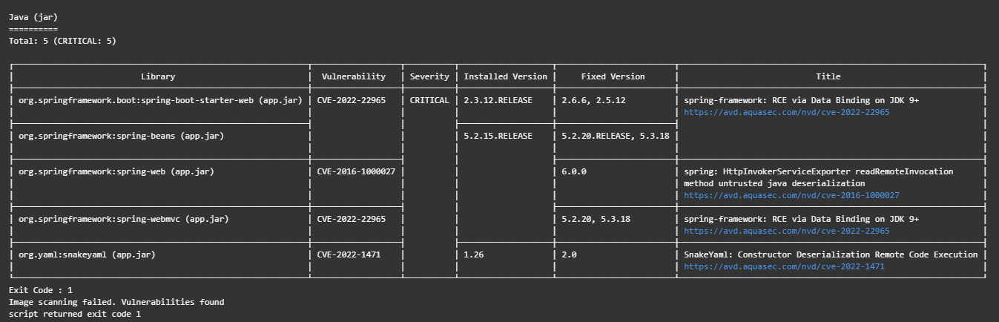{width="10.416666666666666in"
height="3.3541666666666665in"}

 

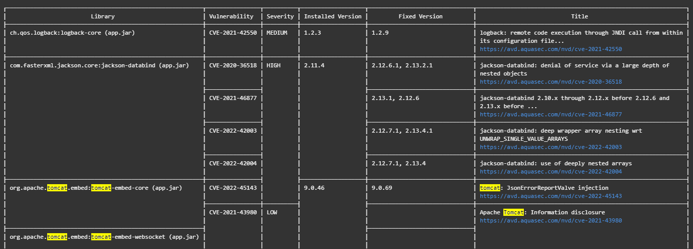{width="10.447916666666666in"
height="3.7708333333333335in"}

We can fix CVE-2022-45143 by updating tomcat to version 9.0.69 and
CVE-2022-22965 by updating spring-boot to version 2.6.6 or 2.5.12. And
build again

 

 

Intergration test


 

 

sleep 5s

PORT=\$(kubectl -n default get svc \${serviceName} -o json \| jq
.spec.ports\[\].nodePort)

echo \$PORT

echo \$applicationURL:\$PORT/\$applicationURI

if \[\[ ! -z \"\$PORT\" \]\];

then

response=\$(curl -s \$applicationURL:\$PORT\$applicationURI)

http_code=\$(curl -s -o /dev/null -w \"%{http_code}\"
\$applicationURL:\$PORT\$applicationURI)

if \[\[ \"\$response\" == 100 \]\];

then

echo \"Increment Test Passed\"

else

echo \"Increment Test Failed\"

exit 1;

fi;

if \[\[ \"\$http_code\" == 200 \]\];

then

echo \"HTTP Status Code Test Passed\"

else

echo \"HTTP Status code is not 200\"

exit 1;

fi;

else

echo \"The Service does not have a NodePort\"

exit 1;

fi;

 

 

 

The code performs automated testing on a service running on a Kubernetes
cluster. Here\'s what each section of the script does:

Retrieve the NodePort for a Kubernetes service specified by
\`\$serviceName\`:

PORT=\$(kubectl -n default get svc \${serviceName} -o json \| jq
.spec.ports\[\].nodePort)

This command uses \`kubectl\` to retrieve the service\'s details in JSON
format, and \`jq\` to extract the NodePort value from the JSON output.
The NodePort is stored in the \`\$PORT\` variable.

 

Output the service\'s URL: echo \$applicationURL:\$PORT/\$applicationURI

This command outputs the URL that the service can be accessed at,
constructed by combining the \`\$applicationURL\`, \`\$PORT\`, and
\`\$applicationURI\` variables.

 

Send HTTP requests to the service and perform tests:

f \[\[ ! -z \"\$PORT\" \]\];

then

response=\$(curl -s \$applicationURL:\$PORT\$applicationURI)

http_code=\$(curl -s -o /dev/null -w \"%{http_code}\"
\$applicationURL:\$PORT\$applicationURI)

if \[\[ \"\$response\" == 100 \]\];

then

echo \"Increment Test Passed\"

else

echo \"Increment Test Failed\"

exit 1;

fi;

if \[\[ \"\$http_code\" == 200 \]\];

then

echo \"HTTP Status Code Test Passed\"

else

echo \"HTTP Status code is not 200\"

exit 1;

fi;

else

echo \"The Service does not have a NodePort\"

exit 1;

fi;

In this section, two HTTP requests are sent to the service. The first
request retrieves the response body and stores it in the \`\$response\`
variable.

 

Since this application has function +1 value per request, and now we
have applicationURL=\"/increment/99\". So we need \"\$response\" == 100
in code. If the response body is \"100\", the \"Increment Test Passed\"
message is printed to the console.

 

The second request retrieves the HTTP response code and stores it in the
\`\$http_code\` variable. The two \`if\` statements then perform tests
on these values. If the HTTP response code is \"200\", the \"HTTP Status
Code Test Passed\" message is printed. If either of these tests fail, an
error message is printed and the script exits with a non-zero status
code. If the \`\$PORT\` variable is empty, an error message is printed
and the script exits with a non-zero status code.

 

 

Explain detail command below:

curl -s -o /dev/null -w \"%{http_code}\"
\$applicationURL:\$PORT\$applicationURI

 

This is a \`curl\` command that retrieves the HTTP status code of a
URL\'s response without printing the response body to the console.
Here\'s what each piece of the command does:

 

\`curl\`: the command that makes HTTP requests to web servers.

\`-s\`: a parameter that tells \`curl\` to operate in silent mode,
meaning that it won\'t display any progress information or error
messages in the console. It\'s useful for automated testing since it
avoids cluttering the output.

\`-o /dev/null\`: a parameter that redirects the output of the command
to \`/dev/null\`, a special file that discards all output. This means
that the body of the response is not returned to the script, which would
interfere with the tests.

\`-w \"%{http_code}\"\`: a parameter that outputs only the HTTP status
code, using a predefined format. \`\"%\"{http_code}\` is a \`curl\`
variable that represents the HTTP status code of the response.

\`\$applicationURL:\$PORT\$applicationURI\`: a dynamic URL that combines
the \`\$applicationURL\`, \`\$PORT\`, and \`\$applicationURI\` variables
that the script has defined earlier. \`\$applicationURL\` represents the
base URL of the service, \`\$PORT\` the NodePort number of the service,
and \`\$applicationURI\` a specific endpoint or resource path of the
service.

Together, these parameters tell \`curl\` to send an HTTP request to the
constructed URL, retrieve only the HTTP status code from the response
headers, and discard the response body. The response status code is then
assigned to the \`\$http_code\` variable so that it can be used later in
the script for testing purposes to verify that the service is
functioning as expected.

 

 

 

 

 

 

 

 

stage(\'Integration Tests - DEV\') {

steps {

script {

try {

withKubeConfig(\[credentialsId: \'kubeconfig\'\]) {

sh \"bash integration-test.sh\"

}

} catch (e) {

withKubeConfig(\[credentialsId: \'kubeconfig\'\]) {

sh \"kubectl -n default rollout undo deploy \${deploymentName}\"

}

throw e

}

}

}

}

 

 

 

DAST


 

> springdoc-openapi java library helps to automate the generation of API
> documentation using spring boot projects. springdoc-openapi works by
> examining an application at runtime to infer API semantics based on
> spring configurations, class structure and various annotations.
>
>  
>
> For the integration between spring-boot and swagger-ui, add the
> library to the list of your project dependencies (No additional
> configuration is needed)
>
> \# Adding springdoc-openapi-ui dependency in pom.xml \#
>
> \<dependency\>
>
> \<groupId\>org.springdoc\</groupId\>
>
> \<artifactId\>springdoc-openapi-ui\</artifactId\>
>
> \<version\>1.7.0\</version\>
>
> \</dependency\>
>
> This will automatically deploy swagger-ui to a spring-boot
> application:

-   Documentation will be available in HTML format, using the official
    [swagger-ui jars](https://github.com/swagger-api/swagger-ui.git)

-   The Swagger UI page will then be available at
    [http://server:port/context-path/swagger-ui.html](http://server:port/context-path/swagger-ui.html)
    and the OpenAPI description will be available at the following url
    for json format:
    [http://server:port/context-path/v3/api-docs](http://server:port/context-path/v3/api-docs)

-   server: The server name or IP

-   port: The server port

-   context-path: The context path of the application

-   Documentation can be available in yaml format as well, on the
    following path : /v3/api-docs.yaml

>  
>
> Reference: <https://springdoc.org/>
>
>  
>
>  
>
> The Zap API Scan script can run automated security testing on this
> Endpoint.
>
>  
>
>  
>
>  
>
>  
>
>  
>
> *#!/bin/bash*
>
> PORT=\$(kubectl -n default get svc \${serviceName} -o json \| jq
> .spec.ports\[\].nodePort)
>
> *\# first run this*
>
> chmod 777 \$(pwd)
>
> echo \$(id -u):\$(id -g)
>
> docker run -v \$(pwd):/zap/wrk/:rw -t owasp/zap2docker-weekly
> zap-api-scan.py -t \$applicationURL:\$PORT/v3/api-docs -f openapi -r
> zap_report.html
>
> exit_code=\$?
>
> *\# comment above cmd and uncomment below lines to run with CUSTOM
> RULES*
>
> *\# docker run -v \$(pwd):/zap/wrk/:rw -t owasp/zap2docker-weekly
> zap-api-scan.py -t \$applicationURL:\$PORT/v3/api-docs -f openapi -c
> zap-rules -w report.md -J json_report.json -r zap_report.html*
>
> *\# HTML Report*
>
> sudo mkdir -p owasp-zap-report
>
> sudo mv zap_report.html owasp-zap-report
>
>  
>
> echo \"Exit Code : \$exit_code\"
>
> if \[\[ \${exit_code} -ne 0 \]\]; then
>
> echo \"OWASP ZAP Report has either Low/Medium/High Risk. Please check
> the HTML Report\"
>
> exit 1;
>
> else
>
> echo \"OWASP ZAP did not report any Risk\"
>
> fi;
>
>  
>
>  
>
> The script uses Docker to run OWASP ZAP inside a container. It then
> scans an API endpoint for vulnerabilities using OWASP ZAP and
> generates an HTML report.
>
>  
>
> Here is a step-by-step explanation of the script:
>
>  
>
> The first line \`#!/bin/bash\` is called a shebang and tells the
> system that this file is a bash shell script.
>
>  
>
> 2The second line gets the \*\*nodePort\*\* of a Kubernetes service
> named \`\${serviceName}\` in the default namespace and assigns it to
> the variable \`PORT\`.
>
> Then, it changes the permissions of the current working directory to
> allow read and write access to all users. It prints the user and group
> IDs of the current user.
>
>  
>
> The third line changes the permission of the current directory to 777,
> which means that anyone can read, write, or execute files in this
> directory.
>
>  
>
> The fourth line prints the user ID and group ID of the current user.
>
>  
>
> The fifth line runs a Docker container using the
> \`owasp/zap2docker-weekly\` image. The container is mounted with the
> current working directory stored in the \`/zap/wrk/\` directory. The
> container is run with the \`zap-api-scan.py\` script, which performs
> an API scan. The \`applicationURL\` is the base URL of the API to
> scan, which is concatenated with the \`nodePort\` previously obtained.
> The \`-f\` flag indicates the format of the API definition, which is
> OpenAPI. The \`-r\` flag indicates the filename of the HTML report to
> be generated, which is \`zap_report.html\`.
>
>  
>
> other options :
>
> • \`-v \$(pwd):/zap/wrk/:rw\`: mounts the current working directory to
> the \`/zap/wrk/\` directory within the container with read/write
> permissions.
>
> • \`-t \$applicationURL:\$PORT/v3/api-docs\`: specifies the target URL
> to scan by concatenating the \`applicationURL\` environment variable
> with the \`nodePort\` value obtained earlier and the \`/v3/api-docs\`
> endpoint.
>
>  
>
>  
>
> The sixth line stores the exit code of the previous command in a
> variable named \`exit_code\`.
>
>  
>
> The seventh line checks if \`exit_code\` is not equal to 0, which
> means that OWASP ZAP has found vulnerabilities in the API endpoint.
>
> If \`exit_code\` is not equal to 0, then it prints a message saying
> that OWASP ZAP has found vulnerabilities in the API endpoint and exits
> with status code 1.
>
>  
>
> If \`exit_code\` is equal to 0, then it prints a message saying that
> OWASP ZAP did not find any vulnerabilities in the API endpoint.
>
>  
>
> The script also contains commented-out code that can be used to run
> the scan with custom rules and generate a different set of reports.
>
>  
>
>  
>
> This command essentially runs an API scan on the specified target URL
> using OWASP ZAP within a Docker container. The results of the scan
> will be saved in the \`zap_report.html\` file in the current working
> directory.
>
>  
>
>  
>
> MANUAL PUBLISH HTML REPORT IN JENKINS
>
> Go to projects - select pipeline syntax
>
>  
>
> {width="3.84375in"
> height="5.802083333333333in"}
>
>  
>
>  
>
> select publish html.
>
> For html directory entry you need to enter your report directory. My
> project example is owasp-zap-report
>
> The index page is the name of the report file.
>
> The index page title is optional, you can enter the title you want.
>
>  
>
> ![Sample Step publishHTML: Publish HTML reports publishHTML HTML
> directory to archive owasp-zap-report Index page \[s\] ? zap_report.
> html Index page title\[s\] (Optional) owasp zap report html Report
> title ? owasp zap report html Publishing options v Pi peli-•e Script
> publishHTML(\[allowMissing: false, alwaysLinkToLastBuild: false,
> keepAll: false, reportDir: \'owasp-zep-report\', reportFiles:
> \'zap_report.html\', reportNeme: \'ovvasp zap report html\',
> reportTitles: \'owasp zap report html\', useWrapperFileDirectly:
> true)) ](./images/media/image22.png){width="5.572916666666667in"
> height="4.947916666666667in"}
>
> After all of the above click on generate pipeline script and copy the
> code into jenkins pipeline post.
>
> post {
>
> always {
>
> junit \'target/surefire-reports/\*.xml\'
>
> jacoco execPattern: \'target/jacoco.exec\'
>
> dependencyCheckPublisher pattern:
> \'target/dependency-check-report.xml\'
>
> publishHTML(\[allowMissing: false, alwaysLinkToLastBuild: true,
> keepAll: true, reportDir: \'owasp-zap-report\', reportFiles:
> \'zap_report.html\', reportName: \'OWASP ZAP HTML Report\',
> reportTitles: \'OWASP ZAP HTML Report\', useWrapperFileDirectly:
> true\])
>
> *// Use sendNotifications.groovy from shared library and provide
> current build result as parameter*
>
> sendNotification currentBuild.result
>
> }
>
> }
>
>  
>
> Now you build the project and can get the report like below.
>
>  
>
> WARN-NEW: X-Content-Type-Options Header Missing \[10021\] x 4
>
> <http://192.168.207.129:31242/increment/10> (200)
>
> <http://192.168.207.129:31242/compare/10> (200)
>
> <http://192.168.207.129:31242/> (200)
>
> <http://192.168.207.129:31242/v3/api-docs> (200)

 

 

Fix X-Content-Type-Options Header Missing


 

Now we go to fix X-Content-Type-Options Header Missing. I was found this
article have instruction to fix this issue.

 

<https://stackoverflow.com/questions/52034082/how-to-set-header-x-content-type-options-nosniff-in-springboot-application>

 

 

First, we need and dependency below into pom.xml

 

\<dependency\>

\<groupId\>org.springframework.boot\</groupId\>

\<artifactId\>spring-boot-starter-security\</artifactId\>

*\<!\-- \<version\>2.3.12.RELEASE\</version\> \--\>*

\</dependency\>

 

 

Second, we create a new class, this class need inside source code
folder.

This is my directory \"devsecops/WebSecurityConfig.java\". So package
will be the same with project name.

 

package com.devsecops;

import
org.springframework.security.config.annotation.web.builders.HttpSecurity;

import
org.springframework.security.config.annotation.web.configuration.EnableWebSecurity;

import
org.springframework.security.config.annotation.web.configuration.WebSecurityConfigurerAdapter;

\@EnableWebSecurity

public class WebSecurityConfig extends WebSecurityConfigurerAdapter {

\@Override

protected void configure(HttpSecurity http) throws Exception {

*http.csrf().disable();*

}

}

 

According to this code, You will disable csrf protection. So you can
remove http.csrf().disable(); out of code for secure measurement.

 

 

 

Another way if you have false positive alerts like below and you want to
ignore the warnings then you can do the following, we can also add our
own rules to ignore it. Now, you run command below.

 

docker run -v \$(pwd):/zap/wrk/:rw -t owasp/zap2docker-weekly
zap-api-scan.py -t \$applicationURL:\$PORT/v3/api-docs -f openapi -g
zap-rules

 

 

In this command, \"-g\" tag is used to indicate the set of rules that
will be used during the scan. Here, \"zap-rules\" refers to the set of
rules that are bundled with OWASP ZAP, an open-source web application
security scanner. These rules are used to detect and report the security
vulnerabilities present in the API endpoints of an application.

 

You can see below is a sample rule after run command above

 

\# zap-api-scan rule configuration file

\# Change WARN to IGNORE to ignore rule or FAIL to fail if rule matches

\# Active scan rules set to IGNORE will not be run which will speed up
the scan

\# Only the rule identifiers are used - the names are just for info

\# You can add your own messages to each rule by appending them after a
tab on each line.

10003 WARN (Vulnerable JS Library (Powered by Retire.js) -
Passive/release)

10009 WARN (In Page Banner Information Leak - Passive/beta)

10010 WARN (Cookie No HttpOnly Flag - Passive/release)

10011 WARN (Cookie Without Secure Flag - Passive/release)

10015 WARN (Re-examine Cache-control Directives - Passive/release)

10017 WARN (Cross-Domain JavaScript Source File Inclusion -
Passive/release)

10019 WARN (Content-Type Header Missing - Passive/release)

10020 WARN (Anti-clickjacking Header - Passive/release)

10021 WARN (X-Content-Type-Options Header Missing - Passive/release

 

 

 

 

Example false positive:

WARN-NEW: X-Content-Type-Options Header Missing \[100000\] x 4

<http://192.168.207.129:31242/increment/10> (200)

<http://192.168.207.129:31242/compare/10> (200)

<http://192.168.207.129:31242/> (200)

<http://192.168.207.129:31242/v3/api-docs> (200)

 

 

Now, run this command:

 

docker run -v \$(pwd):/zap/wrk/:rw -t owasp/zap2docker-weekly
zap-api-scan.py -t \$applicationURL:\$PORT/v3/api-docs -f openapi -c
zap-rules -r zap_report.html

 

The \`-c\` flag in the command you provided is used to specify a
configuration file containing rules for the scan. The rules file is used
to configure which rules should be run during the scan and how they
should be handled.

 

In our case, the rules file is named \`zap-rules\`. It contains a list
of rules with their corresponding rule identifiers and their handling
configuration. The handling configuration can be set to either \`WARN\`,
\`IGNORE\`, or \`FAIL\`.

 

For example, rule number \`10003\` has a handling configuration of
\`WARN\` and its name is \"Vulnerable JS Library (Powered by
Retire.js)\". This means that if this rule matches during the scan, it
will generate a warning message.

 

To write your own rules file, you can create a text file with a
\`.conf\` extension and use the following format:

 

\`\`\`

\<rule_id\> \<handling_configuration\> \<rule_name\>

\`\`\`

 

For example:

 

\`\`\`

10001 WARN Example Rule 1

10002 IGNORE Example Rule 2

\`\`\`

 

 

 

 

Note: keep the space between each value with the tab button, do not use
space button.

 

Now you can create file like below to create custom rule to ignore false
positive.

The first value is the rule ID, you can see the report above, we have
the ID 100000, the second value and we configure it as IGNORE, the last
value is the url we see in the report fox.

 

\# zap-api-scan rule configuration file

\# Change WARN to IGNORE to ignore rule or FAIL to fail if rule matches

\# Active scan rules set to IGNORE will not be run which will speed up
the scan

\# Only the rule identifiers are used - the names are just for info

\# You can add your own messages to each rule by appending them after a
tab on each line.

100000 IGNORE <http://192.168.207.129:31242>

 

 

Reference: [OWASP ZAP -- ZAP - API Scan
(zaproxy.org)](https://www.zaproxy.org/docs/docker/api-scan/)

<https://www.zaproxy.org/docs/docker/api-scan/#rules-file-format>

 

Run again:

docker run -v \$(pwd):/zap/wrk/:rw -t owasp/zap2docker-weekly
zap-api-scan.py -t \$applicationURL:\$PORT/v3/api-docs -f openapi -c
zap-rules -r zap_report.html

 

 

 

ADDTION CREATE CUSTOM RULE:

For example, if you have a configuration file named
\`my_zap_rules.conf\`, you can use the \`-c\` tag to specify that
configuration file:

 

Copy code

docker run -v \$(pwd):/zap/wrk/:rw -t owasp/zap2docker-weekly
zap-api-scan.py \\

-t \$applicationURL:\$PORT/v3/api-docs -f openapi -c my_zap_rules.conf
\\

-r zap_report.html

 

A configuration file is a set of rules and configurations that you can
use to tailor ZAP\'s scanning to your application. It can contain
various settings such as the scope of the scan, authentication settings,
and other customizations.

 

Each rule in a configuration file defines a specific security test that
will be performed by ZAP. For example, a rule can be defined to check
for SQL injection vulnerabilities, cross-site scripting (XSS)
vulnerabilities, or other security issues.

 

 

Here\'s an example of a rule that checks for SQL injection
vulnerabilities:

 

\# SQL injection check

alertSqlInjection=\\

enabled\\

alertThresholdHigh=3\\

alertThresholdMedium=2\\

attackStrength=medium\\

ignorePublicOrigin=true\\

ignoreTimeThresholdInSecs=3600\\

maxErrors=-1\\

matchRegex=\\

onlyForward=false\\

parameterName=\\

poa=false\\

useUnionBasedSqlInjection=true\\

useErrorBasedSqlInjection=true\\

useBooleanBasedSqlInjection=true\\

usePiggyBackedSqlInjection=true\\

useOutOfBandSqlInjection=true\\

useSecondOrderSqlInjection=true

 

This rule checks for SQL injection vulnerabilities in the application.
It specifies various settings such as the attack strength, whether to
use union-based, error-based, or boolean-based SQL injection techniques,
and whether to use out-of-band techniques.

The SQL Injection check in the provided configuration file checks for
SQL injection vulnerabilities in the application being tested by ZAP.
This vulnerability allows an attacker to inject malicious SQL code into
a query, which can result in data loss, data manipulation or
unauthorized access to sensitive data.

 

 

The configuration file specifies various settings for the SQL Injection
check, which can be matched against the requests and responses made by
the application being tested. Here\'s an explanation of some of the
important settings in the rule:

 

 

\`enabled\`: This setting specifies whether the rule is enabled or
disabled. When set to , the rule will be used during the
scan.\`enabled\`

\`attackStrength\`: This setting defines the strength of the SQL
injection attack. It can be set to either , or . The strength determines
the complexity of the payload generated by ZAP. A higher strength
increases the likelihood of detecting vulnerabilities but can also
result in more false positives.\`low\`\`medium\`\`high\`

\`useUnionBasedSqlInjection\`: When set to , ZAP will use union-based
SQL injection, which is a technique that allows an attacker to retrieve
data from the database.\`true\`

\`useErrorBasedSqlInjection\`: When set to , ZAP will use error-based
SQL injection, which is a technique that relies on error messages
generated by the database to retrieve data.\`true\`

\`useBooleanBasedSqlInjection\`: When set to , ZAP will use
boolean-based SQL injection, which is a technique that relies on the
true or false responses generated by the database to retrieve
data.\`true\`

\`usePiggyBackedSqlInjection\`: When set to , ZAP will use piggy-backed
SQL injection, which is a technique that injects malicious code into
fields that are not directly used in the query, but are included in the
response.\`true\`

 

During the scan, ZAP will use the settings specified in the
configuration file to generate payloads and test the application for SQL
injection vulnerabilities. If ZAP detects a vulnerability, it will
generate an alert, which can be viewed in the ZAP GUI or in the report
generated after the scan.

 

 

To use the configuration file, you can pass the file name as an argument
to the option when running ZAP, like this:\`-c\`

 

docker run -v \$(pwd):/zap/wrk/:rw -t owasp/zap2docker-weekly
zap-api-scan.py \\

-t \$applicationURL:\$PORT/v3/api-docs -f openapi -c my_zap_rules.conf
\\

-r zap_report.html

 

In the command above, is the name of the configuration file containing
the SQL Injection check and other rules.\`my_zap_rules.conf\`

 

 

XSS check in a ZAP configuration file:

 

alertXss=\\

enabled\\

alertThresholdHigh=3\\

alertThresholdMedium=2\\

attackStrength=medium\\

ignorePublicOrigin=true\\

ignoreTimeThresholdInSecs=3600\\

maxErrors=-1\\

matchRegex=\\

onlyForward=false\\

parameterName=\\

poa=false\\

scanHeadersAllRequests=false\\

scanHeadersInAttack=false\\

showEvidence=true\\

stripScriptTags=false\\

testAllTags=false\\

variant=0

 

This rule checks for cross-site scripting (XSS) vulnerabilities in the
application being tested by ZAP. An XSS vulnerability allows an attacker
to inject malicious code into a web page that can steal data or modify
the behavior of the page.

 

The configuration file specifies various settings for the XSS check,
which can be matched against the requests and responses made by the
application being tested. Here\'s an explanation of some of the
important settings in the rule:

\`enabled\`: This setting specifies whether the rule is enabled or
disabled. When set to \`enabled\`, the rule will be used during the
scan.

\`attackStrength\`: This setting defines the strength of the XSS attack.
It can be set to either \`low\`, \`medium\` or \`high\`. The strength
determines the complexity of the payload generated by ZAP. A higher
strength increases the likelihood of detecting vulnerabilities but can
also result in more false positives.

\`stripScriptTags\`: When set to \`false\`, ZAP will not remove script
tags from the response before testing for XSS vulnerabilities. If the
application is vulnerable to XSS attacks, ZAP will generate an alert
with details of the attack.

\`testAllTags\`: When set to \`false\`, ZAP will only test input fields
for XSS vulnerabilities. If set to \`true\`, ZAP will test all tags for
vulnerabilities, including tags that are normally not used for user
input.

 

Learn more:

[SQL Injection Prevention - OWASP Cheat Sheet
Series](https://cheatsheetseries.owasp.org/cheatsheets/SQL_Injection_Prevention_Cheat_Sheet.html)

[zap-extensions/SqlInjectionScanRule.java at main ·
zaproxy/zap-extensions ·
GitHub](https://github.com/zaproxy/zap-extensions/blob/main/addOns/ascanrules/src/main/java/org/zaproxy/zap/extension/ascanrules/SqlInjectionScanRule.java)

 

 

Chatgpt Q&A ZAP rule


 

 

 

CHATGPT Q&A:

1\. what different of my \'zap-rule\' file and my_zap_rules.conf file
you was provide for ?

 

The \`zap-rules\` file in the provided command is a configuration file
that specifies a set of passive scan rules for ZAP. Passive scan rules
do not modify the request or response being tested - they only examine
it for vulnerabilities.

 

 

The \`zap-rules\` file specifies several passive scan rules with their
associated risk levels and descriptions. For example, the \`10010\` rule
checks if cookies are missing the \`HttpOnly\` flag, which makes them
vulnerable to cross-site scripting attacks. The rule is set to \`WARN\`,
which means that ZAP will report the finding as a warning but will not
fail the scan.

 

 

In contrast, the \`my_zap_rules.conf\` file is a configuration file that
can specify both active and passive scan rules for ZAP. Active scan
rules modify the request or response being tested and can be used to
detect vulnerabilities that require interaction with the web
application.

 

 

In the \`my_zap_rules.conf\` file, you can define rules to check for a
wide range of vulnerabilities such as SQL injection, cross-site
scripting (XSS), and other security issues. The rules can be tailored to
your specific requirements and can be customized based on the
application being tested.

 

 

When running ZAP, you can pass the path to your custom configuration
file using the \`-c\` argument in the command-line, like this:

 

 

Copy code

docker run -v \$(pwd):/zap/wrk/:rw -t owasp/zap2docker-weekly
zap-api-scan.py \\

-t \$applicationURL:\$PORT/v3/api-docs -f openapi -c my_zap_rules.conf
\\

-r zap_report.html

 

Overall, the primary difference between the \`zap-rules\` file and a
custom configuration file is that the latter allows you to define a more
comprehensive set of security checks tailored to your specific needs.

 

 

 

2.  how to know what rule ID will affect with vulnerability ? explain
    how zap work with it ?

 

ZAP (Zed Attack Proxy) is a web application security testing tool that
uses a set of preconfigured rules or plugins to detect and report
various security vulnerabilities and threats. The rules are organized by
category and severity level, and are designed to detect a wide range of
issues such as SQL injection, cross-site scripting (XSS), and insecure
communication.

 

 

When you run a scan with ZAP, it applies these rules to analyze the
targeted website or application, then generates a report of the
vulnerabilities it discovered. Each vulnerability is associated with a
unique alert ID, which indicates the type and severity level of the
issue.

 

 

To determine the rule ID that corresponds to a specific alert ID, you
can use the \"Alerts\" tab and \"Rules\" tab in the ZAP UI, as explained
in the previous answer.

 

 

Here\'s a step-by-step guide on how to find the rule ID for a particular
vulnerability using ZAP:

 

 

 

1.Start ZAP and navigate to the \"Sites\" tab.

 

 

 

2.Add the site or URL you want to scan to the list of targets.

 

 

 

3\. Click on the site or URL to select it and then click the \"Attack\"
button to start the scan.

 

 

 

4\. Once the scan is complete, go to the \"Alerts\" tab to view the list
of alerts.

 

 

 

5\. Click on the alert that you want to investigate to display its
details.

 

 

 

6\. In the alert details pane on the right-hand side, look for the
\"Rule ID\" field. This will show you the ID of the rule that triggered
the alert.

 

 

 

7\. To view the details of the rule, navigate to the \"Rules\" tab in
the left-hand panel.

 

 

 

8\. Locate the rule ID that you found in Step 6 and click on it to view
its details.

 

 

 

9\. You can now modify the configuration of this rule in the \"Rules\"
tab, or in the ZAP configuration file directly, to customize your scan
according to your specific requirements.

 

 

 

By understanding the relationship between alert IDs and rule IDs, you
can effectively use ZAP to scan and secure your web applications against
a wide range of vulnerabilities and threats.

 

 

 

 

Slack jenkins alert


 

 

Now we will create a notification to slack after building the project.

In slack workspace, go to Settings & administration - manage apps

 

![devsecops v \# devsecops v devsecops-rcm2595.slack.com 90 days left to
view full history On the free version of Slack, messages and files sent
more than 90 days aw will be hidden. See upgrade options Invite people
to devsecops Create a channel Preferences Settings & administration
Tools Add workspaces Open the desktop app Sign in to devsecops on mobile
Sign out of devsecops a bookmark This is the very beginning of the
devsecops This channel is for everything #devsecops. Hold 2+ Add people
Workspace settings Customize devsecops Edit workspace details o Manage
members kil ](./images/media/image23.png){width="6.614583333333333in"
height="5.927083333333333in"}

 

Search Jenkins CI and add to slack.

{width="6.15625in"
height="2.7708333333333335in"}

 

**Setup Instructions**

 

**Step 1**

In your Jenkins dashboard, click on **Manage Jenkins** from the left
navigation.

{width="2.4479166666666665in"
height="3.125in"}

 

* *

**Step 2**

Click on **Manage Plugins** and search for **Slack Notification** in the
**Available** tab. Click the checkbox and install the plugin.

{width="6.84375in"
height="1.2291666666666667in"}

 

 

**Step 3**

After it\'s installed, click on **Manage Jenkins** again in the left
navigation, and then go to **Configure System**. Find the **Global Slack
Notifier Settings** section and add the following values:

-   **Team Subdomain:** devsecops-rcm2595

-   **Integration Token Credential ID:** Create a secret text credential
    using BX2nTsWQSqRz4cu37UiVxzLj as the value

The other fields are optional. You can click on the question mark icons
next to them for more information. Press **Save** when you\'re done.

**Note:** Please remember to replace the Integration Token in the
screenshot below with your own.

 

We will create an entry in the workspace field as devsecops-rcm2595 this
is the Team Subdomain provided after installing the jenkins app

 

Next we create a credential named slack-token with the secret text
BX2nTsWQSqRz4cu37UiVxzLj which has been provided.

default channel is the channel to receive notifications on slack

 

{width="6.6875in"
height="5.302083333333333in"}

 

Run test and we can have this message in slack

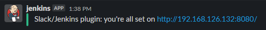{width="5.5625in"
height="0.6354166666666666in"}

 

**Step 4**

For each Project that you would like receive notifications for, choose
**Configure** from the project\'s menu.

{width="2.46875in"
height="3.0416666666666665in"}

 

**Step 5**

Then you\'ll need to add **Slack Notifications** to the **Post-build
Actions** for this project.

{width="2.46875in"
height="2.1979166666666665in"}

 

**Step 6**

In the **Slack Notifications** section, choose the events you\'d like to
be notified about.

{width="5.0in"
height="3.2708333333333335in"}

 

 

 

 

 

 

Now, we will create Shared Libraries to customize the message to send to
slack.

 

1\. Go to your Jenkins dashboard and click on \"Manage Jenkins\".

2\. Click on \"Configure System\".

3\. Scroll down to the \"Global Pipeline Libraries\" section and click
on the \"Add\" button.

4\. In the \"Name\" field, enter a name for your library (for example,
\"slack-library\").

5\. In the \"Default Version\" field, enter the default version of your
library (for example, \"main\").

6\. In the \"Modern SCM\" section, select the source code management
system you are using for your library (for example, \"Git\").

7\. Enter the repository URL for your library in the \"Project
Repository\" field (for example, \"
<https://github.com/myusername/my-slack-library.git>\").

8\. Click on \"Save\" to save your changes.

 

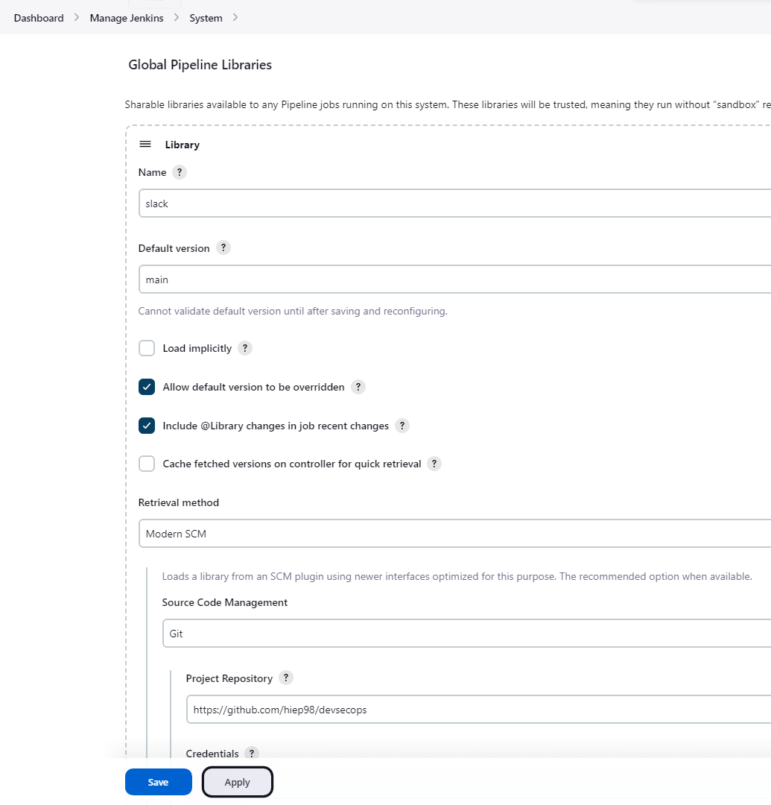{width="6.802083333333333in"
height="7.09375in"}

 

 

Now, you can use your new global pipeline library in your Jenkins
pipelines to send custom messages to Slack. You need add
\@Library(\'slack\') \_ on the top of jenkins pipeline and here is
script.

 

 

 

\@Library(\'slack\') \_

 

 

 

always {

sendNotification currentBuild.result

}

}

 

This is a Jenkinsfile that uses a shared library called 'slack' and
sends a notification with the current build result.

The '@Library' annotation is used to specify the name of the shared
library to use. The underscore character ('\_') specifies the default
version of the library to use.

 

The 'always' block is a pipeline step that will always be executed
regardless of whether the previous steps have failed or succeeded. It
sends a notification with the current build result using the
'sendNotification' function.

 

The \'currentBuild.result\' variable is used to access the result of the
current build in Jenkins. It can be used to determine if there were any
test failures or if the build was successful.

For example, in your Jenkinsfile, you are using the 'sendNotification'
function to send a notification with the current build result. The
'currentBuild.result' variable is used to get the result of the current
build and pass it as an argument to the 'sendNotification' function.

 

 

Now ew create file sendNotification.groovy in vars folder to custom
slack notification.

 

def call(String buildStatus = \'STARTED\') {

buildStatus = buildStatus ?: \'SUCCESS\'

def color

if (buildStatus == \'SUCCESS\') {

color = \'#47ec05\'

} else if (buildStatus == \'UNSTABLE\') {

color = \'#d5ee0d\'

} else {

color = \'#ec2805\'

}

def msg = \"\${buildStatus}: \`\${env.JOB_NAME}\`
#\${env.BUILD_NUMBER}:\\n\${env.BUILD_URL}\"

slackSend(color: color, message: msg)

}

 

This is a Groovy script file that includes a function called \"call\".
The function takes a string argument called \"buildstatus\" and if no
value is specified, it defaults to \"started\".

 

The function then checks the value of \"buildstatus\" and assigns a
color based on its value. If \"buildstatus\" is equal to \"success\",
then the color \"#47ec05\" is assigned. If \"buildstatus\" is equal to
\"unstable\", then the color \"#d5ee0d\" is assigned. Otherwise, the
color \"#ec2805\" is assigned.

 

The function then creates a message string that contains the value of
\`buildStatus\`, the name of the job (\`env.JOB_NAME\`), the build
number (\`env.BUILD_NUMBER\`) and the build URL (\`env.BUILD_URL\`)
using Groovy\'s string interpolation feature¹. Finally, it calls another
function named \`slackSend\` with two parameters: \`color\` and
\`message\`. The function sends a notification message to Slack with the
specified color and message.

You can see result below

 

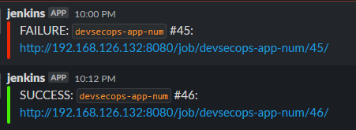{width="4.6875in" height="1.71875in"}

 

Reference: [Extending with Shared Libraries
(jenkins.io)](https://www.jenkins.io/doc/book/pipeline/shared-libraries/)

<https://e.printstacktrace.blog/jenkins-pipeline-environment-variables-the-definitive-guide/>

<https://stackoverflow.com/questions/39140191/how-to-send-slack-notification-after-a-jenkins-pipeline-build-failed>

 

 

Next, we go to with manual approve the Deployment to Production

 

stage(\'Prompte to PROD?\') {

steps {

timeout(time: 2, unit: \'DAYS\') {

input \'Do you want to Approve the Deployment to Production
Environment/Namespace?\'

}

}

}

 

This stage is a timeout step that waits for 2 days for a user input. The
user input is asking for approval to deploy the code to the production
environment or namespace. If the user approves the deployment within the
timeout period, the pipeline continues to the next stage, which is
likely a stage that triggers the actual deployment to production. If the
user does not approve the deployment within the timeout period, the
pipeline will fail because the deployment was not approved. This stage
adds an important layer of safety to the pipeline to ensure that code
changes are not accidentally or haphazardly deployed to production
without proper review and approval.

 

Now run build and you can you notification like below

![I I \< 48 Branch: --- Commit: Start Build Artifact Prompte to PROD? -
4m 35s @ 12m 44s Unit Tests Mutation Tests - Changes by nthiep1998
Started by GitHub push by hiep98 Docker Build and SonarQube - SAST
Pipeline Integration Tests - DEV Changes Tests OWASP ZAP - DAST Logout
Vulnerability Scan Dependency Scan OPA Conftest Tri\" scan Push
Vulnerability Scan - Kubernetes Kubesec Scan OPA scan Tri\" scan K8S
Deployment - DEV Deployment Rollout Status Prompte to PROD? End x 4m 35s
v Do you want to Approve the Deployment to Production
Environment/Namespace? --- Wait for interactive input Do you want to
Approve the Deployment to Production Environment/Namespace? Proceed
Abort ](./images/media/image34.png){width="8.625in"
height="3.2604166666666665in"}

 

You can select proceed and have slack notification like below

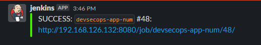{width="5.40625in" height="0.9375in"}

 

 

 

writing groovy code for jenkins about custom send notification slack in
vars folder


 

please writing code groovy jenkin custom slack notfication. If build
sucess, message is red corlor, else is blue

 

 

You can use the \*\*Slack Notification Plugin\*\* in Jenkins to send
notifications to a Slack channel after a build is completed. You can
also use \*\*Groovy Postbuild Plugin\*\* to send notifications when a
build fails¹³.

 

Here\'s an example of how you can send a notification to Slack using
Groovy:

 

\`\`\`groovy

def notifySlack(String buildStatus = \'STARTED\') {

// Build status of null means success

def color = buildStatus == \'STARTED\' ? \'good\' : \'danger\'

def message = buildStatus == \'STARTED\' ? \"Build started: Job
\${env.JOB_NAME} \[\${env.BUILD_NUMBER}\](\${env.BUILD_URL})\" : \"Build
failed: Job \${env.JOB_NAME}
\[\${env.BUILD_NUMBER}\](\${env.BUILD_URL})\"

slackSend (color: color, message: message)

}

\`\`\`

 

You can modify this code to change the color of the message. For
example, you can set it to red for success and blue for failure:

 

\`\`\`groovy

def notifySlack(String buildStatus = \'STARTED\') {

// Build status of null means success

def color = buildStatus == \'STARTED\' ? \'#FF0000\' : \'#0000FF\'

def message = buildStatus == \'STARTED\' ? \"Build started: Job
\${env.JOB_NAME} \[\${env.BUILD_NUMBER}\](\${env.BUILD_URL})\" : \"Build
failed: Job \${env.JOB_NAME}
\[\${env.BUILD_NUMBER}\](\${env.BUILD_URL})\"

slackSend (color: color, message: message)

}

\`\`\`

 

I hope this helps! Let me know if you have any other questions.

 

Source: Conversation with Bing, 4/8/2023(1) groovy - How to send Slack
notification after a Jenkins pipeline build \....
<https://stackoverflow.com/questions/39140191/how-to-send-slack-notification-after-a-jenkins-pipeline-build-failed>
Accessed 4/8/2023.

\(2\) Jenkins - Unable to send slack notifications using Groovy
postbuild \....
<https://stackoverflow.com/questions/53572838/jenkins-unable-to-send-slack-notifications-using-groovy-postbuild-plugin>
Accessed 4/8/2023.

\(3\) Slack Notification Plugin.
<https://www.jenkins.io/doc/pipeline/steps/slack/> Accessed 4/8/2023.

\(4\) groovy - Notify slack user from Jenkins pipeline when build fails
\....
<https://stackoverflow.com/questions/62127056/notify-slack-user-from-jenkins-pipeline-when-build-fails>
Accessed 4/8/2023.

 

 

 

CIS benchmark with kube-bench


 

 

Kube-bench is an open-source tool that helps you assess the security of
your Kubernetes cluster by running checks against the Center for
Internet Security (CIS) Kubernetes benchmark. The CIS Kubernetes
benchmark is a set of security best practices that can help you harden
your Kubernetes cluster.

 

Overview kube-bench:

[Kube-Bench: Kubernetes CIS Benchmarking Tool \[Guide\]
(devopscube.com)](https://devopscube.com/kube-bench-guide/)

Overview cis benchmark:

<https://www.cisecurity.org/benchmark/kubernetes>

**Specifying the benchmark or Kubernetes version**

kube-bench uses the Kubernetes API, or access to the kubectl or kubelet
executables to try to determine the Kubernetes version, and hence which
benchmark to run. If you wish to override this, or if none of these
methods are available, you can specify either the Kubernetes version or
CIS Benchmark as a command line parameter.

You can specify a particular version of Kubernetes by setting the
\--version flag or with the KUBE_BENCH_VERSION environment variable. The
value of \--version takes precedence over the value of
KUBE_BENCH_VERSION.

For example, run kube-bench using the tests for Kubernetes version 1.13:

kube-bench \--version 1.13

You can specify \--benchmark to run a specific CIS Benchmark version:

kube-bench \--benchmark cis-1.5

 

 

 

kube-bench uses the Kubernetes API, or access to the kubectl or kubelet
executables to try to determine the Kubernetes version, and hence which
benchmark to run. If you wish to override this, or if none of these
methods are available, you can specify either the Kubernetes version or
CIS Benchmark as a command line parameter.

 

You can specify a particular version of Kubernetes by setting the
\--version flag or with the KUBE_BENCH_VERSION environment variable. The
value of \--version takes precedence over the value of
KUBE_BENCH_VERSION.

 

For example, run kube-bench using the tests for Kubernetes version 1.17:

kube-bench \--version=1.17.0

 

You can get current kubernetes version with command: kubectl version

And check Git Version value.

**Note:** It is an error to specify both \--version and \--benchmark
flags together

**Specifying Benchmark sections**

If you want to run specific CIS Benchmark sections (i.e master, node,
etcd, etc\...) you can use the run \--targets subcommand.

kube-bench run \--targets master,node

Or

kube-bench run \--targets master,node,etcd,policies

If no targets are specified, kube-bench will determine the appropriate
targets based on the CIS Benchmark version and the components detected
on the node. The detection is done by verifying which components are
running, as defined in the config files (see
[Configuration](https://github.com/aquasecurity/kube-bench/blob/main/docs/controls.md#configuration-and-variables).

Reference:
<https://github.com/aquasecurity/kube-bench/blob/main/docs/flags-and-commands.md>

Kube-bench will run a series of checks against your Kubernetes cluster
and report any security issues that it finds. You can use this
information to harden your Kubernetes cluster and improve its security
posture.

The mapping between kube-bench and CIS Benchmark versions is as follows:

<https://github.com/aquasecurity/kube-bench/blob/main/docs/platforms.md#cis-kubernetes-benchmark-support>

If you are running a newer version of Kubernetes, you can use the latest
version of kube-bench. If you are running an older version of
Kubernetes, you can use the corresponding version of kube-bench.

 

 

what about \--check flag, difference between \--benchmark flag and
\--check flag ?

The \--benchmark flag specifies the CIS Kubernetes benchmark version
that kube-bench should use. The \--check flag specifies the individual
checks that kube-bench should run.

 

For example, to run kube-bench against the CIS Kubernetes benchmark
version 1.17.0 and only run the checks for authentication and
authorization, you would use the following command:

kube-bench \--benchmark=1.17.0 \--check=\"1.1,1.2\"

 

The \--benchmark flag is required, but the \--check flag is optional. If
you do not specify the \--check flag, kube-bench will run all of the
checks in the CIS Kubernetes benchmark.

Here is a table that summarizes the difference between the \--benchmark
flag and the \--check flag:

\| Flag \| Description \|

\--benchmark \| Specifies the CIS Kubernetes benchmark version that
kube-bench should use. \|

\--check \| Specifies the individual checks that kube-bench should run.
\|

 

 

Now, I will try run kube-bench for our project with docker.

docker run \--pid=host -v /etc:/etc:ro -v /var:/var:ro -v \$(which
kubectl):/usr/local/mount-from-host/bin/kubectl -v \~/.kube:/.kube -e
KUBECONFIG=/.kube/config -t docker.io/aquasec/kube-bench:latest run

 

This script runs kube-bench in Docker and checks whether Kubernetes is
deployed securely by running the checks documented in the CIS Kubernetes
Benchmark¹. The script runs kube-bench with the following parameters:

\- \`\--pid=host\`: This flag allows kube-bench to access the host\'s
PID namespace.

\- \`-v /etc:/etc:ro -v /var:/var:ro\`: These flags mount the host\'s
\`/etc\` and \`/var\` directories as read-only volumes inside the
container.

\- \`-v \$(which kubectl):/usr/local/mount-from-host/bin/kubectl\`: This
flag mounts the \`kubectl\` binary from the host into the container.

\- \`-v \~/.kube:/.kube -e KUBECONFIG=/.kube/config\`: These flags mount
the \`\~/.kube\` directory from the host into the container and set the
\`KUBECONFIG\` environment variable to \`/root/.kube/config\`.

\- \`-t docker.io/aquasec/kube-bench:latest\`: This specifies that
kube-bench should be run using the latest version of the Docker image
provided by Aqua Security.

 

 

 

And we have test results with each check list and Remediations

\[INFO\] 1 Master Node Security Configuration

\[INFO\] 1.1 Master Node Configuration Files

\[PASS\] 1.1.1 Ensure that the API server pod specification file
permissions are set to 644 or more restrictive (Automated)

\[PASS\] 1.1.2 Ensure that the API server pod specification file
ownership is set to root:root (Automated)

\[FAIL\] 1.1.12 Ensure that the etcd data directory ownership is set to
etcd:etcd (Automated)

 

== Remediations master ==

1.1.12 On the etcd server node, get the etcd data directory, passed as
an argument \--data-dir,

from the below command:

ps -ef \| grep etcd

Run the below command (based on the etcd data directory found above).

For example, chown etcd:etcd /var/lib/etcd

 

Now we will follow Remediations and run again to see the test results.

Useradd etcd

chown etcd:etcd /var/lib/etcd

docker run \--pid=host -v /etc:/etc:ro -v /var:/var:ro -v \$(which
kubectl):/usr/local/mount-from-host/bin/kubectl -v \~/.kube:/.kube -e
KUBECONFIG=/.kube/config -t docker.io/aquasec/kube-bench:latest run etcd
\--check 1.1.12

 

\[INFO\] 1 Master Node Security Configuration

\[INFO\] 1.1 Master Node Configuration Files

\[PASS\] 1.1.12 Ensure that the etcd data directory ownership is set to
etcd:etcd (Automated)

 

and this time we passed. Now I will create custom script to test certain
items for etcd, kubelet (node) and master. you can customize the
checklists you want to test or simply use kube-bench run to run all the
tests.

 

Create file *cis-etcd.sh*

 

*#!/bin/bash*

*#cis-etcd.sh*

*#total_fail=\$(kube-bench run \--targets etcd \--version 1.15 \--check
2.2 \--json \| jq .\[\].total_fail)*

total_fail=\$(docker run \--pid=host -v /etc:/etc:ro -v /var:/var:ro -v
\$(which kubectl):/usr/local/mount-from-host/bin/kubectl -v
\~/.kube:/.kube -e KUBECONFIG=/.kube/config -t
docker.io/aquasec/kube-bench:latest run ectd \--version 1.20 \--check
2.2 \--json \| jq \'.Totals.total_fail\')

fail_result=\$(docker run \--pid=host -v /etc:/etc:ro -v /var:/var:ro -v
\$(which kubectl):/usr/local/mount-from-host/bin/kubectl -v
\~/.kube:/.kube -e KUBECONFIG=/.kube/config -t
docker.io/aquasec/kube-bench:latest run ectd \--version 1.20 \--check
2.2)

if \[\[ \"\$total_fail\" -ne 0 \]\];

then

echo \"CIS Benchmark Failed ETCD while testing for 2.2\"

exit 1;

else

echo \"CIS Benchmark Passed for ETCD - 2.2\"

echo \$fail_result

fi;

 

In this script the \`\--check\` flag specifies which checks should be
run. In this case, \`\--check 2.2\` is used to check for compliance with
CIS Benchmark 2.2 The latest version of kube-bench is v0.6.6.

 

The specified \--targets \"ectd\" are not configured for the CIS
Benchmark cis-1.20, so you just need use *kube-bench run ectd* without
tag \--target.

 

Similarly, we continue to create the following files.

Create file *cis-kubelet.sh*

 

*#!/bin/bash*

*#cis-kubelet.sh*

*#total_fail=\$(kube-bench run \--targets node \--version 1.15 \--check
4.2.1,4.2.2 \--json \| jq .\[\].total_fail)*

total_fail=\$(docker run \--pid=host -v /etc:/etc:ro -v /var:/var:ro -v
\$(which kubectl):/usr/local/mount-from-host/bin/kubectl -v
\~/.kube:/.kube -e KUBECONFIG=/.kube/config -t
docker.io/aquasec/kube-bench:latest run \--targets node \--version 1.20
\--check 4.2.1,4.2.2 \--json \| jq \'.Totals.total_fail\')

fail_result=\$(docker run \--pid=host -v /etc:/etc:ro -v /var:/var:ro -v
\$(which kubectl):/usr/local/mount-from-host/bin/kubectl -v
\~/.kube:/.kube -e KUBECONFIG=/.kube/config -t
docker.io/aquasec/kube-bench:latest run \--targets node \--version 1.20
\--check 4.2.1,4.2.2 )

if \[\[ \"\$total_fail\" -ne 0 \]\];

then

echo \"CIS Benchmark Failed Kubelet while testing for 4.2.1, 4.2.2\"

exit 1;

else

echo \"CIS Benchmark Passed Kubelet for 4.2.1, 4.2.2\"

echo \$fail_result

fi;

 

 

Create file *cis-master.sh*

 

*#!/bin/bash*

*#cis-master.sh*

*#total_fail=\$(kube-bench master \--version 1.15 \--check
1.2.7,1.2.8,1.2.9 \--json \| jq .\[\].total_fail)*

total_fail=\$(docker run \--pid=host -v /etc:/etc:ro -v /var:/var:ro -v
\$(which kubectl):/usr/local/mount-from-host/bin/kubectl -v
\~/.kube:/.kube -e KUBECONFIG=/.kube/config -t
docker.io/aquasec/kube-bench:latest run \--targets master \--version
1.20 \--check 1.2.7,1.2.8,1.2.9 \--json \| jq \'.Totals.total_fail\')

fail_result=\$(docker run \--pid=host -v /etc:/etc:ro -v /var:/var:ro -v
\$(which kubectl):/usr/local/mount-from-host/bin/kubectl -v
\~/.kube:/.kube -e KUBECONFIG=/.kube/config -t
docker.io/aquasec/kube-bench:latest run \--targets master \--version
1.20 \--check 1.2.7,1.2.8,1.2.9 )

if \[\[ \"\$total_fail\" -ne 0 \]\];

then

echo \"CIS Benchmark Failed MASTER while testing for 1.2.7, 1.2.8,
1.2.9\"

exit 1;

else

echo \"CIS Benchmark Passed for MASTER - 1.2.7, 1.2.8, 1.2.9\"

echo \$fail_result

fi;

 

 

Add stage below into jenkins file

 

stage(\'K8S CIS Benchmark\') {

steps {

script {

parallel(

\"Master\": {

sh \"bash cis-master.sh\"

},

\"Etcd\": {

sh \"bash cis-etcd.sh\"

},

\"Kubelet\": {

sh \"bash cis-kubelet.sh\"

}

)

}

}

}

 

Run build pipeline file.

 

 

Istio service mesh - Production deployment


 

 

# Istio architecture

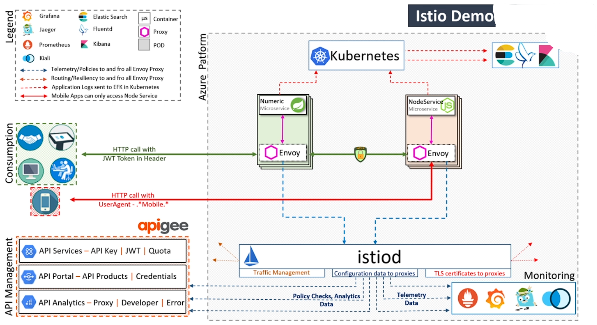{width="7.291666666666667in"
height="3.9791666666666665in"}

 

Overview:

Istio is an open-source service mesh platform that provides a unified
control plane for managing microservices. Istio enables developers to
add advanced traffic management, security, and observability to their
microservices without requiring changes to the application code.

 

Reference:

[Giới thiệu Istio - Istio là gì
(devopsvn.tech)](https://devopsvn.tech/service-mesh-on-kubernetes/gioi-thieu-istio-istio-la-gi)

 

Application architecture:

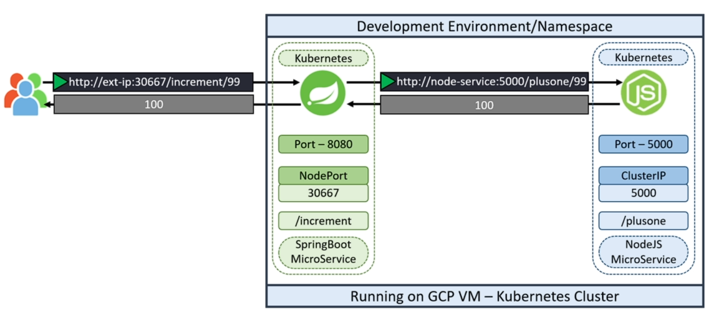{width="6.927083333333333in"
height="3.2395833333333335in"}

 

 

# Istio Installation

curl -Ls <https://istio.io/downloadIstio> \| ISTIO_VERSION=1.17.2 sh -

cd istio-1.17.2

export PATH=\$PWD/bin:\$PATH

istioctl install \--set profile=demo -y && kubectl apply -f
samples/addons

 

Check all node,pod,svc in istio namespace:

kubectl -n istio-system get all

 

 

You can access services inside istio using a web browser by modifying
the svc in istio from clusterIP to nodeport with command below.

kubectl -n istio-system edit svc kiali

 

However, this approach is not recommended in a practical environment.

Another way is using port-forwarding. You can create script like below.

 

port-forwarding.sh

kubectl -n istio-system port-forward deploy/kiali 20001:20001 \--address
192.168.207.129 &

kubectl -n istio-system port-forward deploy/grafana 3000:3000 \--address
192.168.207.129 &

kubectl -n istio-system port-forward deploy/prometheus 9090:9090
\--address 192.168.207.129 &

kubectl -n istio-system port-forward deploy/jaeger 16686:16686
\--address 192.168.207.129 &

 

 

Now, we create bash shell file to setup production enviroment

 

*#!/bin/bash*

*\# Set the namespace name*

namespace=\"prod\"

*\# Check if the namespace exists*

if kubectl get namespace \"\${namespace}\" \> /dev/null 2\>&1; then

*\# Check if the namespace has the istio-injection label*

if ! kubectl get namespace \"\${namespace}\" -o
jsonpath=\'{.metadata.labels.istio-injection}\' \| grep -q enabled; then

*\# Add the istio-injection label to the namespace*

kubectl label namespace \"\${namespace}\" istio-injection=enabled

*\# Restart all deployments in the namespace to apply the label*

kubectl rollout restart deployment -n \"\${namespace}\"

else

echo \"namespace \${namespace} already has istio-injection label\"

fi

else

*\# Create the namespace and add the istio-injection label*

kubectl create namespace \"\${namespace}\"

kubectl label namespace \"\${namespace}\" istio-injection=enabled

fi

*\# Get the name and tag of the Docker image*

image_info=\$(docker images \--format \'{{.Repository}}:{{.Tag}}\' \|
grep -i node-service)

if \[ -n \"\${image_info}\" \]; then

image_name=\$(echo \"\${image_info}\" \| cut -d \':\' -f 1)

image_tag=\$(echo \"\${image_info}\" \| cut -d \':\' -f 2)

*\# Check if the deployment already exists*

if ! kubectl get deployment node-app -n \"\${namespace}\" \> /dev/null
2\>&1; then

*\# Create the deployment with 2 replicas and the specified image*

kubectl create deployment node-app \--image
\"\${image_name}:\${image_tag}\" \--replicas 2 -n \"\${namespace}\"

else

echo \"deployment node-app already exists\"

fi

*\# Check if the service already exists*

if ! kubectl get service node-service -n \"\${namespace}\" \> /dev/null
2\>&1; then

*\# Create a service for the deployment on port 5000*

kubectl expose deployment node-app \--name node-service \--port 5000 -n
\"\${namespace}\"

else

echo \"service node-service already exists\"

fi

else

echo \"Docker image for node-service does not exist\"

fi

 

 

The source code below is a shell script that performs the following
tasks:

 

\- It checks if the namespace prod exists in the Kubernetes cluster
using the kubectl command. A namespace is a way to group and isolate
resources within a cluster.

\- If the namespace prod exists, it checks if the label
istio-injection=enabled exists in the namespace. A label is a key-value
pair that can be attached to any resource for identification and
selection. Istio is a service mesh that provides traffic management,
security and observability for microservices. The label
istio-injection=enabled enables automatic sidecar injection for the pods
in the namespace. A sidecar is a container that runs alongside the main
application container and provides additional functionality such as
proxying, logging and monitoring.

\- If the label istio-injection=enabled does not exist in the namespace
prod, it adds the label using the kubectl command.

\- If the namespace prod does not exist, it creates the namespace using
the kubectl command and adds the label istio-injection=enabled to it.

\- It gets the name of the Docker image node-service using the docker
command. A Docker image is a packaged version of an application and its
dependencies that can run on any platform that supports Docker.
Node-service is an example of a Node.js application that serves HTTP
requests on port 5000.

\- It checks if the Docker image node-service exists by checking if the
image name is not empty.

\- If the image exists, it gets the image tag using the docker command.
A tag is a way to identify a specific version of an image.

\- It creates a deployment and a service for the image using the kubectl
command. A deployment is a resource that manages a set of pods that run
the same image and can be scaled up or down. A service is a resource
that exposes a set of pods to other pods or external clients using a
stable IP address and port number.

\- It specifies the namespace prod, the image name and tag, and the
number of replicas (2) for the deployment. It also specifies the name
(node-service), the port (5000) and the type (ClusterIP) for the
service. ClusterIP means that the service is only accessible within the
cluster.

\- If the image does not exist, it prints an message.

 

 

You can manual check and apply istio-injection following below command:

sudo kubectl get all -n prod

sudo kubectl label ns prod istio-injection=enabled

sudo kubectl get ns \--show-labels

kubectl rollout restart deployment node-app -n prod

 

Next. We create yaml file to deploy application to production
enviroment.

k8s_PROD-deployment_service.yaml

 

apiVersion: apps/v1

kind: Deployment

metadata:

labels:

app: devsecops

name: devsecops

spec:

replicas: 3

selector:

matchLabels:

app: devsecops

strategy: {}

template:

metadata:

labels:

app: devsecops

spec:

serviceAccountName: default

volumes:

\- name: vol

emptyDir: {}

containers:

\- image: replace

name: devsecops-container

volumeMounts:

\- mountPath: /tmp

name: vol

securityContext:

capabilities:

drop:

\- NET_RAW

runAsUser: 100

runAsNonRoot: true

readOnlyRootFilesystem: true

allowPrivilegeEscalation: false

resources:

requests:

memory: \"256Mi\"

cpu: \"200m\"

limits:

memory: \"512Mi\"

cpu: \"500m\"

\-\--

apiVersion: v1

kind: Service

metadata:

labels:

app: devsecops

name: devsecops-svc

spec:

ports:

\- port: 8080

protocol: TCP

targetPort: 8080

selector:

app: devsecops

type: ClusterIP

 

The resources section in the YAML file specifies the resource
requirements and limits for the container. In this case, the container
has a request of 256Mi memory and 200m CPU. This means that Kubernetes
will try to schedule the container on a node that has at least 256Mi
memory and 200m CPU available. If there are no nodes with enough
resources available, the container will remain in a pending state.

The container also has a limit of 512Mi memory and 500m CPU. This means
that the container will not be allowed to use more than 512Mi memory and
500m CPU even if more resources are available on the node.

 

Setting requests and limits is important for a number of reasons. First,
it helps to ensure that your containers don\'t over-consume resources
and cause other containers to fail. Second, it can help to improve the
performance of your applications by ensuring that they have the
resources they need to run efficiently. Third, it can help to prevent
your applications from being killed by Kubernetes if they try to use too
many resources.

 

A securityContext that takes away the NET_RAW capability from our
application can help us avoid dns spoofing.

Reference: <https://blog.aquasec.com/dns-spoofing-kubernetes-clusters>

 

 

Next, Create file k8s-PROD-deployment-rollout-status.sh like

 

*#!/bin/bash*

sleep 60s

if \[\[ \$(kubectl -n prod rollout status deploy \${deploymentName}
\--timeout 5s) != \*\"successfully rolled out\"\* \]\];

then

echo \"Deployment \${deploymentName} Rollout has Failed\"

kubectl -n prod rollout undo deploy \${deploymentName}

exit 1;

else

echo \"Deployment \${deploymentName} Rollout is Success\"

fi

 

 

 

 

Add k8s deployment production stage into Jenkins file

 

stage(\'K8S Deployment - PROD\') {

steps {

parallel(

\"Deployment\": {

withKubeConfig(\[credentialsId: \'kubeconfig\'\]) {

sh \"sed -i \'s#replace#\${imageName}#g\'
k8s_PROD-deployment_service.yaml\"

sh \"kubectl -n prod apply -f k8s_PROD-deployment_service.yaml\"

}

},

\"Rollout Status\": {

withKubeConfig(\[credentialsId: \'kubeconfig\'\]) {

sh \"bash k8s-PROD-deployment-rollout-status.sh\"

}

}

)

}

}

 

Run build. After build successful you can check connection like below.

 

 

 

# Istio PeerAuthentication

Next, we create PeerAuthentication istio-system with yaml file

 

peer-auth.yaml

 

apiVersion: security.istio.io/v1beta1

kind: PeerAuthentication

metadata:

name: default

namespace: istio-system

spec:

mtls:

mode: DISABLE

 

This YAML file is a configuration file for Istio\'s PeerAuthentication
resource, which is used to configure mutual TLS (mTLS) authentication
between services in an Istio service mesh. The file specifies the
following:

 

\- apiVersion: The version of the Istio security API being used.

\- kind: The type of Istio resource being defined, which is
PeerAuthentication in this case.

\- metadata: The metadata for the PeerAuthentication resource, which
includes the name of the resource (default) and the namespace in which
it is defined (istio-system).

\- spec: The specification for the PeerAuthentication resource, which
includes the mtls field that specifies the mTLS mode.

 

The mtls field specifies the mTLS mode for the PeerAuthentication
resource, which is set to DISABLE in this case. This means that mTLS
authentication is disabled for all services in the Istio service mesh.

In general, there are three mTLS modes that can be set for a
PeerAuthentication resource:

\- STRICT: All requests between services must use mTLS authentication.

\- PERMISSIVE: Requests between services can use either mTLS
authentication or plaintext (non-encrypted) communication.

\- DISABLE: mTLS authentication is disabled for all services in the
Istio service mesh.

The PeerAuthentication resource can be used to configure mTLS
authentication for specific services or for all services in the Istio
service mesh.

 

 

Run kubectl apply:

kubectl apply -f peer-auth.yaml -n istio-system

 

Check mtls mode:

sudo kubectl get pa -n istio-system

NAME MODE AGE

default DISABLE 9s

 

You can change mtls mode with command below:

kubectl edit pa -n istio-system

spec:

mtls:

mode: STRICT \# write mode you want

 

 

Reference:
<https://istio.io/latest/docs/reference/config/security/peer_authentication/>

 

 

 

We will run command below to test connection

sudo kubectl -n prod get svc

NAME TYPE CLUSTER-IP EXTERNAL-IP PORT(S) AGE

devsecops-svc ClusterIP 10.103.98.41 \<none\> 8080/TCP 148m

node-service ClusterIP 10.110.155.212 \<none\> 5000/TCP 148m

 

while true; do curl -s 10.103.98.41:8080/increment/99; echo; sleep 1;
done

 

You can go to kiali dashboard, select graph to know how connection
inside out application work.

PERMISSIVE MODE -we can see at the top there is a partially enabled TLS
text

 

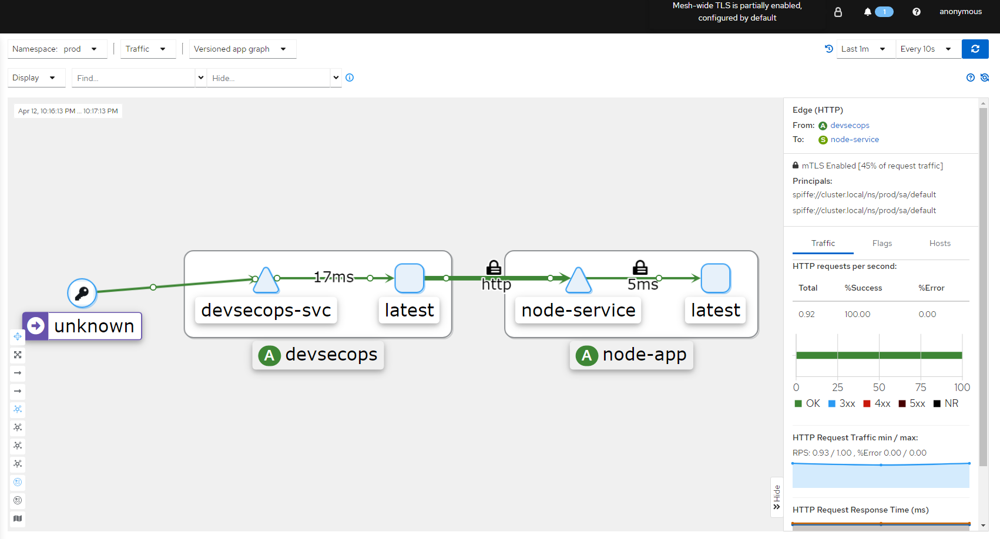{width="8.364583333333334in"
height="4.510416666666667in"}

 

DISABLE MODE -when we change the mode to disabled, traffic including
mtls will drop until all traffic is no longer encrypted

 

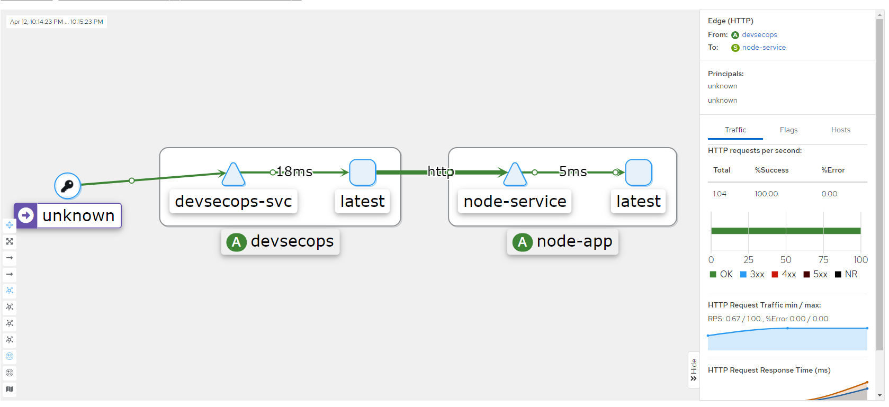{width="8.395833333333334in"
height="3.84375in"}

 

 

STRICT MODE: all traffic is encrypted, authenticated and does not allow
outside traffic to go inside

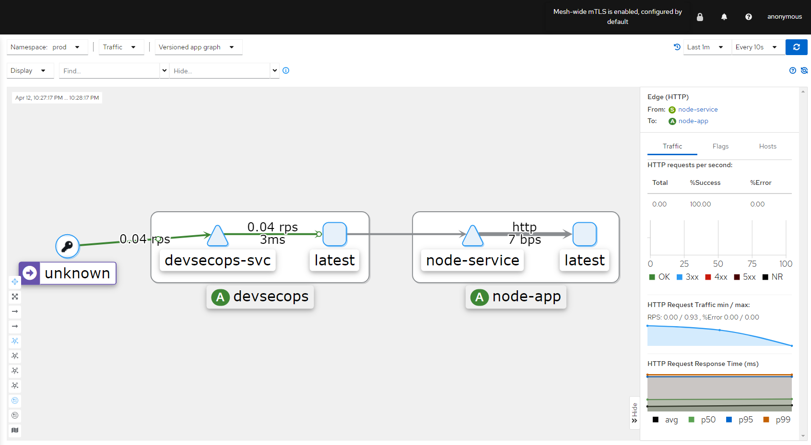{width="8.416666666666666in"
height="4.625in"}

 

And you can explore some more features of kiali like checking metrics,
traffic, logs of each deployment in the namespace of your choice.

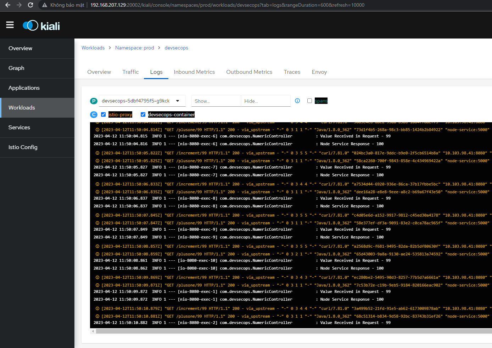{width="8.40625in"
height="5.958333333333333in"}

 

 

 

 

# ISTIO INGRESS

 

In Istio, an Ingress is a component that enables external traffic to
access services within the mesh. Istio Ingress provides traffic
management features such as load balancing, TLS termination, and
routing. It allows you to define rules for routing traffic to specific
services based on various criteria such as URL path, headers, and source
IP address.

 

A VirtualService, on the other hand, is a Kubernetes custom resource
that is used to define rules for how traffic should be routed to a
specific service within the Istio service mesh. It provides more
advanced traffic management features than Ingress, such as traffic
splitting, fault injection, and retries. With VirtualServices, you can
define rules to send traffic to different versions of a service or to
specific instances of a service based on various criteria such as HTTP
headers or source IP addresses.

 

In summary, Istio Ingress provides a way for external traffic to enter
the service mesh and provides basic routing capabilities, while
VirtualService provides more advanced traffic management features for
routing traffic within the mesh.

 

Reference:
<https://istio.io/latest/docs/tasks/traffic-management/ingress/ingress-control/>

<https://istio.io/latest/docs/reference/config/networking/virtual-service/>

 

Now we go to create istio ingress and virtualService according to the
yaml file below.

 

apiVersion: networking.istio.io/v1alpha3 *\# The API version for Istio
resources*

kind: Gateway *\# The kind of resource*

metadata: *\# The metadata for the resource*

name: devsecopsgateway *\# The name of the Gateway*

namespace: prod *\# The namespace where the Gateway is deployed*

spec: *\# The specification for the Gateway*

selector: *\# The selector for the Gateway*

istio: ingressgateway *\# The label of the Istio ingress gateway pod*

servers: *\# The list of servers for the Gateway*

\- port: *\# The port configuration for the server*

number: 80 *\# The port number*

name: http *\# The port name*

protocol: HTTP *\# The port protocol*

hosts: *\# The list of hosts for the server*

\- \"\*\" *\# A wildcard host that matches any domain*

\-\-- *\# The separator for the next document*

apiVersion: networking.istio.io/v1alpha3

kind: VirtualService

metadata:

name: devsecopsnumeric *\# The name of the VirtualService*

namespace: prod

spec: *\# The specification for the VirtualService*

hosts:

\- \'\*\'

gateways: *\# The list of gateways for the VirtualService*

\- devsecopsgateway *\# The name of the Gateway from the first document*

http: *\# The list of HTTP routes for the VirtualService*

\- match: *\# The list of match conditions for the route*

\- uri: *\# The URI match condition*

prefix: /increment *\# The URI prefix to match*

\- uri:

exact: / *\# The exact URI to match*

route: *\# The list of destinations for the route*

\- destination: *\# The destination configuration*

host: devsecopssvc *\# The host name of the destination service*

port:

number: 8080

 

This is a YAML file that contains two Kubernetes resources: a Gateway
and a VirtualService.

The Gateway resource is named devsecops-gateway and is of type
networking.istio.io/v1alpha3. It has a selector that specifies the Istio
ingress gateway as the default controller. It also has one server that
listens on port 80 and accepts HTTP traffic from any host.

The VirtualService resource is named devsecops-numeric and is also of
type networking.istio.io/v1alpha3. It specifies that all hosts should be
matched and that the gateway to use is devsecops-gateway. It also
specifies an HTTP route that matches URIs with prefix /increment or
exact URI / and sends traffic to a destination service named
devsecops-svc listening on port 8080.

 

URI prefix and exact URI are two different concepts in web development.
A URI is a string of characters that identifies a name or a resource on
the internet. A URI prefix is a matching method based on the prefix of
the URL path separated by the slash character. The matching is
case-sensitive and performed on each segment of the path. On the other
hand, an exact URI is a matching method that matches the entire URL
path, including the query parameters and the fragment identifier. In web
development, these concepts are used in routing and URL mapping to
direct incoming requests to the appropriate controller or handler. The
difference between URI prefix and exact URI is that URI prefix matches
the URL path based on the prefix of the path, while exact URI matches
the entire URL path, including the query parameters and the fragment
identifier.

 

 

kubectl get vs,gateway -n prod

NAME GATEWAYS HOSTS AGE

virtualservice.networking.istio.io/devsecops-numeric
\[\"devsecops-gateway\"\] \[\"\*\"\] 6d23h

NAME AGE

gateway.networking.istio.io/devsecops-gateway 6d23h

 

kubectl -n istio-system get svc istio-ingressgateway

NAME TYPE CLUSTER-IP EXTERNAL-IP PORT(S)

istio-ingressgateway LoadBalancer 10.99.213.128 \<pending\>
15021:30561/TCP,80:30886/TCP,443:32190/TCP,31400:32600/TCP,15443:30266/TCP

 

 

Now we try curl to test connection

curl localhost:30886/increment/22

23

 

curl localhost:30886/

Kubernetes DevSecOps

 

We can use bash below and open kiali to see connection inside

while true; do curl -s localhost:30886/increment/22; echo; sleep 1; done

 

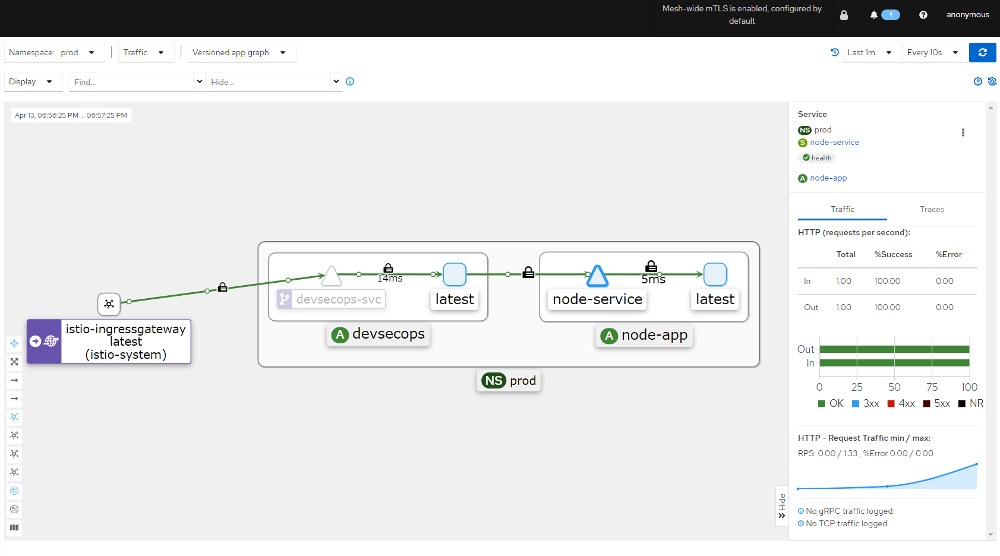{width="8.072916666666666in"
height="4.489583333333333in"}

 

If we remove url extract in virtualService

\- uri:

exact: /

 

By using kubectl edit vs -n prod In file and run curl localhost:30886/
to test connection again, we cannot receive response.

 

 

K8s monitoring


 

 

# PROMETHEUS - GRAFANA

 

 

istio_requests_total is a COUNTER that aggregates request totals between
Kubernetes workloads, and groups them by response codes, response flags
and security policy. It is used to record the total number of requests
handled by an Istio proxy. This metric is available only for HTTP,
HTTP/2, and GRPC traffic. For TCP traffic there is no requests_total
metric because it would be hard to say what to define as a request³.

 

 

{width="10.760416666666666in"
height="5.333333333333333in"}

 

 

Reference:

<https://istio.io/latest/zh/docs/reference/config/metrics/>.

<https://istio.io/latest/docs/tasks/observability/metrics/querying-metrics/>

 

 

 

In grafana, Go to istio - Istio Workload Dashboard

 

Run bash script below to test connection

while true; do curl -s localhost:30886/increment/22; sleep 1; done

 

And you can see metric display in dashboard like below

![c A 88 istio Khöng béo mgt / Istio Workload Dashboard = 1 1m
destination Q O datasource default v General v Inbound Workloads 1
ops\'s 0.750 ops\'s 0.500 ops\'s 0.250 ops\'s O ops\'s Namespace prod
Workload devsecops Reporter Inbound Workload Namespace All Inbound
Workload All Destination Service WORKLOAD: devsecops.prod Incoming
Success Rate (non-5xx responses) 100% INBOUND WORKLOADS 100% 75% 25% ---
istio-ingressgateway.istio-system (\"mTLS) All 19:34 @ Last 5 minutes
Request Duration Incoming Request Volume ops/s 19:35 19:36 19:37 19:38
TCP server Traffic N/A Incoming Requests By Source And Response Code TCP
Client Traffic N/A Incoming Success Rate (non-5xx responses) By Source
--- istio-ingressgateway.istio-system : 200 (\'mTLS) ---
istio-ingressgateway_istio-system : 500 (d mTLS)
](./images/media/image44.png){width="8.46875in" height="4.34375in"}

 

 

 

# FALCO

 

Falco is the open source standard for runtime security for hosts,
containers, Kubernetes and the cloud. Get real-time visibility into
unexpected behaviors, config changes, intrusions, and data theft.

 

 

Install falco:

<https://falco.org/docs/getting-started/installation/>

 

Run falco:

falco

 

Now we try create nginx and execute bash in nginx to test falco:

 

sudo kubectl run nginx \--image nginx

pod/nginx created

 

sudo kubectl get pod nginx

NAME READY STATUS RESTARTS AGE

nginx 1/1 Running 0 13s

 

sudo kubectl exec -it nginx \-- bash

![root@dai : / home/ dai \$ Thu Thu Thu Thu Thu Thu Thu Thu Apr Apr Apr
Apr Apr Apr Apr Apr 13 13 13 13 13 13 13 13 16 : 25 : 03 16 : 25 : 03
16:35: 10.331044274 : falco : Falco version: 8.34.1 (x86_64) 2023 Falco
initialized with configuration file: /etc/fatco/fatco.yamt 2023 : :
Loading rules from file /etc/fatco/fatco_rutes.yamt 2023 : Loading rules
from file /etc/fatco/fatco_rutes. local.yamt 2023 : The chosen syscatt
buffer dimension is: 8388608 bytes (8 MBs) 2023 Starting health
webserver with threadiness 8, listening on port 8765 2023 : Enabled
event sources: syscatt 2023 : Opening capture with Kernel module 2023 :
Error File below a monitored di rectory opened for writing (user=root
command=nano / usr/tocat/bin/startup_script.sh pid=206288
file=/usr/tocat/bin/ .startup_script.sh.swp parent=sudo pcmdtine=sudo
nano /usr/ local/bin/startup_script.sh gparent=sudo container_id=host
image=\<NA\>) Notice A shell was spawned in a container with an attached
terminal (user=root k8s_ng (id=aaeab9af4dbd) shen=bash parent=runc
cmdtine=bash pid=210334 terninat=34816 container_id=aaeab9af4dbd
image=nginx) ](./images/media/image45.png){width="10.28125in"
height="3.71875in"}

 

Comeback falco and we see alert a shell was spawned.

 

And we can see rule list in falco_rules.yaml

cat /etc/falco/falco_rules.yaml \| grep -i \"A shell was spawned in a
container with an attached terminal\"

A shell was spawned in a container with an attached terminal
(user=%user.name user_loginuid=%user.loginuid %container.info

 

 

 

cat /etc/falco/falco_rules.yaml \| grep -i \"A shell was spawned in a
container with an attached terminal\" -A15 -B20

\- rule: System user interactive

desc: an attempt to run interactive commands by a system (i.e.
non-login) user

condition: spawned_process and system_users and interactive and not
user_known_system_user_login

output: \"System user ran an interactive command (user=%user.name
user_loginuid=%user.loginuid command=%proc.cmdline pid=%proc.pid
container_id=%container.id image=%container.image.repository)\"

priority: INFO

tags: \[host, container, users, mitre_execution, T1059\]

*\# In some cases, a shell is expected to be run in a container. For
example, configuration*

*\# management software may do this, which is expected.*

\- macro: user_expected_terminal_shell_in_container_conditions

condition: (never_true)

\- rule: Terminal shell in container

desc: A shell was used as the entrypoint/exec point into a container
with an attached terminal.

condition: \>

spawned_process and container

and shell_procs and proc.tty != 0

and container_entrypoint

and not user_expected_terminal_shell_in_container_conditions

output: \>

A shell was spawned in a container with an attached terminal
(user=%user.name user_loginuid=%user.loginuid %container.info

shell=%proc.name parent=%proc.pname cmdline=%proc.cmdline pid=%proc.pid
terminal=%proc.tty container_id=%container.id
image=%container.image.repository)

priority: NOTICE

tags: \[container, shell, mitre_execution, T1059\]

*\# For some container types (mesos), there isn\'t a container image to*

*\# work with, and the container name is autogenerated, so there isn\'t*

*\# any stable aspect of the software to work with. In this case, we*

*\# fall back to allowing certain command lines.*

\- list: known_shell_spawn_cmdlines

items: \[

\'\"sh -c uname -p 2\> /dev/null\"\',

\'\"sh -c uname -s 2\>&1\"\',

\'\"sh -c uname -r 2\>&1\"\',

\'\"sh -c uname -v 2\>&1\"\',

 

This command displays the same lines as the first command but also
includes the 15 lines after and 20 lines before the line containing the
text. This is useful for understanding the context of the rule, as it
also shows the related rules and conditions, such as the
\"user_expected_terminal_shell_in_container_conditions\" macro, which
defines the conditions when a shell in a container is expected and
should not trigger the rule. The command also includes the list of known
command lines that are allowed for some container types.

 

The falco rules listed are used to monitor and alert on certain events
happening within a containerized environment.

The first rule, \"System user interactive\", is triggered when a
non-login system user attempts to run interactive commands. The
condition for this rule to trigger is when a process is spawned, the
user is a system user, the command is interactive, and the user is not a
known system user login. The output of this rule includes information
such as the user name, login UID, command, process ID, container ID, and
container image repository. The priority for this rule is set to INFO
and the associated tags include host, container, users, mitre_execution,
and T1059.

The second rule, \"Terminal shell in container\", is triggered when a
shell is used as the entry point or execution point within a container
that has an attached terminal. The conditions for this rule include the
spawning of a process within a container, the process is a shell
process, the process has a TTY attached, the container has an entry
point, and the user did not expect a terminal shell in the container.
The output of this rule includes information such as the user name,
login UID, container information, shell process name, parent process
name, command line, process ID, terminal, container ID, and container
image repository. The priority for this rule is set to NOTICE and the
associated tags include container, shell, mitre_execution, and T1059.

Lastly, the rule defines a list of known shell spawn command lines that
are allowed for certain container types where there is no container
image to work with or where the container name is autogenerated.

 

 

Reference:

<https://falco.org/docs/rules/>

 

 

 

HELM - FALCO

 

curl <https://baltocdn.com/helm/signing.asc> \| gpg \--dearmor \| sudo
tee /usr/share/keyrings/helm.gpg \> /dev/null

sudo apt-get install apt-transport-https \--yes

echo \"deb \[arch=\$(dpkg \--print-architecture)
signed-by=/usr/share/keyrings/helm.gpg\]
<https://baltocdn.com/helm/stable/debian/> all main\" \| sudo tee
/etc/apt/sources.list.d/helm-stable-debian.list

sudo apt-get update

sudo apt-get install helm

 

 

Install falco-falcosidekick:

 

kubectl create namespace falco

helm repo add falcosecurity <https://falcosecurity.github.io/charts>

helm repo update

 

helm install falco falcosecurity/falco \\

\--set falcosidekick.enabled=true \\

\--set falcosidekick.webui.enabled=true \\

-n falco

 

Or

 

helm install falco falcosecurity/falco \--set ebpf.enabled=true \--set
falcosidekick.enabled=true \--set falcosidekick.webui.enabled=true

 

 

If you see falco UI error, you can create PV, PVC file.

 

PersistentVolume.yaml

apiVersion: v1

kind: PersistentVolume

metadata:

name: falcosidekick-ui-redis-data-pv

spec:

capacity:

storage: 1Gi

accessModes:

\- ReadWriteOnce

persistentVolumeReclaimPolicy: Retain

storageClassName: manual

hostPath:

path: \"/mnt/data\"

 

PersistentVolumeClaim.yaml

apiVersion: v1

kind: PersistentVolumeClaim

metadata:

name: falco-falcosidekick-ui-redis-data-falco-falcosidekick-ui-redis-0

spec:

accessModes:

\- ReadWriteOnce

resources:

requests:

storage: 1Gi

storageClassName: manual

 

 

kubectl apply -f persistentVolume.yaml -n falco

kubectl apply -f persistentVolumeClaim.yaml -n falco

 

or

kubectl create pv \-- falco-falcosidekick-ui-redis-data \--capacity 1Gi
\--storage-class standard

kubectl create pvc \--name
falco-falcosidekick-ui-redis-data-falco-falcosidekick-ui-redis-0
\--claim-name
falco-falcosidekick-ui-redis-data-falco-falcosidekick-ui-redis-0
\--storage-class standard

 

If pv and pvc not bound, update pvc spec

kubectl patch pvc
falco-falcosidekick-ui-redis-data-falco-falcosidekick-ui-redis-0 -p
\'{\"spec\": {\"volumeName\": \"falcosidekick-ui-redis-data-pv\"}}\' -n
falco

 

 

Check bound status

kubectl -n falco describe pvc
falco-falcosidekick-ui-redis-data-falco-falcosidekick-ui-redis-0

 

Port-forwarding:

kubectl -n falco port-forward deploy/falco-falcosidekick-ui 2802:2802
\--address 192.168.207.129

 

Login falco-UI with user,password: admin

 

{width="7.6875in"
height="3.7604166666666665in"}

 

 

Falco Slack Notifications


 

Go to <https://api.slack.com/apps>

Select incoming webhooks

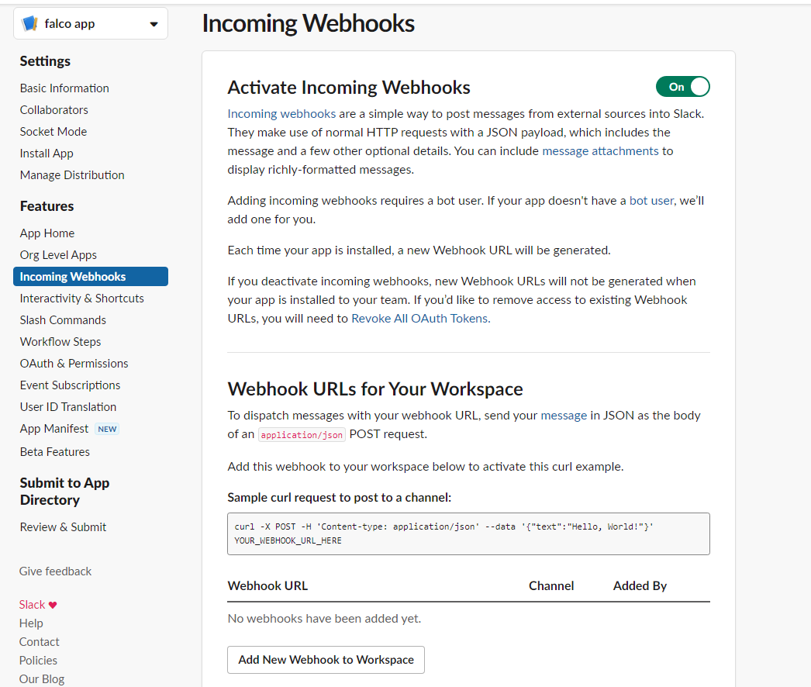{width="6.989583333333333in"
height="5.916666666666667in"}

 

Select add new webhook to workspace

{width="6.947916666666667in"
height="4.677083333333333in"}

 

Select chaneel and allow

 

 

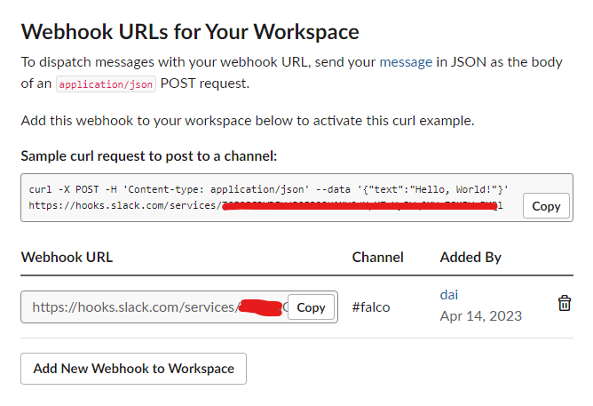{width="6.958333333333333in"
height="4.75in"}

 

We can copy sample curl to test connection and update webhook-url into
falco.

 

helm upgrade falco falcosecurity/falco \\

\--set falcosidekick.enabled=true \\

\--set falcosidekick.webui.enabled=true \\

\--set
falcosidekick.config.slack.webhookurl=\"https://hooks.slack.com/services/\<ID\>\"
\\

-n falco

 

Execute shell nginx to test notification:

kubectl exec -it nginx \-- sh

 

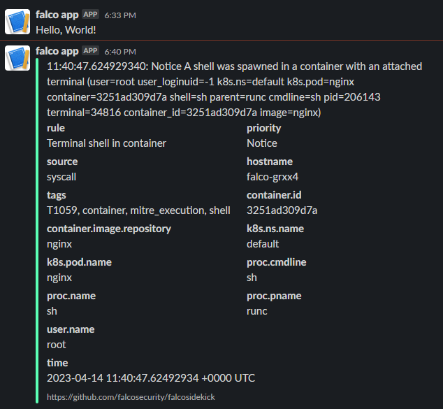{width="6.59375in" height="6.09375in"}

 

 

 

Kubescan


 

 

Kube-Scan gives a risk score, from 0 (no risk) to 10 (high risk) for
each workload. The risk is based on the runtime configuration of each
workload (currently 20+ settings). The exact rules and scoring formula
are part of the open-source framework KCCSS, the Kubernetes Common
Configuration Scoring System.

 

KCCSS is similar to the Common Vulnerability Scoring System (CVSS), the
industry-standard for rating vulnerabilities, but instead focuses on the
configurations and security settings themselves. Vulnerabilities are
always detrimental, but configuration settings can be insecure, neutral,
or critical for protection or remediation. KCCSS scores both risks and
remediations as separate rules, and allows users to calculate a risk for
every runtime setting of a workload and then to calculate the total risk
of the workload.

 

Source:

<https://github.com/octarinesec/kube-scan>

 

 

Install kubesec in k8s:

 

kubectl apply -f
<https://raw.githubusercontent.com/sidd-harth/kubernetes-devops-security/main/kube-scan.yaml>

 

 

kubectl -n kube-scan get all

NAME READY STATUS RESTARTS AGE

pod/kube-scan-79d8f5cd7c-q6r4v 2/2 Running 10 5d23h

 

NAME TYPE CLUSTER-IP EXTERNAL-IP PORT(S) AGE

service/kube-scan-ui ClusterIP 10.111.116.27 \<none\> 80/TCP 5d23h

 

NAME READY UP-TO-DATE AVAILABLE AGE

deployment.apps/kube-scan 1/1 1 1 5d23h

 

NAME DESIRED CURRENT READY AGE

replicaset.apps/kube-scan-79d8f5cd7c 1 1 1 5d23h

 

 

kubectl port-forward \--namespace kube-scan svc/kube-scan-ui 8081:80

 

Go to dashboard and we can see RISK and REMEDIATION

{width="8.114583333333334in"
height="4.947916666666667in"}

 

 

 

Integration test production


 

This stage same Intergration test before.

 

*#!/bin/bash*

sleep 5s

*\# echo \"ok\"*

*\# PORT=\$(kubectl -n prod get svc \${serviceName} -o json \| jq
.spec.ports\[\].nodePort)*

*\### Istio Ingress Gateway Port 80 - NodePort*

PORT=\$(kubectl -n istio-system get svc istio-ingressgateway -o json \|
jq \'.spec.ports\[\] \| select(.port == 80)\' \| jq .nodePort)

 

echo \$PORT

echo \$applicationURL:\$PORT\$applicationURI

if \[\[ ! -z \"\$PORT\" \]\];

then

response=\$(curl -s \$applicationURL:\$PORT\$applicationURI)

http_code=\$(curl -s -o /dev/null -w \"%{http_code}\"
\$applicationURL:\$PORT\$applicationURI)

if \[\[ \"\$response\" == 100 \]\];

then

echo \"Increment Test Passed\"

else

echo \"Increment Test Failed\"

exit 1;

fi;

if \[\[ \"\$http_code\" == 200 \]\];

then

echo \"HTTP Status Code Test Passed\"

else

echo \"HTTP Status code is not 200\"

exit 1;

fi;

else

echo \"The Service does not have a NodePort\"

exit 1;

fi;

 

 

Add stage integration tests after stage k8s production deployment.

 

stage(\'Integration Tests - PROD\') {

steps {

script {

try {

withKubeConfig(\[credentialsId: \'kubeconfig\'\]) {

sh \"bash integration-test-PROD.sh\"

}

} catch (e) {

withKubeConfig(\[credentialsId: \'kubeconfig\'\]) {

sh \"kubectl -n prod rollout undo deploy \${deploymentName}\"

}

throw e

}

}

}

}

 

 

Custom jenkins alert


 

#  

>  

# Create jenkins bot

>  
>
> Go to <https://api.slack.com/apps> and select

-   Go to <https://api.slack.com/apps> and click \"Create New App\".

-   Pick an app name, i.e. \"Jenkins\" and a workspace that you\'ll be
    installing it to.

-   Click \"Create App\". This will leave you on the \"Basic
    Information\" screen for your new app.

-   Scroll down to \"Display Information\" and fill it out. You can get
    the Jenkins logo from: <https://jenkins.io/artwork/>.

-   Scroll back up to \"Add features and functionality\".

-   Click \"Permissions\" to navigate to the \"OAuth & Permissions\"
    page.

-   Scroll down to \"Scopes\". Under \"Bot Token Scopes\"

    1.  Add chat:write Scope.

    2.  (optional) Add files:write Scope if you will be uploading files.

    3.  (optional) Add chat:write.customize Scope if you will be sending
        messages with a custom username and/or avatar.

    4.  (optional) Add reactions:write Scope if you will be [adding
        reactions](https://plugins.jenkins.io/slack/#plugin-content-emoji-reactions).

    5.  (optional) Add users:read and users:read.email Scope if you will
        be [looking users up by
        email](https://plugins.jenkins.io/slack/#plugin-content-user-id-look-up).

```{=html}
<!-- -->
```
-   (optional) Click \"App Home\" in the sidebar

    1.  (optional) Edit the slack display name for the bot.

    2.  Return to the \"OAuth & Permissions\" page.

>  
>
> ![Scopes A Slack app\'s capabilities and permissions are governed by
> the scopes it requests. Bot Token Scopes Scopes that govern what your
> app can access. OAuth scope files:write chat:write
> chat:write.customize emoji:read reactions:read reactions:write Add an
> OAuth Scope Description Upload, edit, and delete files as jenkins Send
> messages as jenkins Send messages as jenkins with a customized
> username and avatar View custom emoji in a workspace View emoji
> reactions and their associated content in channels and conversations
> that jenkins has been added to Add and edit emoji reactions
> ](./images/media/image52.png){width="6.958333333333333in"
> height="7.53125in"}
>
>  
>
>  
>
> {width="6.78125in"
> height="4.927083333333333in"}
>
>  
>
> {width="6.96875in"
> height="3.2291666666666665in"}
>
>  

-   At the top of the page, click \"Install App to Workspace\". This
    will generate a \"Bot User OAuth Access Token\".

-   Copy the \"Bot User OAuth Access Token\".

>  
>
>  

-   {width="6.96875in"
    height="6.875in"}

>  

-   *On Jenkins*: Find the Slack configuration in \"Manage Jenkins →
    Configure System\".

    1.  *On Jenkins*: Click \"Add\" to create a new \"Secret text\"
        Credential with that token.

    2.  *On Jenkins*: Select the new \"Secret text\" in the dropdown.

    3.  *On Jenkins*: Make note of the \"Default channel / member id\".

    4.  *On Jenkins*: Tick the \"Custom slack app bot user\" option.

```{=html}
<!-- -->
```
-   Invite the Jenkins bot user into the Slack channel(s) you wish to be
    notified in.

>  
>
> {width="8.364583333333334in"
> height="3.4270833333333335in"}

-   *On Jenkins*: Click test connection. A message will be sent to the
    default channel / default member.

> 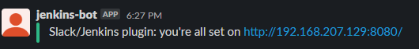{width="5.520833333333333in"
> height="0.65625in"}
>
> We will receive this notification if test connection sucess.
>
>  
>
> Read more:
> <https://plugins.jenkins.io/slack/#plugin-content-creating-your-app>
>
>  

# Custom alert with Block Kit Builder

>  
>
> Block Kit is a framework for building Slack messages that allows
> developers to create modular and flexible message layouts. Block Kit
> Builder provides a visual interface for creating and customizing Block
> Kit messages, making it easier for non-developers to create messages
> without writing any code.
>
>  
>
> <https://app.slack.com/block-kit-builder>
>
>  
>
>  

# Update vars/sendNotification.groovy

>  
>
> def call(String buildStatus = \'STARTED\') {
>
> buildStatus = buildStatus ?: \'SUCCESS\'
>
>  
>
> def color
>
>  
>
> if (buildStatus == \'SUCCESS\') {
>
> color = \'#47ec05\'
>
> emoji = \':ww:\'
>
> } else if (buildStatus == \'UNSTABLE\') {
>
> color = \'#d5ee0d\'
>
> emoji = \':deadpool:\'
>
> } else {
>
> color = \'#ec2805\'
>
> emoji = \':hulk:\'
>
> }
>
>  
>
> // def msg = \"\${buildStatus}: \`\${env.JOB_NAME}\`
> #\${env.BUILD_NUMBER}:\\n\${env.BUILD_URL}\"
>
>  
>
> // slackSend(color: color, message: msg)
>
>  
>
> attachments = \[
>
> \[
>
> \"color\": color,
>
> \"blocks\": \[
>
> \[
>
> \"type\": \"header\",
>
> \"text\": \[
>
> \"type\": \"plain_text\",
>
> \"text\": \"K8S Deployment - \${deploymentName} Pipeline
> \${env.emoji}\",
>
> \"emoji\": true
>
> \]
>
> \],
>
> \[
>
> \"type\": \"section\",
>
> \"fields\": \[
>
> \[
>
> \"type\": \"mrkdwn\",
>
> \"text\": \"\*Job Name:\*\\n\${env.JOB_NAME}\"
>
> \],
>
> \[
>
> \"type\": \"mrkdwn\",
>
> \"text\": \"\*Build Number:\*\\n\${env.BUILD_NUMBER}\"
>
> \]
>
> \],
>
> \"accessory\": \[
>
> \"type\": \"image\",
>
> \"image_url\": \"
> <https://raw.githubusercontent.com/sidd-harth/kubernetes-devops-security/main/slack-emojis/jenkins.png>\",
>
> \"alt_text\": \"Slack Icon\"
>
> \]
>
> \],
>
> \[
>
> \"type\": \"section\",
>
> \"text\": \[
>
> \"type\": \"mrkdwn\",
>
> \"text\": \"\*Failed Stage Name: \* \`\${env.failedStage}\`\"
>
> \],
>
> \"accessory\": \[
>
> \"type\": \"button\",
>
> \"text\": \[
>
> \"type\": \"plain_text\",
>
> \"text\": \"Jenkins Build URL\",
>
> \"emoji\": true
>
> \],
>
> \"value\": \"click_me_123\",
>
> \"url\": \"\${env.BUILD_URL}\",
>
> \"action_id\": \"button-action\"
>
> \]
>
> \],
>
> \[
>
> \"type\": \"divider\"
>
> \],
>
> \[
>
> \"type\": \"section\",
>
> \"fields\": \[
>
> \[
>
> \"type\": \"mrkdwn\",
>
> \"text\": \"\*Kubernetes Deployment Name:\*\\n\${deploymentName}\"
>
> \],
>
> \[
>
> \"type\": \"mrkdwn\",
>
> \"text\": \"\*Node Port\*\\n32564\"
>
> \]
>
> \],
>
> \"accessory\": \[
>
> \"type\": \"image\",
>
> \"image_url\": \"
> <https://raw.githubusercontent.com/sidd-harth/kubernetes-devops-security/main/slack-emojis/k8s.png>\",
>
> \"alt_text\": \"Kubernetes Icon\"
>
> \],
>
> \],
>
>  
>
> \[
>
> \"type\": \"section\",
>
> \"text\": \[
>
> \"type\": \"mrkdwn\",
>
> \"text\": \"\*Kubernetes Node: \* \`controlplane\`\"
>
> \],
>
> \"accessory\": \[
>
> \"type\": \"button\",
>
> \"text\": \[
>
> \"type\": \"plain_text\",
>
> \"text\": \"Application URL\",
>
> \"emoji\": true
>
> \],
>
> \"value\": \"click_me_123\",
>
> \"url\": \"\${applicationURL}:32564\",
>
> \"action_id\": \"button-action\"
>
> \]
>
> \],
>
> \[
>
> \"type\": \"divider\"
>
> \],
>
> \[
>
> \"type\": \"section\",
>
> \"fields\": \[
>
> \[
>
> \"type\": \"mrkdwn\",
>
> \"text\": \"\*Git Commit:\*\\n\${GIT_COMMIT}\"
>
> \],
>
> \[
>
> \"type\": \"mrkdwn\",
>
> \"text\": \"\*GIT Previous Success
> Commit:\*\\n\${GIT_PREVIOUS_SUCCESSFUL_COMMIT}\"
>
> \]
>
> \],
>
> \"accessory\": \[
>
> \"type\": \"image\",
>
> \"image_url\": \"
> <https://raw.githubusercontent.com/sidd-harth/kubernetes-devops-security/main/slack-emojis/github.png>\",
>
> \"alt_text\": \"Github Icon\"
>
> \]
>
> \],
>
> \[
>
> \"type\": \"section\",
>
> \"text\": \[
>
> \"type\": \"mrkdwn\",
>
> \"text\": \"\*Git Branch: \* \`\${GIT_BRANCH}\`\"
>
> \],
>
> \"accessory\": \[
>
> \"type\": \"button\",
>
> \"text\": \[
>
> \"type\": \"plain_text\",
>
> \"text\": \"Github Repo URL\",
>
> \"emoji\": true
>
> \],
>
> \"value\": \"click_me_123\",
>
> \"url\": \"\${env.GIT_URL}\",
>
> \"action_id\": \"button-action\"
>
> \]
>
> \]
>
> \]
>
> \]
>
> \]
>
>  
>
> slackSend(iconEmoji: emoji, attachments: attachments)
>
>  
>
> }
>
>  
>
> This is a Groovy script designed to send a notification to a Slack
> channel based on the outcome of a Jenkins build. The alert uses the
> Jenkins Slack plugin to post messages to the Slack channel.
>
> The script defines a function called call that takes an optional
> buildStatus parameter, which defaults to \'STARTED\'. The function
> first sets buildStatus to \'SUCCESS\' if it is not already defined.
>
> Next, the function sets the color and emoji for the Slack message
> based on the buildStatus value.
>
>  
>
> If buildStatus is \'SUCCESS\', the color is set to green (\'#47ec05\')
> and the emoji is set to \':ww:\'.
>
> If buildStatus is \'UNSTABLE\', the color is set to yellow
> (\'#d5ee0d\') and the emoji is set to \':deadpool:\'. Otherwise, the
> color is set to red (\'#ec2805\') and the emoji is set to \':hulk:\'.
>
>  
>
> The Slack message is defined using an attachments array. The
> attachments array contains a single attachment object that specifies
> the color and content of the Slack message. The attachment contains
> several sections that provide information about the build, including
> the job name, build number, failed stage name, Kubernetes deployment
> name, node port, application URL, Git commit,
>
> Git branch, and GitHub repo URL.
>
>  
>
> The message is sent using the slackSend function with the iconEmoji
> and attachments parameters. The iconEmoji parameter specifies the
> emoji to use as the icon for the Slack message. The attachments
> parameter specifies the attachments array containing the message
> content.
>
>  
>
>  
>
>  

# Jenkinsfile - Add Slack Notification in Post Success 

>  
>
> \@Library(\'slack\') \_
>
>  
>
> /////// \*\*\*\*\*\*\*\*\*\*\*\*\*\*\*\*\*\*\*\*\*\*\*\*\*\*\*\*\*\*\*
> Code for fectching Failed Stage Name
> \*\*\*\*\*\*\*\*\*\*\*\*\*\*\*\*\*\*\*\*\*\*\*\*\*\*\*\*\*\*\* ///////
>
> import
> io.jenkins.blueocean.rest.impl.pipeline.PipelineNodeGraphVisitor
>
> import io.jenkins.blueocean.rest.impl.pipeline.FlowNodeWrapper
>
> import org.jenkinsci.plugins.workflow.support.steps.build.RunWrapper
>
> import org.jenkinsci.plugins.workflow.actions.ErrorAction
>
>  
>
> // Get information about all stages, including the failure cases
>
> // Returns a list of maps: \[\[id, failedStageName, result, errors\]\]
>
> \@NonCPS
>
> List \< Map \> getStageResults(RunWrapper build) {
>
>  
>
> // Get all pipeline nodes that represent stages
>
> def visitor = new PipelineNodeGraphVisitor(build.rawBuild)
>
> def stages = visitor.pipelineNodes.findAll {
>
> it.type == FlowNodeWrapper.NodeType.STAGE
>
> }
>
>  
>
> return stages.collect {
>
> stage -\>
>
>  
>
> // Get all the errors from the stage
>
> def errorActions = stage.getPipelineActions(ErrorAction)
>
> def errors = errorActions?.collect {
>
> it.error
>
> }.unique()
>
>  
>
> return \[
>
> id: stage.id,
>
> failedStageName: stage.displayName,
>
> result: \"\${stage.status.result}\",
>
> errors: errors
>
> \]
>
> }
>
> }
>
>  
>
> // Get information of all failed stages
>
> \@NonCPS
>
> List \< Map \> getFailedStages(RunWrapper build) {
>
> return getStageResults(build).findAll {
>
> it.result == \'FAILURE\'
>
> }
>
> }
>
>  
>
> /////// \*\*\*\*\*\*\*\*\*\*\*\*\*\*\*\*\*\*\*\*\*\*\*\*\*\*\*\*\*\*\*
> Code for fectching Failed Stage Name
> \*\*\*\*\*\*\*\*\*\*\*\*\*\*\*\*\*\*\*\*\*\*\*\*\*\*\*\*\*\*\* ///////
>
>  
>
> pipeline {
>
> agent any
>
>  
>
> environment {
>
> deploymentName = \"devsecops\"
>
> containerName = \"devsecops-container\"
>
> serviceName = \"devsecops-svc\"
>
> imageName = \"siddharth67/numeric-app:\${GIT_COMMIT}\"
>
> applicationURL = \"
> <http://devsecops-demo.eastus.cloudapp.azure.com>\"
>
> applicationURI = \"/increment/99\"
>
> }
>
>  
>
> stages {
>
>  
>
> stage(\'Testing Slack - 1\') {
>
> steps {
>
> sh \'exit 0\'
>
> }
>
> }
>
>  
>
> stage(\'Testing Slack - Error Stage\') {
>
> steps {
>
> sh \'exit 0\'
>
> }
>
> }
>
>  
>
> }
>
>  
>
> post {
>
> // always {
>
> // junit \'target/surefire-reports/\*.xml\'
>
> // jacoco execPattern: \'target/jacoco.exec\'
>
> // pitmutation mutationStatsFile:
> \'\*\*/target/pit-reports/\*\*/mutations.xml\'
>
> // dependencyCheckPublisher pattern:
> \'target/dependency-check-report.xml\'
>
> // publishHTML(\[allowMissing: false, alwaysLinkToLastBuild: true,
> keepAll: true, reportDir: \'owasp-zap-report\', reportFiles:
> \'zap_report.html\', reportName: \'OWASP ZAP HTML Report\',
> reportTitles: \'OWASP ZAP HTML Report\'\])
>
>  
>
> // //Use sendNotifications.groovy from shared library and provide
> current build result as parameter
>
> // //sendNotification currentBuild.result
>
> // }
>
>  
>
> success {
>
> script {
>
> /\* Use slackNotifier.groovy from shared library and provide current
> build result as parameter \*/
>
> env.failedStage = \"none\"
>
> env.emoji = \":white_check_mark: :tada: :thumbsup_all:\"
>
> sendNotification currentBuild.result
>
> }
>
> }
>
>  
>
> failure {
>
> script {
>
> //Fetch information about failed stage
>
> def failedStages = getFailedStages(currentBuild)
>
> env.failedStage = failedStages.failedStageName
>
> env.emoji = \":x: :red_circle: :sos:\"
>
> sendNotification currentBuild.result
>
> }
>
> }
>
> }
>
>  
>
> }
>
>  
>
>  
>
>  
>
> This is a Jenkins pipeline script that defines two functions for
> fetching information about failed stages in a Jenkins pipeline build.
>
> The first function, getStageResults(RunWrapper build), fetches
> information about all stages in the pipeline, including the failure
> cases. It does this by using the PipelineNodeGraphVisitor class to
> traverse the pipeline graph and find all nodes that represent stages.
> For each stage node, it collects information such as the stage ID,
> display name, status result, and any errors associated with the stage.
> The function returns a list of maps, where each map contains this
> information for a single stage.
>
>  
>
> The second function, getFailedStages(RunWrapper build), uses the
> getStageResults function to fetch information about all stages and
> then filters this list to only include the stages that have a status
> result of \'FAILURE\'. This function returns a list of maps, where
> each map contains information about a single failed stage, including
> the stage ID, display name, and any errors associated with the stage.
>
> The script also includes an import statement for a Jenkins shared
> library called \'slack\', and it uses the \@NonCPS annotation to
> indicate that the two functions should not be checkpointed and should
> be executed entirely in memory. Additionally, the script includes some
> import statements for various Jenkins and pipeline classes that are
> needed for the getStageResults function.
>
>  
>
> Within the post block, there is a failure section, which is executed
> only if the pipeline build has failed.
>
> Within the failure section, there is a script block, which contains
> some code for sending a notification about the failed build.
>
> The code first calls the getFailedStages function, which was defined
> in a previous part of the pipeline script, to fetch information about
> the failed stages in the pipeline build. It then sets two environment
> variables: failedStage, which is set to the name of the first failed
> stage, and emoji, which is set to a string of emojis to be included in
> the notification message.
>
> Finally, the sendNotification function is called with the
> currentBuild.result as its argument, which sends a notification
> message with the result of the pipeline build (i.e., \"FAILURE\") and
> includes the failedStage and emoji variables in the message.
>
> Overall, this post block and the getFailedStages function are part of
> a larger pipeline script that is designed to send notifications when a
> pipeline build fails, and to include information about the failed
> stages in the notification message.
>
>  
>
>  
>
> BING:
>
> The code has two main parts:
>
>  
>
> \- A \@Library annotation that imports a shared library called
> \'slack\', which presumably contains some functions or variables
> related to sending notifications to Slack.
>
> \- A custom function called getFailedStages that takes a RunWrapper
> object as an argument and returns a list of maps containing
> information about all the failed stages in the pipeline run. The
> function uses some classes and methods from the
> io.jenkins.blueocean.rest.impl.pipeline package, which provides an API
> for accessing pipeline data. The function iterates over all the
> pipeline nodes that represent stages, and collects their id, name,
> result, and errors into a list.
>
>  
>
> The purpose of this function is probably to report the failed stages
> to Slack or some other channel, using the imported library. The
> function is annotated with \@NonCPS, which means it is not subject to
> the CPS (Continuation Passing Style) transformation that Jenkins
> applies to pipeline scripts. This allows the function to use some
> Groovy features that are not compatible with CPS, such as closures and
> collections.
>
>  
>
> I hope this helps you understand the code better. If you want to learn
> more about Jenkins pipeline code, you can check out these resources:
>
>  
>
> \- Pipeline as Code:
> <https://www.jenkins.io/doc/book/pipeline-as-code/>
>
> \- Pipeline: <https://www.jenkins.io/doc/book/pipeline/>
>
> \- Scripted Pipeline Syntax:
> <https://www.jenkins.io/doc/book/pipeline/syntax/#scripted-pipeline>
>
> \- Blue Ocean Pipeline REST API:
> <https://github.com/jenkinsci/blueocean-plugin/tree/master/blueocean-rest>
>
>  
>
> Source: Conversation with Bing, 4/20/2023
>
> \(1\) Pipeline as Code.
> <https://www.jenkins.io/doc/book/pipeline-as-code/>.
>
> \(2\) Pipeline. <https://www.jenkins.io/doc/book/pipeline/>.
>
>  
>
> \-\-\-\-\-\-\-\-\-\-\-\-\-\--
>
> BING
>
> The code starts with a \@Library annotation, which imports a shared
> library called \'slack\'. This library provides some functions for
> sending notifications to Slack channels. Then it defines a function
> called getStageResults, which takes a RunWrapper object as an argument
> and returns a list of maps containing information about all the stages
> in the pipeline, such as their ids, names, results, and errors. This
> function uses some classes from the io.jenkins.blueocean package,
> which are part of the Blue Ocean plugin that provides a modern user
> interface for Jenkins pipelines³.
>
>  
>
> Next, the code defines another function called getFailedStages, which
> takes a RunWrapper object as an argument and returns a list of maps
> containing information about only the failed stages in the pipeline.
> This function calls the getStageResults function and filters out the
> stages that have a result of \'FAILURE\'.
>
>  
>
> Then the code begins the declarative pipeline block with the keyword
> pipeline. Inside this block, there are several sections and directives
> that define the behavior and structure of the pipeline. The first
> section is agent, which specifies where the entire pipeline or a
> specific stage will execute in the Jenkins environment. In this case,
> the agent is set to any, which means that any available agent can run
> the pipeline.
>
>  
>
> The next section is post, which defines some actions to take after the
> pipeline or a stage has completed. In this case, there are two post
> conditions: success and failure. The success condition executes when
> the pipeline or stage has completed successfully, and the failure
> condition executes when the pipeline or stage has failed. Inside each
> condition, there is a script block that contains some Groovy code to
> execute. The code uses some environment variables such as currentBuild
> and env to access information about the current build and its
> environment.
>
>  
>
> The code inside the success condition sets the env.failedStage
> variable to \"none\" and the env.emoji variable to some emoji symbols
> that indicate success. Then it calls the sendNotification function
> from the slack library and passes the currentBuild.result as an
> argument. This function sends a notification to a Slack channel with
> some information about the build result and status.
>
>  
>
> The code inside the failure condition calls the getFailedStages
> function and assigns its return value to a variable called
> failedStages. Then it sets the env.failedStage variable to the name of
> the failed stage and the env.emoji variable to some emoji symbols that
> indicate failure. Then it calls the sendNotification function from the
> slack library and passes the currentBuild.result as an argument. This
> function sends a notification to a Slack channel with some information
> about the build result and status.
>
>  
>
> The code does not have any stages section, which is where normally one
> would define the stages of the pipeline and their steps. This means
> that this code is meant to be used as a shared library or a template
> for other pipelines that define their own stages.
>
>  
>
>  
>
> Source: Conversation with Bing, 4/20/2023
>
> \(1\) Pipeline. <https://www.jenkins.io/doc/book/pipeline/>.
>
> \(2\) Pipeline Syntax.
> <https://www.jenkins.io/doc/book/pipeline/syntax/>.
>
> \(3\) Getting Started with Pipelines.
> <https://www.jenkins.io/pipeline/getting-started-pipelines/>.
>
>  
>
>  
>
> \-\-\-\-\-\-\-\-\-\-\-\-\-\-\-\-\-\-\-\-\-\-\-\-\-\-\--
>
> GOOGLE BARD
>
> The code you provided is a Jenkins pipeline that can be used to notify
> Slack when a build fails. The pipeline first imports the following
> libraries:

-   slack: This library is used to send notifications to Slack.

-   io.jenkins.blueocean.rest.impl.pipeline.PipelineNodeGraphVisitor:
    This library is used to get information about the stages of a
    pipeline.

-   io.jenkins.blueocean.rest.impl.pipeline.FlowNodeWrapper: This
    library is used to represent a stage in a pipeline.

-   org.jenkinsci.plugins.workflow.support.steps.build.RunWrapper: This
    library is used to represent a build in Jenkins.

-   org.jenkinsci.plugins.workflow.actions.ErrorAction: This library is
    used to represent an error action in a pipeline.

> The pipeline then defines a function called getStageResults(). This
> function takes one argument, build, which is a RunWrapper object that
> represents the build. The function returns a list of maps. Each map in
> the list represents a stage in the build. The maps have the following
> properties:

-   id: The ID of the stage.

-   failedStageName: The name of the failed stage.

-   result: The result of the stage.

-   errors: A list of errors that occurred in the stage.

> The pipeline then defines a function called getFailedStages(). This
> function takes one argument, build, which is a RunWrapper object that
> represents the build. The function returns a list of maps. Each map in
> the list represents a failed stage in the build. The maps have the
> same properties as the maps returned by the getStageResults()
> function.
>
> The script then defines a function called getFailedStages(). This
> function takes one argument, build, which is a RunWrapper object. The
> function simply calls the getStageResults() function and passes it the
> build argument. The function then filters the results to only include
> stages with a result of FAILURE.
>
> The script finally calls the slackSend() function to send a
> notification to Slack. The function passes the following arguments to
> the slackSend() function:

-   color: The color of the notification

-   title: The title of the notification

-   text: The text of the notification

-   attachments: The attachments for the notification

> The slackSend() function is a Groovy function that is defined in the
> slack library. The function sends a notification to Slack. The
> notification can have a color, title, text, and attachments.
>
> The pipeline then defines a post section. This section is executed
> when the build is finished. The post section has two branches: a
> success branch and a failure branch.
>
> The success branch is executed when the build succeeds. The success
> branch does the following:

-   Sets the environment variable failedStage to the empty string.

-   Sets the environment variable emoji to a list of emojis that
    indicate success.

-   Calls the sendNotification() function with the current build\'s
    result as the argument.

> The failure branch is executed when the build fails. The failure
> branch does the following:

-   Gets a list of failed stages from the getFailedStages() function.

-   Sets the environment variable failedStage to the name of the first
    failed stage.

-   Sets the environment variable emoji to a list of emojis that
    indicate failure.

-   Calls the sendNotification() function with the current build\'s
    result as the argument.

> The sendNotification() function is a function that is defined in the
> slack library. This function takes one argument, result, which is the
> result of the build. The function sends a notification to Slack that
> contains the following information:

-   The name of the build.

-   The result of the build.

-   The name of the failed stage, if the build failed.

-   A list of emojis that indicate the result of the build.

> The following is an example of a notification that is sent to Slack
> when a build succeeds:
>
> Build \`my-build\` has succeeded!
>
> The following is an example of a notification that is sent to Slack
> when a build fails:
>
> Build \`my-build\` has failed!\
> The failed stage is \`deploy\`.
>
> thumb_upthumb_downrefreshGoogle it
>
> more_vert
>
>  
>
> *From \< <https://bard.google.com/u/1/>\>*
>
>  
>
>  
>
>  
>
>  

 

 

Alert manager


 

# Install Alertmanager

> wget
> <https://github.com/prometheus/alertmanager/releases/download/v0.25.0/alertmanager-0.25.0.linux-amd64.tar.gz>
>
>  
>
> tar xvzf alertmanager-0.25.0.linux-amd64.tar.gz
>
> cd alertmanager-0.25.0.linux-amd64/
>
> ./alertmanager
>
>  
>
>  
>
> cat alertmanager.yml
>
> route:
>
> group_by: \[\'alertname\'\]
>
> group_wait: 30s
>
> group_interval: 5m
>
> repeat_interval: 1h
>
> receiver: \'web.hook\'
>
> receivers:
>
> \- name: \'web.hook\'
>
> webhook_configs:
>
> \- url: \' <http://127.0.0.1:5001/'>
>
> inhibit_rules:
>
> \- source_match:
>
> severity: \'critical\'
>
> target_match:
>
> severity: \'warning\'
>
> equal: \[\'alertname\', \'dev\', \'instance\'\]
>
>  
>
>  
>
> Reference:
>
> <https://acloudguru.com/hands-on-labs/installing-prometheus-alertmanager>
>
>  
>
> Default Config
>
> global:
>
> resolve_timeout: 5m
>
> http_config:
>
> follow_redirects: true
>
> enable_http2: true
>
> smtp_hello: localhost
>
> smtp_require_tls: true
>
> pagerduty_url: <https://events.pagerduty.com/v2/enqueue>
>
> opsgenie_api_url: <https://api.opsgenie.com/>
>
> wechat_api_url: <https://qyapi.weixin.qq.com/cgi-bin/>
>
> victorops_api_url:
> <https://alert.victorops.com/integrations/generic/20131114/alert/>
>
> telegram_api_url: <https://api.telegram.org>
>
> webex_api_url: <https://webexapis.com/v1/messages>
>
> route:
>
> receiver: web.hook
>
> group_by:
>
> \- alertname
>
> continue: false
>
> group_wait: 30s
>
> group_interval: 5m
>
> repeat_interval: 1h
>
> inhibit_rules:
>
> \- source_match:
>
> severity: critical
>
> target_match:
>
> severity: warning
>
> equal:
>
> \- alertname
>
> \- dev
>
> \- instance
>
> receivers:
>
> \- name: web.hook
>
> webhook_configs:
>
> \- send_resolved: true
>
> http_config:
>
> follow_redirects: true
>
> enable_http2: true
>
> url: <http://127.0.0.1:5001/>
>
> max_alerts: 0
>
> templates: \[\]
>
>  
>
> 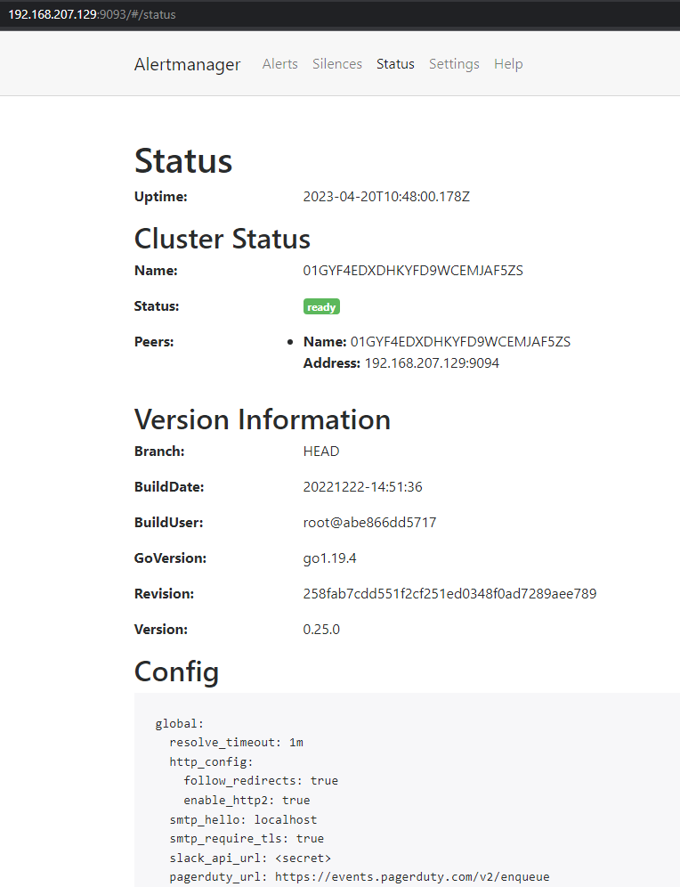{width="7.958333333333333in"
> height="10.375in"}
>
>  
>
>  
>
>  
>
> UPDATE alertmanager.yml
>
> global:
>
> resolve_timeout: 1m
>
> slack_api_url:
> \'[https://hooks.slack.com/services/\<ID\>](https://hooks.slack.com/services/%3cID%3e)\'
>
>  
>
> route:
>
> receiver: \'slack-notifications\'
>
>  
>
> receivers:
>
> \- name: \'slack-notifications\'
>
> slack_configs:
>
> \- send_resolved: true
>
> channel: \'#prometheus\'
>
> icon_url: <https://avatars3.githubusercontent.com/u/3380462>
>
> title: \|-
>
> \[{{ .Status \| toUpper }}{{ if eq .Status \"firing\" }}:{{
> .Alerts.Firing \| len }}{{ end }}\] {{ .CommonLabels.alertname }} for
> {{ .CommonLabels.job }}
>
> {{- if gt (len .CommonLabels) (len .GroupLabels) -}}
>
> {{\" \"}}
>
> {{- end }}
>
> title_link: \'{{ template \"slack.default.titlelink\" . }}\'
>
> text: \>-
>
> {{ range .Alerts -}}
>
> \*Alert:\* {{ .Annotations.summary }}{{ if .Labels.severity }} - \`{{
> .Labels.severity }}\`{{ end }}
>
> \*Description:\* {{ .Annotations.description }}
>
> \*Details:\*
>
> {{ range .Labels.SortedPairs }} • \*{{ .Name }}:\* \`{{ .Value }}\`
>
> {{ end }}
>
> {{ end }}
>
>  
>
>  
>
> BARD:
>
>  
>
> The alertmanager.yml file is the configuration file for Alertmanager,
> a component of the Prometheus monitoring system. It defines how
> Alertmanager should handle alerts, such as which notifications to
> send, how to group alerts, and how to silence alerts.
>
> The global section of the file defines global configuration settings,
> such as the timeout for resolving alerts and the URL of the Slack API.
>
> The route section defines the default route for alerts. This route
> specifies that all alerts should be sent to the slack-notifications
> receiver.
>
> The receivers section defines the receivers that Alertmanager can send
> alerts to. In this example, there is only one receiver, called
> slack-notifications. This receiver sends alerts to Slack.
>
> The slack_configs section defines the configuration for the Slack
> receiver. This section specifies the channel to send alerts to, the
> icon to use, and the title and text of the notification.
>
> Here is a more detailed explanation of each section of the
> alertmanager.yml file:

-   global

    -   resolve_timeout - The timeout for resolving alerts. This is the
        amount of time that Alertmanager will wait for an alert to
        resolve before sending a notification.

    -   slack_api_url - The URL of the Slack API. This is the URL that
        Alertmanager will use to send notifications to Slack.

-   route

    -   receiver - The name of the receiver to send alerts to. In this
        example, the receiver is called slack-notifications.

-   receivers

    -   name - The name of the receiver.

    -   slack_configs

        -   send_resolved - Whether or not to send notifications when
            alerts are resolved.

        -   channel - The channel to send alerts to.

        -   icon_url - The icon to use in the notification.

        -   title - The title of the notification.

        -   title_link - The link to use in the notification.

        -   text - The text of the notification.

>  
>
>  
>
> GPT:
>
> This is a configuration file for Alertmanager, a component of the
> Prometheus monitoring system that manages alerts sent by Prometheus
> server. The configuration file defines how alerts are processed and
> routed to different receivers, such as email, Slack, PagerDuty, etc.
>
> Here\'s a breakdown of the different sections and settings in this
> particular alertmanager.ymlfile:
>
> Global Settings
>
> The globalsection contains global settings for Alertmanager,
> including:

-   resolve_timeout: The time to wait before resolving an alert if it
    has stopped firing (default is 5m).

-   slack_api_url: The URL for the Slack API webhook that Alertmanager
    uses to send notifications to Slack. This is specific to the Slack
    integration and must be configured with your own Slack webhook URL.

> Route
>
> The routesection defines the default receiver for alerts, which in
> this case is set to slack-notifications. This means that any alerts
> that are not specifically routed to another receiver will be sent to
> the slack-notificationsreceiver.
>
> Receivers
>
> The receiverssection defines the available receivers for alerts, which
> in this case only includes one receiver named slack-notifications. The
> settings for this receiver include:

-   name: The name of the receiver.

-   slack_configs: The Slack-specific configuration for the receiver.

> Under the slack_configssetting, the following configuration options
> are defined:

-   send_resolved: Whether or not to send notifications when an alert
    has been resolved.

-   channel: The Slack channel to send the notifications to (e.g.
    \"#prometheus\").

-   icon_url: The URL for the icon that appears next to the notification
    in Slack.

-   title: The title of the notification, which is a template that
    includes the status of the alert, the name of the alert, and the job
    associated with the alert.

-   title_link: A template for the URL to use for the title of the
    notification, which in this case is using a default template defined
    elsewhere in the configuration file.

-   text: The body of the notification, which includes the summary and
    description of the alert, as well as any additional label values
    associated with the alert. The rangefunction is used to loop over
    all alerts in the group and create a list of them in the
    notification body.

> Overall, this configuration file is defining how alerts should be sent
> to Slack and what information should be included in the notification
> message. It is only one example of how Alertmanager can be configured,
> and there are many other configuration options and integrations
> available.
>
>  
>
>  
>
> The title field in the slack_configssection of the
> alertmanager.ymlconfiguration file is a template for the title of the
> notification that is sent to Slack when an alert is fired. It contains
> the following elements:

-   \|-\\n: This is a YAML block scalar style that indicates a
    multi-line string literal. The \|character indicates that the string
    should be preserved exactly as it is, including line breaks, and the
    -character indicates that any trailing whitespace on each line
    should be ignored.

-   {{ .Status \| toUpper }}: This is a Go template expression that
    retrieves the Statusfield of the alert and converts it to uppercase
    using the toUpperfunction. The .character refers to the current
    context, which is the alert group that triggered the notification.

-   {{ if eq .Status \"firing\" }}:{{ .Alerts.Firing \| len }}{{ end }}:
    This is another Go template expression that checks if the
    Statusfield of the alert is \"firing\", and if it is, adds a colon
    and the number of firing alerts to the title. The Alerts.Firingfield
    returns a list of all alerts that are currently firing, and the
    lenfunction returns the length of that list.

-   {{ .CommonLabels.alertname }} for {{ .CommonLabels.job }}: This
    retrieves the alertnameand jobfields from the CommonLabelssection of
    the alert group and formats them into a string that describes the
    alert.

-   {{- if gt (len .CommonLabels) (len .GroupLabels) -}} {{\" \"}} {{-
    end }}: This is another Go template expression that checks if the
    number of labels in the CommonLabelssection is greater than the
    number of labels in the GroupLabelssection, and if it is, adds a
    space to the end of the title. This is used to ensure that the title
    is aligned properly when different alerts have different label sets.

-   title_link: \'{{ template \"slack.default.titlelink\" . }}\': This
    is a reference to another template in the configuration file that
    specifies the URL to link the title to.

-   text: \>- \...: This is a multi-line string literal that defines the
    body of the notification, which contains more details about the
    alerts that have fired. It uses another Go template expression to
    loop over all alerts in the group and generate a list of their
    details.

>  
>
>  
>
> BING:
>
>  
>
> The title code is part of the slack_configs section in the
> alertmanager.yml file. It defines how to format and send Slack
> messages for alerts. The code uses the Go templating system¹ to access
> the data sent by the Alertmanager. Here is a breakdown of what each
> line does:
>
>  
>
> \- The title line starts with a \|- symbol, which means that the
> following lines are a literal block scalar² that preserves newlines.
> The title is composed of several elements enclosed in {{ }} brackets,
> which are template actions. The first element is .Status, which is a
> dot expression that accesses the status field of the data (either
> firing or resolved). The \| toUpper function converts it to uppercase.
> The next element is an if conditional that checks if the status is
> equal to \"firing\". If so, it appends a colon and the number of
> alerts that are firing, which is obtained by accessing the
> .Alerts.Firing field and applying the len function. The next element
> is .CommonLabels.alertname, which accesses the alertname label that is
> common to all alerts in the group. The last element is
> .CommonLabels.job, which accesses the job label that is common to all
> alerts in the group. The title ends with a newline character (\\n).
>
> \- The next line starts with {{- if gt (len .CommonLabels) (len
> .GroupLabels) -}}, which is another if conditional that checks if the
> number of common labels is greater than the number of group labels. If
> so, it appends a space character (\" \") to the title. This is done to
> avoid having an empty space at the end of the title if there are no
> extra labels. The line ends with {{- end }}, which closes the if
> conditional.
>
> \- The title_link line defines a link for the title that can be
> clicked to open a dashboard or a runbook. It uses the template
> function to invoke a predefined template named
> \"slack.default.titlelink\" and passes the current data as an argument
> (.). The template function returns a string that is enclosed in single
> quotes (\' \').
>
> \- The text line starts with a \>- symbol, which means that the
> following lines are a folded block scalar² that removes newlines and
> adds spaces instead. The text is composed of several elements enclosed
> in {{ }} brackets, which are template actions. The first element is
> range .Alerts, which iterates over all alerts in the group and
> executes the following actions for each one. The range action ends
> with {{ end }}.
>
> \- For each alert, the text appends an asterisk (\*) followed by
> \"Alert:\" and then accesses the .Annotations.summary field, which
> contains a summary of the alert. If the alert has a severity label, it
> appends a dash (-) and formats the label value as code by enclosing it
> in backticks (\` \`). Then it adds a newline character (\\n).
>
> \- Next, the text appends another asterisk (\*) followed by
> \"Description:\" and then accesses the .Annotations.description field,
> which contains a description of the alert. Then it adds another
> newline character (\\n).
>
> \- Next, the text appends another asterisk (\*) followed by
> \"Details:\" and then adds another newline character (\\n).
>
> \- Next, the text uses another range action to iterate over all labels
> of the alert sorted by name and executes the following actions for
> each one. The range action ends with {{ end }}.
>
> \- For each label, the text appends a bullet point (•) followed by an
> asterisk (\*) and then accesses the .Name field, which contains the
> label name. Then it appends a colon (:) and formats the label value as
> code by enclosing it in backticks (\` \`). Then it adds another
> newline character (\\n).
>
>  
>
> I hope this helps you understand how to create Slack notifications
> using Alertmanager templates. If you want to see some examples or
> learn more about how to customize them, you can check out these
> resources¹³ .
>
>  
>
>  
>
> Reference:
>
> \(1\) Notification template examples \| Prometheus.
> <https://prometheus.io/docs/alerting/latest/notification_examples/>.
>
> \(2\) Creating Awesome Alertmanager Templates for Slack - Hodovi.
> <https://hodovi.cc/blog/creating-awesome-alertmanager-templates-for-slack/>.
>
> \(3\) Step-by-step guide to setting up Prometheus Alertmanager with
> Slack \....
> <https://grafana.com/blog/2020/02/25/step-by-step-guide-to-setting-up-prometheus-alertmanager-with-slack-pagerduty-and-gmail/>.
>
>  
>
> <https://prometheus.io/docs/alerting/latest/configuration/#slack_config>
>
> <https://prometheus.io/docs/alerting/latest/notification_examples/>
>
>  
>
>  
>
> Create new webhook and copy like webhook url like tutorial before.
>
> 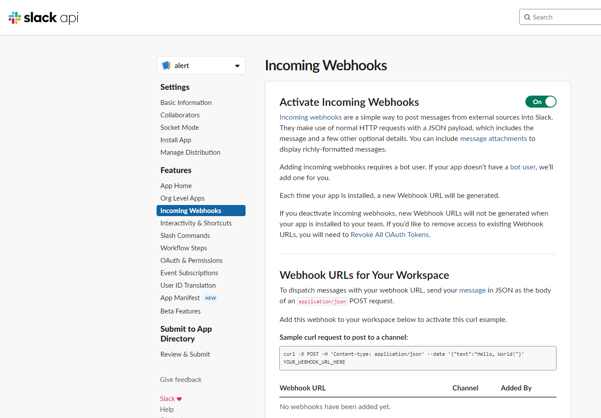{width="7.833333333333333in"
> height="5.447916666666667in"}
>
>  
>
>  
>
> {width="7.927083333333333in"
> height="6.583333333333333in"}
>
>  
>
> Add new webhook url into alertmanager.yml
>
> global:
>
> resolve_timeout: 1m
>
> slack_api_url:
> \'[https://hooks.slack.com/services/\<ID\>](https://hooks.slack.com/services/%3cID%3e)\'
>
>  
>
>  
>
> Use /-/reload to reload config
>
> curl -X POST \<IP\>:9093/-/reload
>
>  
>
> Go to promotheus dashboard and check runtime Information, we can see
> alert manager endpoint
>
>  
>
> 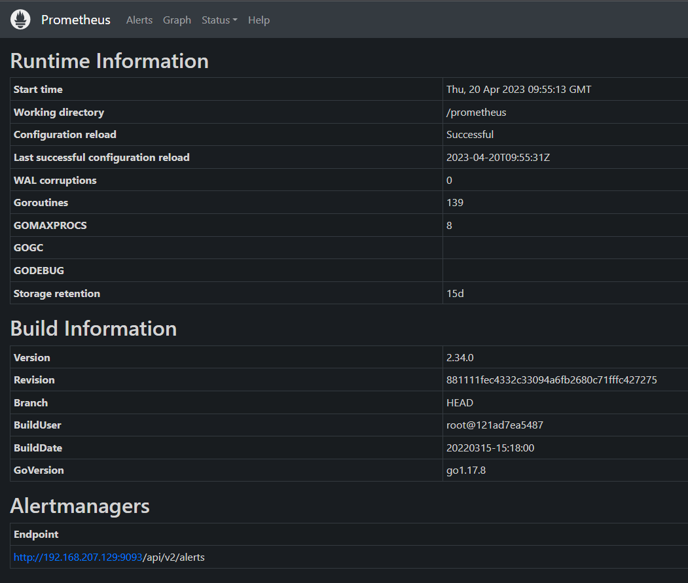{width="7.197916666666667in"
> height="6.09375in"}
>
>  
>
>  

# CREATE ALERT RULE

>  
>
> Frist, we go to prometheus config to know simple config
>
> <https://github.com/istio/istio/blob/master/samples/addons/prometheus.yaml>
>
> data:
>
> allow-snippet-annotations: \"false\"
>
> alerting_rules.yml: \|
>
> {}
>
> alerts: \|
>
> {}
>
>  
>
> This yaml file linked is a configuration file for Prometheus in istio.
> The data section of the file contains the following key-value pairs:

-   allow-snippet-annotations: This setting controls whether Prometheus
    will allow users to add custom annotations to Prometheus rules. If
    set to \"false\", users will only be able to use the pre-defined
    annotations.

-   alerting_rules.yml: This file contains the YAML configuration for
    Prometheus alerting rules.

-   alerts: This file contains the YAML configuration for Prometheus
    alerts.

> The alerting_rules.yml and alerts files are both empty, which means
> that Prometheus will not be configured to send any alerts by default.
> If you want to configure Prometheus to send alerts, you will need to
> add your own rules and alerts to these files.
>
> For more information on configuring Prometheus, please see the
> Prometheus documentation:
> <https://prometheus.io/docs/prometheus/latest/configuration/>
>
>  
>
> Now we update alerting target and rule into prometheus.
>
> sudo kubectl -n istio-system get configmap
>
> NAME DATA AGE
>
> prometheus 5 9d
>
>  
>
> sudo kubectl -n istio-system edit configmap prometheus
>
>  
>
> prometheus.yml: \|
>
> global: \# This section defines global settings for Prometheus
>
> evaluation_interval: 1m \# Evaluate rules every 1 minute
>
> scrape_interval: 15s \# Scrape targets every 15 seconds
>
> scrape_timeout: 10s \# Timeout for scraping targets
>
> alerting: \# This section defines alerting settings for Prometheus
>
> alertmanagers: \# This section specifies the alertmanager instances to
> send alerts to
>
> \- static_configs: \# This section specifies the static list of
> alertmanager targets
>
> \- targets: <http://192.168.207.129:9093> \# This is the address of
> the alertmanager instance
>
>  
>
>  
>
> apiVersion: v1 \# This is the API version for Kubernetes resources
>
> data: \# This section contains the data for the configmap resource
>
> alerting_rules.yml: \| \# This is the name of the file that contains
> the alerting rules
>
> {
>
> \"groups\": \[ \# This is a list of groups of rules
>
> {
>
> \"name\": \"Rules\", \# This is the name of the group
>
> \"rules\": \[ \# This is a list of rules in the group
>
> {
>
> \"alert\": \"InstanceDown\", \# This is the name of the alert
>
> \"expr\": \"up == 0\", \# This is the expression that triggers the
> alert
>
> \"for\": \"0m\", \# This is the duration that the expression must be
> true before firing the alert
>
> \"annotations\": { \# This section contains additional information for
> the alert
>
> \"title\": \"Instance {{ \$labels.instance }} down\", \# This is the
> title of the alert, using label templating
>
> \"description\": \"{{ \$labels.instance }} of job {{ \$labels.job }}
> has been down for more than 1 minute.\" \# This is the description of
> the alert, using label templating
>
> },
>
> \"labels\": { \# This section contains additional labels for the alert
>
> \"severity\": \"critical\" \# This is a label that indicates the
> severity of the alert
>
> }
>
> },
>
> {
>
> \"alert\": \"KubernetesPodClientError\", \# This is another alert name
>
> \"expr\": \"istio_requests_total{reporter=\\\"destination\\\",
> response_code=\\\"403\\\"} \> 10\", \# This is another expression that
> triggers the alert, using metric and label filtering
>
> \"labels\": { \# This section contains additional labels for this
> alert
>
> \"severity\": \"warning\" \# This is another label that indicates the
> severity of this alert
>
> },
>
> \"annotations\": { \# This section contains additional information for
> this alert
>
> \"summary\": \"Kubernetes pod Client Error (instance {{
> \$labels.instance }})\", \# This is another title of this alert, using
> label templating
>
> \"description\": \"Pod {{ \$labels.instance }} of job {{ \$labels.job
> }} reported client specific issues\" \# This is another description of
> this alert, using label templating
>
> }
>
> }
>
> \]
>
> }
>
> \]
>
> }
>
>  
>
>  
>
> This file is a configuration contains the following settings:
>
>  
>
> evaluation_interval: This setting controls how often Prometheus will
> evaluate its rules. The default value is 1 minute.
>
> scrape_interval: This setting controls how often Prometheus will
> scrape metrics from its targets. The default value is 15 seconds.
>
> scrape_timeout: This setting controls how long Prometheus will wait
> for a response from a target before giving up. The default value is 10
> seconds.
>
> alertmanagers: This section configures Prometheus to send alerts to an
> Alertmanager. The Alertmanager is a separate service that is
> responsible for handling alerts and notifying users.
>
>  
>
> It contains the following rules:
>
> InstanceDown: This rule alerts if an instance has been down for more
> than 1 minute.
>
> KubernetesPodClientError: This rule alerts if a Kubernetes pod has
> reported more than 10 client errors.
>
>  
>
> Each rule has the following settings:
>
> alert: This is the name of the alert.
>
> expr: This is the expression that Prometheus will use to evaluate the
> rule.
>
> for: This is the duration for which Prometheus will keep an alert in
> the firing state.
>
> annotations: This is a map of annotations that will be added to alerts
> that fire.
>
> labels: This is a map of labels that will be added to alerts that
> fire.
>
>  
>
>  
>
> we can add larger rule based on rule file below and using converter
> yaml to json:
>
> <https://github.com/samber/awesome-prometheus-alerts/blob/master/dist/rules/istio/embedded-exporter.yml>
>
>  
>
>  
>
> After update config, we restart pod prometheus:
>
> sudo kubectl -n istio-system describe pod -l=app=prometheus
>
> sudo kubectl -n istio-system delete pod -l=app=prometheus
>
> sudo kubectl -n istio-system get pod -l=app=prometheus
>
> sudo kubectl -n istio-system logs prometheus-7cc75b7c8c-nmbmw
> \--container prometheus-server
>
>  
>
> Now, we go to prometheus to check rule again
>
>  
>
> ![0 Prometheus Rules Alerts Graph Status Help Rules Rule alert: expr:
> labels: Error InstanceDown up = severity: critical annotations:
> description: Slabels.instance l} of job \$labels.job has been down for
> more than 1 minute. title: Instance {{ \$labels.instance down 45.886s
> ago Last Evaluation 45.888s ago 45.888s ago 0.520ms Evaluation Time
> 0.354ms 0.155ms alert: expr: labels: KubernetesPodClientError
> istio_requests_total{reporter= \'Idestination\" \"403\") \> 10
> severity: warning annotations: description: Pod {{ \$labels.instance
> of job {{ \$labels.job l} reported client specific issues summary:
> Kubernetes pod Client Error (instance {{ \$labels.instance }})
> ](./images/media/image62.png){width="19.96875in"
> height="6.927083333333333in"}
>
>  
>
> 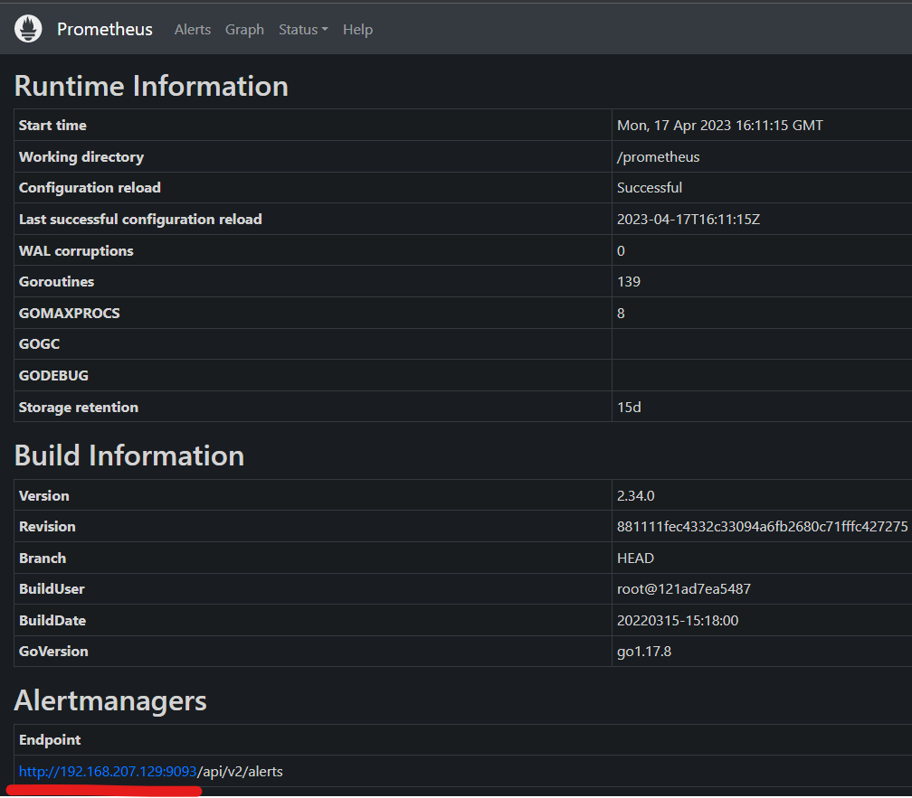{width="10.5in"
> height="9.197916666666666in"}
>
>  
>
>  
>
> Disable peerauthentication to run test rule.
>
>  
>
> sudo kubectl edit pa -n istio-system
>
> spec:
>
> mtls:
>
> mode: DISABLE
>
>  
>
>  
>
> Create nginx service:
>
> kubectl -n prod run nginx \--image nginx
>
> kubectl -n prod expose pod nginx \--port 80
>
> kubectl -n prod get svc
>
>  
>
>  
>
> Use curl to test connection:
>
> curl \<IP nginx svc\>:80
>
> or
>
>  
>
> kubectl -n prod exec -it nginx \-- curl 10.32.0.28:80
>
>  
>
> Next, we go to nginx and delete index.html.
>
> kubectl -n prod exec -it nginx \-- bash
>
> rm /usr/share/nginx/html/index.html
>
>  
>
> We check the connection again by using the following bash script and
> get a 403 error.
>
> while true; do curl -s 10.101.73.244:80; sleep 1; done
>
>  
>
>  
>
>  
>
>  
>
>  
>
> Now let\'s go back to the dashboard to check if the rule is working
>
> ![0 Prometheus Alerts Graph Pending (O) /etc/config/alerting_rules.yml
> \> Rules \> InstanceDown (O active) v KubernetesPodClientError (1
> active) KubernetesPodCLientError name : Status Help Q \"4B\"} \> la
> Show annotations Filter by name or labels
> istio_requests_total{reporter=\"destination\" , response code= expr:
> labels : severity: warning annotations : description: Pod {{ sumary:
> Kubernetes Labels \$1abe1s. instance pod Client Error of job {{
> (instance {{ \$1abe1s.job reported client specific issues \$1abe1s.
> instance Active Since 2023-04- Value 93
> ](./images/media/image64.png){width="12.708333333333334in"
> height="4.34375in"}
>
>  
>
> we can click on expr to execute the query
>
> 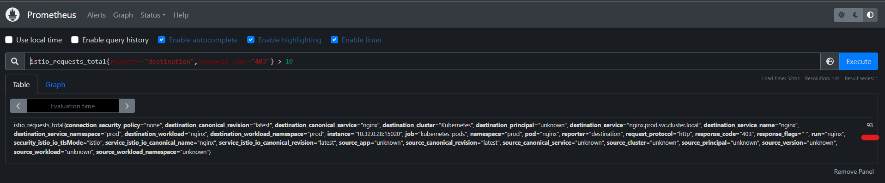{width="12.760416666666666in"
> height="2.6354166666666665in"}
>
>  
>
> and alert is also sent to slack
>
> ![alert APP 7:52 PM \[FIRING:I\] KubernetesPodClientError for
> kubernetes-pods Alert: Kubernetes pod Client Error (instance
> 10.32.028:15020) - Description: Pod 10.32.0.28:15020 of job
> kubernetes-pods reported client specific Issues Details: • alertname:
> KubernetesPodC1ientError • connection_security_policy. mutual_tls Show
> more ](./images/media/image66.png){width="7.15625in"
> height="2.3854166666666665in"}
>
>  
>
> similar to alertmanager, we can select silence.
>
> 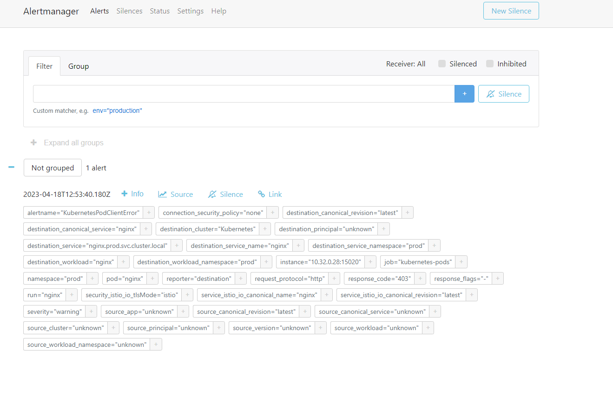{width="9.958333333333334in"
> height="6.552083333333333in"}
>
>  
>
>  
>
> We can enter the creator and comment information to assign the person
> in charge of handling this case
>
> 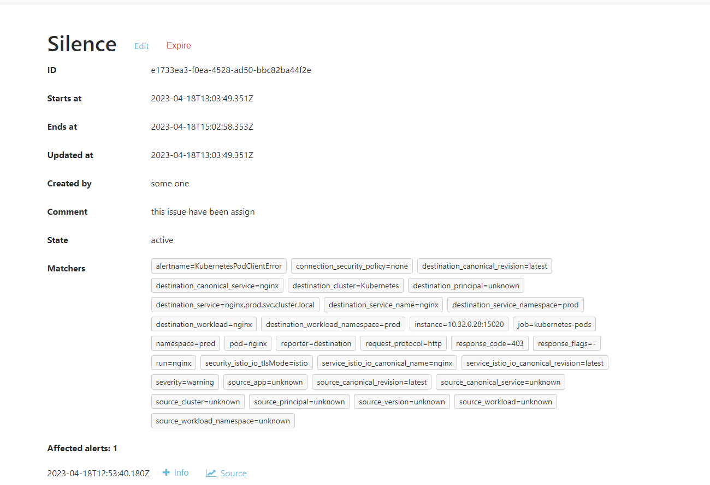{width="9.854166666666666in"
> height="6.739583333333333in"}
>
>  
>
>  
>
>  
>
> similarly we continue to test the rule instance down by deleting pod
> nginx:
>
> kubectl -n prod delete pod nginx
>
>  
>
> Go to dashboard to run query
>
> {width="14.78125in"
> height="3.2291666666666665in"}
>
> And we receive slack alert
>
> ![alert APP 8:36 PM \[FIRING:I\] InstanceDown for kubernetes-pods
> Alert: -I criticall Description: 10.32.0.28:15020 of job
> kubernetes-pods has been down for more than 1 minute. Details: •
> alertname: InstanceDown • instance: 110.32. a.28:15aæel Show more
> ](./images/media/image70.png){width="6.9375in" height="2.125in"}
>
>  

 

 

VAULT


 

+-----------------------------------------------------------------------+
| **Table of Contents**                                                 |
| *\[[Refresh](onemore://InsertTocCommand/refresh)\]*                   |
+=======================================================================+
| [INSTALL                                                              |
| VAULT](onenote:#VAULT&section-id={D84DB586-8314-43BA-9950-54796FE8E   |
| F23}&page-id={27598B9D-93AB-4EAC-A89A-02A2B50FFEB5}&object-id={314190 |
| 2E-2A05-402C-A035-B25988B8B6B7}&44&base-path=https://d.docs.live.net/ |
| e33c2750354c7a93/Documents/Devsecops%20-%20cloud%20sec/devsecops.one) |
|                                                                       |
| [Vault                                                                |
| Initial                                                               |
| ization](onenote:#VAULT&section-id={D84DB586-8314-43BA-9950-54796FE8E |
| F23}&page-id={27598B9D-93AB-4EAC-A89A-02A2B50FFEB5}&object-id={5A1A5A |
| 92-BF6C-4C38-BD21-5BF48AC8C7F2}&4D&base-path=https://d.docs.live.net/ |
| e33c2750354c7a93/Documents/Devsecops%20-%20cloud%20sec/devsecops.one) |
|                                                                       |
| [Vault Secrets                                                        |
| Engine](onenote:#VAULT&section-id={D84DB586-8314-43BA-9950-54796FE8E  |
| F23}&page-id={27598B9D-93AB-4EAC-A89A-02A2B50FFEB5}&object-id={D1DAD1 |
| 11-9BE6-4989-8CB7-832FC62E461F}&BB&base-path=https://d.docs.live.net/ |
| e33c2750354c7a93/Documents/Devsecops%20-%20cloud%20sec/devsecops.one) |
|                                                                       |
| [Vault                                                                |
| Author                                                                |
| ization](onenote:#VAULT&section-id={D84DB586-8314-43BA-9950-54796FE8E |
| F23}&page-id={27598B9D-93AB-4EAC-A89A-02A2B50FFEB5}&object-id={D1DAD1 |
| 11-9BE6-4989-8CB7-832FC62E461F}&C8&base-path=https://d.docs.live.net/ |
| e33c2750354c7a93/Documents/Devsecops%20-%20cloud%20sec/devsecops.one) |
|                                                                       |
| [Authent                                                              |
| ication](onenote:#VAULT&section-id={D84DB586-8314-43BA-9950-54796FE8E |
| F23}&page-id={27598B9D-93AB-4EAC-A89A-02A2B50FFEB5}&object-id={534595 |
| 2D-E21A-43BD-AC24-B89CF476D4F1}&7A&base-path=https://d.docs.live.net/ |
| e33c2750354c7a93/Documents/Devsecops%20-%20cloud%20sec/devsecops.one) |
|                                                                       |
| [PHP APPLICATION                                                      |
| DEMO](onenote:#VAULT&section-id={D84DB586-8314-43BA-9950-54796FE8E    |
| F23}&page-id={27598B9D-93AB-4EAC-A89A-02A2B50FFEB5}&object-id={534595 |
| 2D-E21A-43BD-AC24-B89CF476D4F1}&D5&base-path=https://d.docs.live.net/ |
| e33c2750354c7a93/Documents/Devsecops%20-%20cloud%20sec/devsecops.one) |
+-----------------------------------------------------------------------+
|                                                                       |
+-----------------------------------------------------------------------+

>  

# INSTALL VAULT

> kubectl create ns vault
>
> kubectl config set-context \--current \--namespace vault
>
> kubectl get all
>
>  
>
> helm repo add hashicorp <https://helm.releases.hashicorp.com>
>
> helm install vault \--set=\'ui.enabled=true\'
> \--set=\'ui.serviceType=NodePort\'
> \--set=\'server.dataStorage.enabled=false\' hashicorp/vault \--version
> 0.24.0
>
> NAME: vault
>
> LAST DEPLOYED: Tue Apr 18 14:40:08 2023
>
> NAMESPACE: vault
>
> STATUS: deployed
>
> REVISION: 1
>
> NOTES:
>
> Your release is named vault. To learn more about the release, try:
>
>   \$ helm status vault
>
>   \$ helm get manifest vault
>
>  
>
>  

# Vault Initialization

#  

+-----------------------------------------------------------------------+
| kubectl get pod                                                       |
|                                                                       |
| kubectl exec -it vault-0 \-- vault status                             |
|                                                                       |
| kubectl exec -it vault-0 \-- /bin/sh                                  |
|                                                                       |
|                                                                       |
|                                                                       |
| vault operator init                                                   |
|                                                                       |
| Unseal Key 1: 9yKQv2wqbE8eFDV2lXf6pQDlqxRwe625A2nemYHUIrKE            |
|                                                                       |
| Unseal Key 2: k1AyFsjiqb4DGeBlviYWAyKiSdvamAppmUiV/lNoiMn+            |
|                                                                       |
| Unseal Key 3: LQnEmWY/Ao6q7tB3MQppiYMDhkXfWNtF/gyVNSBggMZw            |
|                                                                       |
| Unseal Key 4: sfioFbDoOLxF6lsUvosNIEL3lA7Y7TtfAbVkUjfMz1KM            |
|                                                                       |
| Unseal Key 5: wG/MfmU+ZvjI8yMHO49K75VrwbN9OrtmMsTPWiTAC1yr            |
|                                                                       |
| Initial Root Token: s.VF5xrdAHb04InF4ov91SUGif                        |
|                                                                       |
| Vault initialized with 5 key shares and a key threshold of 3. Please  |
| securely                                                              |
|                                                                       |
| distribute the key shares printed above. When the Vault is re-sealed, |
|                                                                       |
| restarted, or stopped, you must supply at least 3 of these keys to    |
| unseal it                                                             |
|                                                                       |
| before it can start servicing requests.                               |
|                                                                       |
| Vault does not store the generated master key. Without at least 3     |
| keys to                                                               |
|                                                                       |
| reconstruct the master key, Vault will remain permanently sealed!     |
|                                                                       |
| It is possible to generate new unseal keys, provided you have a       |
| quorum of                                                             |
|                                                                       |
| existing unseal keys shares. See \"vault operator rekey\" for more    |
| information.                                                          |
+=======================================================================+
+-----------------------------------------------------------------------+

>  
>
> The vault operator init command is used to initialize a new Vault
> server instance. It is part of the vault operator command group, which
> is used to manage and operate a Vault server.
>
> When you run the vault operator init command, Vault generates and
> outputs a set of five unseal keys and a root token. These are critical
> pieces of information that are needed to manage and access the Vault
> server.
>
> Here is a brief overview of what happens when you run vault operator
> init:

1.  Vault generates a new encryption key that is used to protect
    sensitive data stored in the Vault server.

2.  Vault generates five unseal keys, which are used to unlock the
    encryption key and decrypt the sensitive data. Each unseal key is a
    26-character string that is randomly generated by Vault.

3.  Vault generates a root token, which is a privileged access token
    that can be used to perform administrative tasks on the Vault
    server.

4.  Vault outputs the five unseal keys and root token to the console.

> It\'s important to keep the unseal keys and root token safe and
> secure, as they provide access to sensitive data stored in the Vault
> server. Typically, the unseal keys are distributed among multiple
> trusted parties to prevent a single point of failure. The root token
> should be stored securely and used only when necessary.
>
>  
>
>  
>
>  

+-----------------------------------------------------------------------+
| vault operator unseal wG/MfmU+ZvjI8yMHO49K75VrwbN9OrtmMsTPWiTAC1yr    |
|                                                                       |
| Unseal Key (will be hidden):                                          |
|                                                                       |
| Key                Value                                              |
|                                                                       |
| \-\--                \-\-\-\--                                        |
|                                                                       |
| Seal Type          shamir                                             |
|                                                                       |
| Initialized        true                                               |
|                                                                       |
| Sealed             true                                               |
|                                                                       |
| Total Shares       5                                                  |
|                                                                       |
| Threshold          3                                                  |
|                                                                       |
| Unseal Progress    1/3                                                |
|                                                                       |
| Unseal Nonce       cccf48d6-b7e9-5014-36b4-66894e0f3b0f               |
|                                                                       |
| Version            1.8.3                                              |
|                                                                       |
| Storage Type       file                                               |
|                                                                       |
| HA Enabled         false                                              |
+=======================================================================+
+-----------------------------------------------------------------------+

>  
>
> This command is used to unseal a Vault server that has been
> initialized but is not yet active. When a Vault server is initialized,
> it is sealed to protect its sensitive data. To start using the Vault
> server, you must unseal it by providing a certain number of unseal
> keys (as determined by the initialization process). Each time the
> vault operator unseal command is executed with an unseal key, the
> Vault server is moved one step closer to being fully unsealed.
>
>  
>
>  
>
> vault login s.VF5xrdAHb04InF4ov91SUGif
>
> Success! You are now authenticated. The token information displayed
> below
>
> is already stored in the token helper. You do NOT need to run \"vault
> login\"
>
> again. Future Vault requests will automatically use this token.
>
> Key                  Value
>
> \-\--                  \-\-\-\--
>
> token                s.VF5xrdAHb04InF4ov91SUGif
>
> token_accessor       KI5fSY50wm2U3DEkyGBfEPKZ
>
> token_duration       ∞
>
> token_renewable      false
>
> token_policies       \[\"root\"\]
>
> identity_policies    \[\]
>
> policies             \[\"root\"\]
>
>  
>
> This command is used to authenticate with the Vault server using a
> specified method, such as using a username and password or a client
> token. Once authenticated, the user is granted an access token, which
> is used to access Vault resources.
>
>  
>
>  

# Vault Secrets Engine

>  
>
> vault secrets enable -path=crds kv-v2
>
> This command is used to enable the KV (key-value) version 2 secrets
> engine on a Vault server. The -path option specifies the path at which
> to mount the secrets engine.
>
>  
>
> In Vault, a secrets engine is a component that is responsible for
> generating, storing, and managing secrets. A secret is any piece of
> sensitive data that needs to be kept secure, such as passwords, API
> keys, and certificates.
>
> Vault supports multiple types of secrets engines, each of which is
> designed to handle a specific type of secret. Some of the commonly
> used secrets engines in Vault include:

-   KV (Key-Value) secrets engine: Used to store and retrieve arbitrary
    key-value pairs.

-   Database secrets engine: Used to dynamically generate database
    credentials on behalf of users and applications.

-   AWS secrets engine: Used to generate and manage AWS access keys and
    secret access keys.

-   PKI (Public Key Infrastructure) secrets engine: Used to issue and
    manage X.509 certificates.

> Each secrets engine in Vault is mounted at a specific path in the
> Vault hierarchy, and can be enabled and configured using Vault
> commands. Once a secrets engine is enabled, applications and users can
> use Vault APIs or CLI commands to generate and retrieve secrets from
> that engine.
>
> Overall, the secrets engines in Vault make it easy for developers and
> operators to manage sensitive data securely, while also providing a
> centralized location for managing all of their secrets.
>
>  
>
>  
>
>  
>
> vault policy list
>
> This command is used to list all of the policies that have been
> defined on the Vault server. Policies are used to define access
> control rules for Vault resources.
>
>  
>
>  
>
> vault kv get crds/mysql
>
> This command is used to read a key-value pair from a Vault server. The
> key-value pair is specified using a path, such as secret/foo.
>
>  
>
> vault kv put crds/mysql username=root password=09132
>
> This command is used to write a key-value pair to a Vault server. The
> key-value pair is specified using a path, such as secret/foo, and a
> set of key-value pairs, such as key=value.
>
>  
>
>  
>
>  
>
> vault kv metadata get crds/mysql
>
> This command is used to retrieve the metadata for a key-value pair in
> a Vault server. The metadata includes information such as the time the
> key-value pair was created and last updated, and the version number of
> the pair.
>
>  

# Vault Authorization

>  
>
> cat \<\<EOF \> /home/vault/app-policy.hcl
>
> path \"crds/data/mongodb\" {
>
> capabilities = \[\"create\", \"read\", \"update\", \"patch\",
> \"delete\", \"list\"\]
>
> }
>
> path \"crds/data/mysql\" {
>
> capabilities = \[\"read\"\]
>
> }
>
> EOF
>
>  
>
> In Vault, a policy is a set of rules that define what actions a user
> or application can perform on a given set of paths within the Vault
> hierarchy. Policies are written in the HCL (HashiCorp Configuration
> Language) syntax and can be defined using a text editor or using Vault
> CLI commands.
>
> In the example policy you provided, there are two paths specified with
> different capabilities assigned to them:
>
> \"crds/data/mongodb\": This path specifies that the policy allows the
> capabilities to create, read, update, patch, delete and list key-value
> pairs located in the \"mongodb\" path under the \"crds/data\" path in
> Vault.
>
> \"crds/data/mysql\": This path specifies that the policy allows the
> capability to read key-value pairs located in the \"mysql\" path under
> the \"crds/data\" path in Vault.
>
> The capabilities defined in the policy specify what actions the user
> or application is authorized to perform on the given path(s). In this
> case, the policy allows a user or application to perform a range of
> actions on MongoDB data, but only to read MySQL data.
>
> Once the policy is written, it can be applied to a user or application
> in Vault, allowing them to perform the actions defined in the policy
> on the paths specified.
>
> Overall, policies in Vault provide a powerful tool for managing access
> to sensitive data, allowing administrators to define granular access
> controls based on the specific needs of their users and applications.
>
>  
>
>  
>
> vault policy write app /home/vault/app-policy.hcl
>
> This command is used to create or update the policy named \"app\" on
> the Vault server. The policy specifies access control rules for Vault
> resources that are used by a particular application.
>
>  
>
>  
>
> vault policy read app
>
> This command is used to read the policy named \"app\" from the Vault
> server. The \"app\" policy specifies access control rules for Vault
> resources that are used by a particular application.
>
>  
>
>  
>
> \-\-\-\-\-\-\-\-\-\-\-\-\-\--
>
>  

# Authentication

>  
>
> vault token create
>
> This command is used to create a new token in HashiCorp Vault. Tokens
> are used to authenticate and authorize clients to interact with Vault.
> When you run this command, Vault will generate a new token with a
> specified set of permissions and a TTL (time to live) that determines
> how long the token will be valid.
>
>  
>
>  
>
> vault token revoke
>
> This command is used to revoke a token in HashiCorp Vault. When you
> run this command, Vault will immediately invalidate the specified
> token, meaning that it can no longer be used to authenticate or
> authorize clients.
>
>  
>
> vault auth enable kubernetes
>
> This command is used to enable the Kubernetes authentication method in
> HashiCorp Vault. When you run this command, you are telling Vault to
> configure itself to accept authentication requests from Kubernetes.
>
>  
>
>  
>
>  
>
> vault write auth/kubernetes/config \\
>
> token_reviewer_jwt=\"\$(cat
> /var/run/secrets/kubernetes.io/serviceaccount/token)\" \\
>
> kubernetes_host=https://\${KUBERNETES_PORT_443_TCP_ADDR}:443 \\
>
> kubernetes_ca_cert=@/var/run/secrets/kubernetes.io/serviceaccount/ca.crt
>
> This command is used to configure the Kubernetes authentication method
> in HashiCorp Vault. Specifically, it sets the configuration parameters
> for the method, such as the location of the Kubernetes API server and
> the location of the Kubernetes CA certificate.
>
>  
>
>  
>
> SET ROLE
>
> vault write auth/kubernetes/role/phpapp \\
>
> bound_service_account_names=app \\
>
> bound_service_account_namespaces=vault \\
>
> policies=app \\
>
> ttl=1h
>
> This command is used to configure a role in the Kubernetes
> authentication method in HashiCorp Vault. When you run this command,
> you are specifying which Kubernetes service account (in this case,
> app) can be used to authenticate with Vault, which namespace the
> service account belongs to (in this case, vault), which policies the
> role should have access to (in this case, app), and how long the token
> issued by this role will be valid (in this case, 1h).
>
>  
>
>  
>
>  
>
> exit
>
> kubectl describe clusterrolebinding vault-server-binding
>
> This command is used to describe a ClusterRoleBinding in Kubernetes. A
> ClusterRoleBinding is a way to bind a ClusterRole (a set of
> permissions in Kubernetes) to a specific Kubernetes service account.
> When you run this command, you are getting information about the
> ClusterRoleBinding named vault-server-binding.
>
>  
>
>  
>
>  
>
>  
>
>  

# PHP APPLICATION DEMO

> git clone <https://github.com/sidd-harth/php-vault-example.git>
>
> cd php-vault-example/
>
> docker build -t php:vault .
>
> kubectl apply -f php-app-k8s-deploy.yaml
>
>  
>
>  
>
> In php-app-k8s-deploy.yaml, we have code below:

  -----------------------------------------------------------------------
  apiVersion: v1
  -----------------------------------------------------------------------

  -----------------------------------------------------------------------

> kind: ServiceAccount
>
> metadata:
>
> name: app
>
> labels:
>
> app: php
>
> It is will be interactive with command:
>
> SET ROLE vault write auth/kubernetes/role/phpapp \\
> bound_service_account_names=app \\
> bound_service_account_namespaces=vault \\ policies=app \\ ttl=1h
>
>  
>
> After run apply, The Kubernetes ServiceAccount named \"app\" in your
> deployment file is connected to the Vault command vault write
> auth/kubernetes/role/phpapp through the bound_service_account_names
> parameter.
>
> When you run the Vault command with bound_service_account_names=app,
> it tells Vault that any authentication requests coming from the
> Kubernetes ServiceAccount named \"app\" should be authorized by this
> Vault role (phpapp).
>
> Additionally, the bound_service_account_namespaces parameter specifies
> the Kubernetes namespace where the ServiceAccount is located (vault in
> this case).
>
> Finally, the policies parameter specifies the Vault policies that
> should be granted to any tokens issued by this role. In this case, the
> app policy is being granted.
>
> The ttl parameter specifies the time-to-live for any tokens issued by
> this role. In this case, the token will expire and be revoked after 1
> hour.
>
>  
>
> kubectl get svc
>
> NAME TYPE CLUSTER-IP EXTERNAL-IP PORT(S) AGE
>
> php NodePort 10.106.55.59 \<none\> 80:30323/TCP 57s
>
>  
>
>  
>
> We try to access the app and now the app has a red background and
> displays secret information
>
> 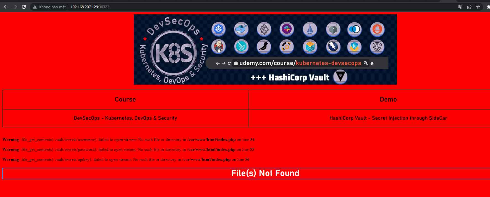{width="8.791666666666666in"
> height="3.5416666666666665in"}
>
>  
>
>  
>
>  
>
>  
>
> cat patch-annotations.yaml
>
> spec:
>
> template:
>
> metadata:
>
> annotations:
>
> vault.hashicorp.com/agent-inject: \"true\"
>
> vault.hashicorp.com/agent-inject-secret-username: \"crds/data/mysql\"
>
> vault.hashicorp.com/role: \"phpapp\"
>
>  
>
> Annotations in Vault HashiCorp are a way to specify metadata about
> Kubernetes objects that indicate how Vault should interact with them.
> Annotations are key-value pairs that are added to Kubernetes objects
> such as pods, deployments, and services to instruct Vault on how to
> inject secrets or otherwise interact with the objects.
>
> Some common annotations used in Vault include:

-   vault.hashicorp.com/agent-inject: \"true\": This annotation enables
    the Vault Agent sidecar injector to inject secrets into a pod.

-   vault.hashicorp.com/agent-inject-secret-\<key\>: \"\<path\>\": This
    annotation specifies the path to a secret in Vault and the key in
    the secret that should be injected into the pod.

-   vault.hashicorp.com/role: \"\<name\>\": This annotation specifies
    the name of a Vault role that should be used to authenticate
    requests from the Kubernetes object.

> Annotations can be specified in a Kubernetes manifest file or added to
> an existing object using the kubectl annotate command. Annotations
> provide a flexible way to integrate Vault with Kubernetes applications
> and manage secrets securely.
>
>  
>
>  
>
>  
>
> kubectl patch deploy php -p \"\$(cat patch-annotations.yaml)\"
>
> This command applies the annotations defined in the
> patch-annotations.yaml file to the Kubernetes Deployment named php.
> Specifically, it adds the annotations
> vault.hashicorp.com/agent-inject: \"true\",
> vault.hashicorp.com/agent-inject-secret-username: \"crds/data/mysql\",
> and vault.hashicorp.com/role: \"phpapp\"to the metadata of the pod
> template.
>
>  
>
>  
>
>  
>
>  
>
> kubectl describe pod php-7744998f8f-lcwx8
>
> Args:
>
> echo \${VAULT_CONFIG?} \| base64 -d \> /home/vault/config.json &&
> vault agent -config=/home/vault/config.json State: Terminated
>
>  
>
> This command provides a detailed description of the Kubernetes pod
> named php-7744998f8f-lcwx8.
>
>  
>
>  
>
> kubectl exec -it pod/php-7744998f8f-lcwx8 -n vault -c php \-- cat
> /vault/secrets/username
>
> data: map\[apikey:813290vjlkad password:09132 username:root\]
>
> metadata: map\[created_time:2023-04-19T02:07:39.660745457Z
> deletion_time: destroyed:false version:1\]
>
>  
>
> This command executes a command inside the container named php in the
> php-7744998f8f-lcwx8 pod, and prints the contents of the
> /vault/secrets/username file. Specifically, it decodes the value of
> the VAULT_CONFIG environment variable, writes it to a file at
> /home/vault/config.json, and starts the Vault agent process with that
> configuration file. The agent then retrieves the secret named username
> from Vault and writes it to the /vault/secrets/username file.
>
>  
>
>  
>
>  
>
> cat patch-annotations-template.yaml
>
> spec:
>
> template:
>
> metadata:
>
> annotations:
>
> vault.hashicorp.com/agent-inject: \"true\"
>
> vault.hashicorp.com/agent-inject-status: \"update\"
>
> vault.hashicorp.com/agent-inject-secret-username: \"crds/data/mysql\"
>
> vault.hashicorp.com/agent-inject-template-username: \|
>
> {{- with secret \"crds/data/mysql\" -}}
>
> {{ .Data.data.username }}
>
> {{- end }}
>
> vault.hashicorp.com/agent-inject-secret-password: \"crds/data/mysql\"
>
> vault.hashicorp.com/agent-inject-template-password: \|
>
> {{- with secret \"crds/data/mysql\" -}}
>
> {{ .Data.data.password }}
>
> {{- end }}
>
> vault.hashicorp.com/agent-inject-secret-apikey: \"crds/data/mysql\"
>
> vault.hashicorp.com/agent-inject-template-apikey: \|
>
> {{- with secret \"crds/data/mysql\" -}}
>
> {{ .Data.data.apikey }}
>
> {{- end }}
>
> vault.hashicorp.com/role: \"phpapp\"
>
>  
>
> It using the Vault Agent Sidecar Injector.
>
> The annotations are divided into two sections: agent and vault. The
> agent annotations change the Vault Agent containers templating
> configuration, such as what secrets they want, how to render them,
> etc. The vault annotations change the Vault Agent containers
> authentication configuration, such as what role they use, what
> certificates they need, etc.
>
>  
>
> Here is a brief explanation of each annotation in the template:
>
>  
>
> \- \`vault.hashicorp.com/agent-inject: \"true\"\`: This enables
> injection for the pod¹.
>
> \- \`vault.hashicorp.com/agent-inject-status: \"update\"\`: This
> blocks further mutations by adding the value \`injected\` to the pod
> after a successful mutation¹.
>
> \- \`vault.hashicorp.com/agent-inject-secret-username:
> \"crds/data/mysql\"\`: This tells the Vault Agent to retrieve the
> secret \`username\` from the path \`crds/data/mysql\` in Vault¹.
>
> \- \`vault.hashicorp.com/agent-inject-template-username: \| \...\`:
> This tells the Vault Agent how to render the secret \`username\` using
> a Go template¹.
>
> \- \`vault.hashicorp.com/agent-inject-secret-password:
> \"crds/data/mysql\"\`: This tells the Vault Agent to retrieve the
> secret \`password\` from the same path as \`username\`¹.
>
> \- \`vault.hashicorp.com/agent-inject-template-password: \| \...\`:
> This tells the Vault Agent how to render the secret \`password\` using
> a Go template¹.
>
> \- \`vault.hashicorp.com/agent-inject-secret-apikey:
> \"crds/data/mysql\"\`: This tells the Vault Agent to retrieve the
> secret \`apikey\` from the same path as \`username\` and
> \`password\`¹.
>
> \- \`vault.hashicorp.com/agent-inject-template-apikey: \| \...\`: This
> tells the Vault Agent how to render the secret \`apikey\` using a Go
> template¹.
>
> \- \`vault.hashicorp.com/role: \"phpapp\"\`: This tells the Vault
> Agent what role to use for authenticating with Vault using the
> Kubernetes auth method¹.
>
>  
>
> Reference:
>
> \(1\) Agent Sidecar Injector Annotations \| Vault \| HashiCorp
> Developer.
> <https://developer.hashicorp.com/vault/docs/platform/k8s/injector/annotations>.
>
> \(2\) Running Vault with Kubernetes - HashiCorp.
> <https://www.hashicorp.com/products/vault/kubernetes>.
>
> \(3\) » Vault Agent Injector Examples - Vault by HashiCorp.
> <https://developer.hashicorp.com/vault/docs/platform/k8s/injector/examples>.
>
>  
>
>  
>
>  
>
> kubectl patch deploy php -p \"\$(cat
> patch-annotations-template.yaml)\"
>
> kubectl exec -it pod/php-697475985f-n58bq -n vault -c php \-- cat
> /vault/secrets/username
>
> Root
>
>  

-   kubectl: This is the command-line tool used to interact with
    Kubernetes clusters.

-   patch: This sub-command is used to update or modify resources in a
    Kubernetes cluster.

-   deploy: This specifies the type of resource to be patched, which in
    this case is a deployment.

-   php: This is the name of the deployment that we want to patch.

-   -p \"\$(cat patch-annotations-template.yaml)\": This is an option
    that specifies the patch to be applied to the deployment. The patch
    is specified using a YAML or JSON file that contains the updated
    metadata for the deployment. The \$(cat
    patch-annotations-template.yaml) command substitution is used to
    read the contents of the file patch-annotations-template.yaml and
    pass it as a string to the -p option.

> Overall, the command kubectl patch deploy php -p \"\$(cat
> patch-annotations-template.yaml)\" is used to update the metadata for
> the deployment named \"php\" by applying a patch contained in the YAML
> file patch-annotations-template.yaml. The specific changes made to the
> metadata will depend on the contents of the patch file.
>
>  
>
> Now, we refresh the app and we see that the app has get the secrets
>
>  
>
> {width="8.354166666666666in"
> height="3.8229166666666665in"}
