# SAST
Run sonarqube  with docker  

```
docker run -d --name sonarqube -e SONAR_ES_BOOTSTRAP_CHECKS_DISABLE=true -p 9000:9000 sonarqube:latest  
Or  
docker run -d --name sonarqube -e SONAR_ES_BOOTSTRAP_CHECKS_DISABLE=true -p 9000:9000 sonarqube:lts
``` 
  
  
sonarqube docker run cannot access port 9000 in website.  

```
docker run --network=host -e SONAR_HOST_URL='http://127.0.0.1:9000' --user="$(id -u):$(id -g)" -v "$PWD:/usr/src" sonarsource/sonar-scanner-cli
``` 
  
  
Read logs  

```
docker logs sonarqube -f
``` 
  
  
Reference to read more detail  
https://docs.sonarqube.org/latest/setup-and-upgrade/install-the-server/  
[Java test coverage sonarqube.org]https://docs.sonarqube.org/latest/analyzing-source-code/test-coverage/java-test-coverage/  
  
Go to dashboard with port 9000, after login and add manual maven project  
  
  
  
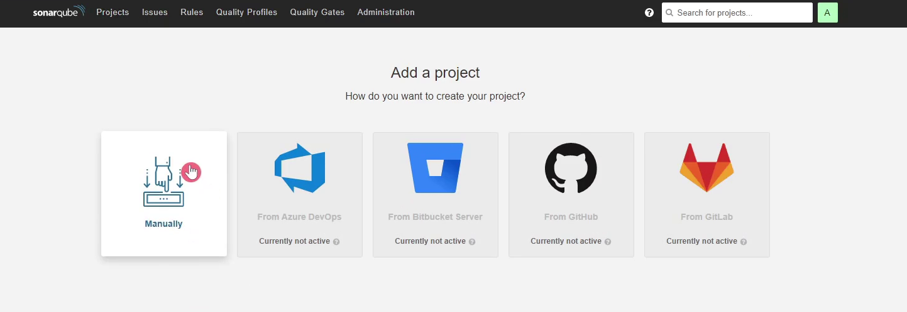  
  
Project key is your project name  
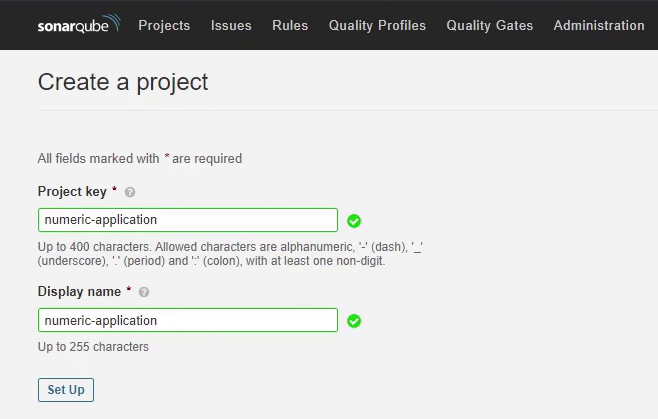  
  
Select maven  
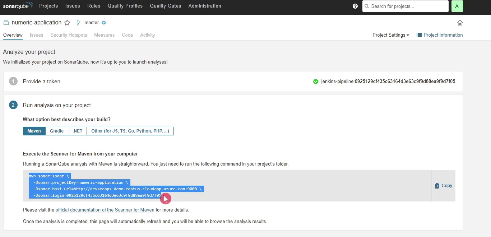  
  
Copy code to jenkins file  

```
stage('SonarQube - SAST') {  
      steps {  
        withSonarQubeEnv('SonarQube') {  
          sh "mvn clean verify sonar:sonar \  
  -Dsonar.projectKey=numeric-app \  
  -Dsonar.host.url=http://192.168.126.132:9000 \  
  -Dsonar.login=sqp_76f368be3de38b7cbc9eedcd1f14798bc1a19397"  
        }
``` 
  
  
# SONARQUBE QUALITY GATES  
  
## Generate a token in SonarQube, please follow these steps:  
- Log in to your SonarQube instance as an administrator.  
- Click on your user avatar in the top-right corner and select "My Account" from the dropdown menu.  
- Click on "Security" in the left-hand navigation menu.  
- Click on "Generate Tokens" in the "Tokens" section.  
- Enter a name for your token in the "Name" field.  
- Select the appropriate permissions for your token in the "Permissions" field (e.g. "Execute Analysis" for a token to be used with a CI/CD pipeline).  
- Click on the "Generate" button to generate your token.  
- Copy the token value into  that is displayed on the screen and store it in a safe place, as it will not be displayed again.  
  
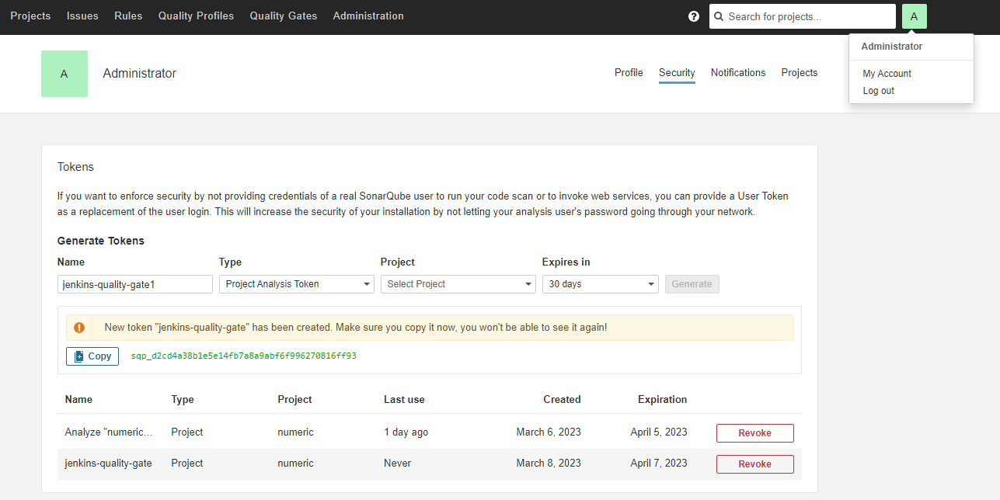  
  
  
## Create Global credential in jenkins:  
- Click on "Credentials" in the main menu.  
- Click on the "System" tab at the top of the screen and then "Global credentials" under the "System" category.  
- Click on the "Add Credentials" link on the left-hand side.  
- Select "Secret text" and  copy the token value into in the fields provided.  
- Optionally, you can set a "Description" to help identify the credential later.  
- Click on the "OK" button to save the credentials.  
  
Note: Global credentials are available to all Jenkins jobs and pipelines. Use them with caution and ensure that you have proper security measures in place to restrict access to these credentials.  
  
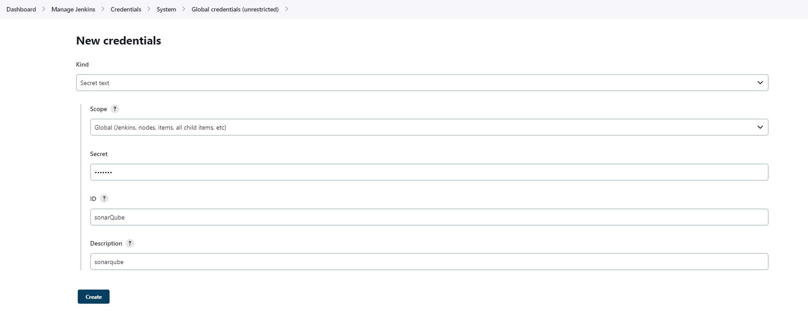  
  
  
# Setup credential:  
  
Click on "Manage Jenkins" and select "Configure System".  
  
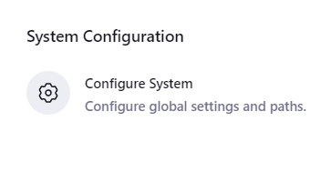  
  
Scroll down to the "SonarQube" section and click on the "Add SonarQube" button.  
  
Enter a name for your SonarQube server in the "Name" field.  
  
Enter the URL of your SonarQube server in the "Server URL" field.  
  
Select on the "Credentials" under the  "Server authentication token" section.  
  
Click on the "OK" button to save the credentials.  
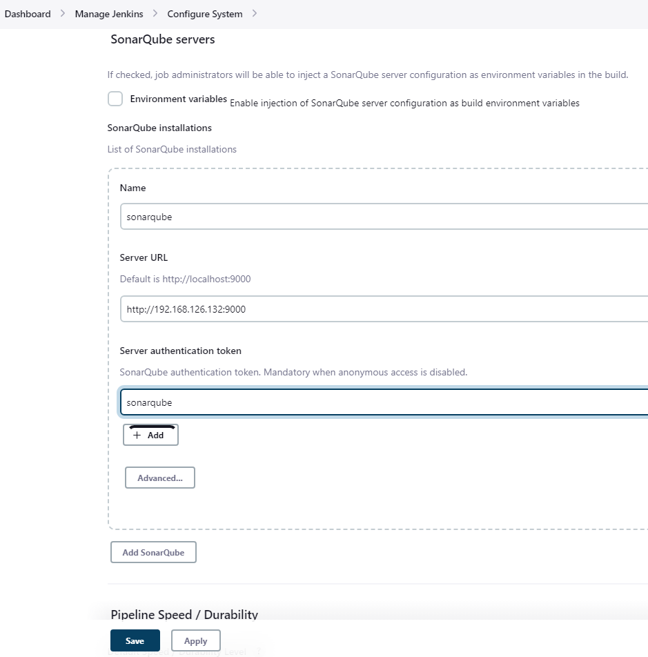  
  
  
Click on the "Administration" button in the left-hand panel and select "Webhooks" from the dropdown menu.  
  
  
  
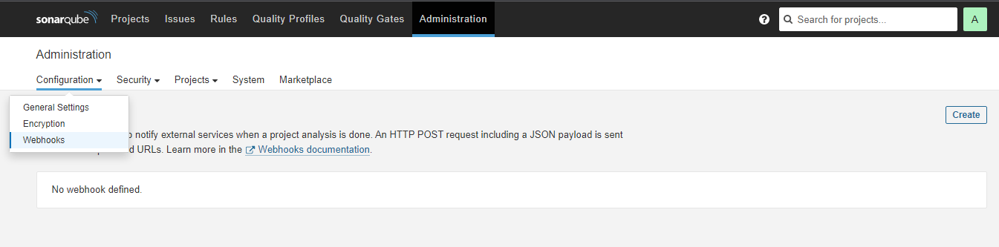  
  
  
Click on the "Create" button to create a new webhook.  
1.   
1. Enter a name for your webhook in the "Name" field.  
1.   
1. Enter the URL of the endpoint that will receive the webhook in the "URL" field.  
1.   
1. Click on the "Create" button to create the webhook.  
  
That's it! Your SonarQube webhook is now created and will send data to the specified endpoint for the selected events.  
  
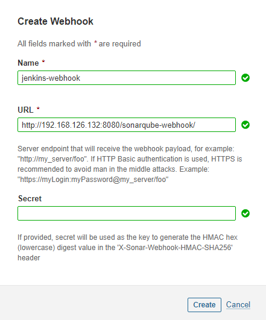  
  
reference: https://docs.sonarqube.org/latest/analyzing-source-code/scanners/jenkins-extension-sonarqube/  
  
  
Update stage  

```
stage'SonarQube - SAST' {  
      steps {  
        withSonarQubeEnv'SonarQube' {  
          sh "mvn sonar:sonar -Dsonar.projectKey=numeric-application -Dsonar.host.url=http://devsecops-demo.eastus.cloudapp.azure.com:9000        }  
        timeouttime: 2, unit: 'MINUTES' {  
          script {  
            waitForQualityGate abortPipeline: true  
          }  
        }  
      }  
    }
``` 
  
This is a Jenkins Pipeline stage that performs a static application security testing SAST scan using SonarQube.  
The stage has the name 'SonarQube - SAST' and contains two steps:  
>1. The first step uses the withSonarQubeEnv function to set up the environment to use SonarQube, which is a tool used to analyze the code quality and security of the application. The configuration specifies the SonarQube instance to use by passing 'SonarQube' as the parameter.  
>1. The second step runs a Maven command to execute the SonarQube analysis on the application code. The parameters passed to the command include the project key and the URL of the SonarQube instance.  
  
The step also includes a timeout block that limits the execution time of the analysis to 2 minutes. After the analysis is completed, the waitForQualityGate function is used to wait for the quality gate to pass or fail.  
If the quality gate passes, the pipeline continues to the next stage. If it fails, the pipeline is aborted and the build is marked as failed.  
  
Build pipeline and I see it fail  
  
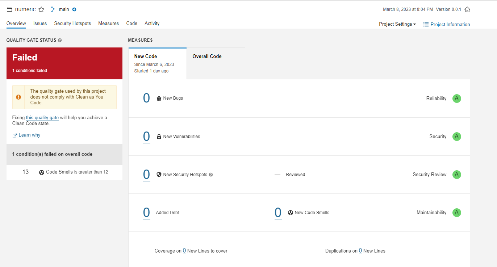  
  
We need remove import code below to improve security:  
  
import org.springframework.beans.factory.annotation.Autowired;  
import org.springframework.beans.factory.annotation.Value;  
import org.springframework.boot.web.client.RestTemplateBuilder;  
import org.springframework.context.annotation.Bean;  
  
  
  
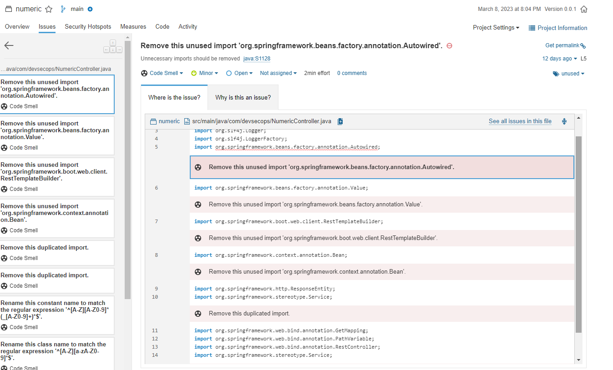  
  
Build pipeline again  
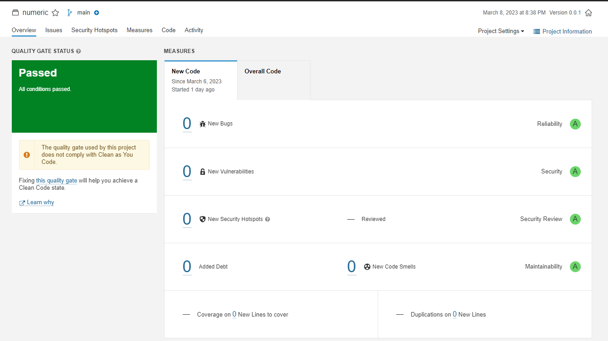  
  
  
  
  

