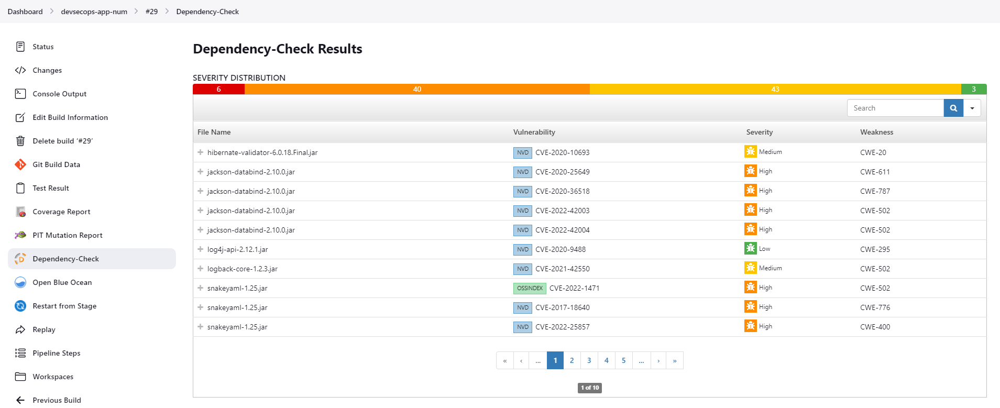

# SCA
# OWASP dependency-check  
 is an open-source software composition analysis (SCA) tool that helps identify known vulnerabilities in a project's dependencies. It scans the project dependencies, including both direct and transitive dependencies, and checks them against a database of known vulnerabilities in commonly used third-party libraries and frameworks.  
It does this by determining if there is a Common Platform Enumeration (CPE) identifier for a given dependency. If found, it will generate a report linking to the associated CVE entries.  
  
OWASP dependency-check provides an easy way for developers and security teams to identify and address potential security risks in their projects' dependencies, helping to prevent the exploitation of known vulnerabilities by attackers.  
  
When scanning for vulnerabilities, OWASP dependency-check uses a number of techniques to determine if a vulnerability is present, such as checking library version numbers and analyzing the code within the libraries. The tool also provides an indication of the severity level of each vulnerability found based on the Common Vulnerability Scoring System (CVSS) score, ranging from low to critical.  
In addition to identifying vulnerabilities, OWASP dependency check can also provide recommendations on how to remediate these vulnerabilities, including instructions on how to upgrade to a patched version of the affected library, or how to mitigate the vulnerability through configuration changes or code changes.  
  
The tool supports multiple programming languages such as Java, .NET, Ruby, Python, and Node.js, among others. It generates a report that lists all the vulnerabilities found in the project's dependencies, including details about the vulnerability, severity level, and potential impact on the project.  
  
  
\<plugin&gt;  
        \<groupId&gt;org.owasp\</groupId&gt;  
        \<artifactId&gt;dependency-check-maven\</artifactId&gt;  
        \<version&gt;8.1.2\</version&gt;  
        \<configuration&gt;  
            \<format&gt;ALL\</format&gt;  
            \<failBuildOnCVSS&gt;6\</failBuildOnCVSS&gt;  *\<!-- fail the build for CVSS greater than or equal to 6 --&gt;*  
        \</configuration&gt;  
\</plugin&gt;  
  
  
  
  
  
stage('Vulnerability Scan'){  
      steps {  
        sh "mvn dependency-check:check"  
      }  
      post {  
        always {  
          dependencyCheckPublisher pattern: 'target/dependency-check-report.xml'  
        }  
      }  
    }  
  
  
  
  
  
  
\<version&gt;2.3.12.RELEASE\</version&gt;  
  
  
  

