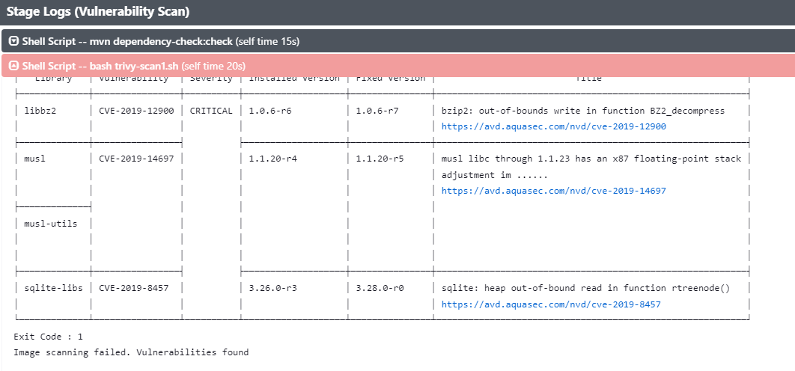
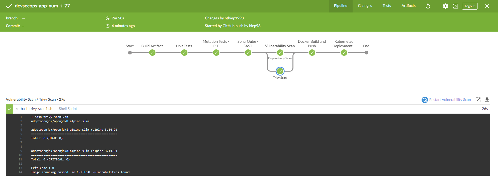

# Trivy - scan docker image
Trivy is an open-source, container image vulnerability scanner that helps detect vulnerabilities in your container images and packages. It is designed to be easy to use, fast, and highly accurate, with support for a variety of package managers and container registries.  
  
Trivy can scan container images for known vulnerabilities in their operating system packages, application dependencies, and configuration files. It can also check for insecure configurations or hardcoded credentials within the container image.  
  
Trivy is highly configurable and can be integrated into various development workflows, including CI/CD pipelines, local development environments, and container orchestration systems.  
  
Overall, Trivy is a powerful tool for improving the security of your containerized applications by providing an automated way to detect vulnerabilities and prioritize remediation efforts.  
  
  
  
Run trivy  

```
docker run -v /var/run/docker.sock:/var/run/docker.sock -v $HOME/Library/Caches:/root/.cache/ aquasec/trivy:0.38.2 image python:3.4-alpine  
or  
docker run --rm -v $HOME/Library/Caches:/root/.cache/ aquasec/trivy  python:3.4-alpine
``` 
  
  
Create bash script custom scan with trivy  

```
*#!/bin/bash*  
dockerImageName=$(awk 'NR==1 {print $2}' Dockerfile)  
echo $dockerImageName  
docker run --rm -v $WORKSPACE:/root/.cache/ aquasec/trivy:0.17.2 -q image --exit-code 0 --severity HIGH --light $dockerImageName  
docker run --rm -v $WORKSPACE:/root/.cache/ aquasec/trivy:0.17.2 -q image --exit-code 1 --severity CRITICAL --light $dockerImageName  
    *# Trivy scan result processing*  
    exit_code=$?  
    echo "Exit Code : $exit_code"  
    *# Check scan results*  
    if  "${exit_code}" == 1 ]; then  
        echo "Image scanning failed. Vulnerabilities found"  
        exit 1;  
    else  
        echo "Image scanning passed. No CRITICAL vulnerabilities found"  
    fi;
``` 
  
  
The code **`$(awk 'NR==1 {print $2}' Dockerfile)`** runs an **`awk`** command in a shell script context, where:  
- **`awk`** is a command line utility used for text processing and pattern matching  
- **`'NR==1 {print $2}'`** is the **`awk`** program provided as an argument, which performs the following actions:  
- **`NR==1`** selects the first record in the input (i.e., the first line of the file)  
- **`{print $2}`** prints the second field (i.e., a word or a substring separated by whitespace) of the selected record  
- **`Dockerfile`** is the file being processed by **`awk`**  
Overall, the command **`$(awk 'NR==1 {print $2}' Dockerfile)`** extracts the second word in the first line of the **`Dockerfile`** and returns it as a string value. The **`$()`** syntax is a Bash command substitution that evaluates the enclosed command and substitutes the output as a string.  
  
Update pipeline  

```
stage('Vulnerability Scan - docker'){  
      steps {  
        parallel(  
           "Dependency Scan": {  
            sh "mvn dependency-check:check"  
          },  
          "Trivy Scan": {  
            sh "bash trivy-scan1.sh"  
          }  
        )  
      }  
    }
``` 
  
  
  
Result  
  
  
we try run trivy to find vulnerability with the same os docker image like: openjdk, openjdk8, adoptopenjdk/openjdk8:alpine-slim  
  

```
docker run --rm -v $WORKSPACE:/root/.cache/ aquasec/trivy:0.17.2 -q image --exit-code 0 --severity HIGH --light $dockerImageName
``` 
  
  
And after have result with zero vulnerability. We update dockerfile to fix vulnerability  

```
FROM adoptopenjdk/openjdk8:alpine-slim  
EXPOSE *8080*  
ARG JAR_FILE=*target/*.jar*  
ADD ${JAR_FILE} *app.jar*  
ENTRYPOINT **"java"*,*"-jar"*,*"/app.jar"**
``` 
  
  
Update docker build command in build stage to fix error relate trivy:  

```
stage('Docker Build and Push') {  
      steps {  
        withDockerRegistry(credentialsId: "docker-hub", url: "") {  
          sh 'printenv'  
          sh 'sudo docker build -t nthiep1998/numeric-app:""$GIT_COMMIT"" .'  
          sh 'docker push nthiep1998/numeric-app:""$GIT_COMMIT""'  
        }  
      }  
    }
``` 
  
  
  
Final Result  
  
  

