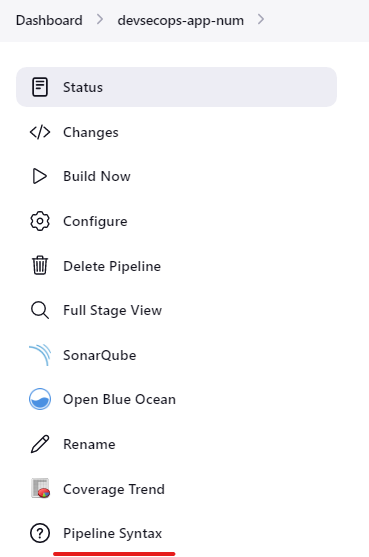
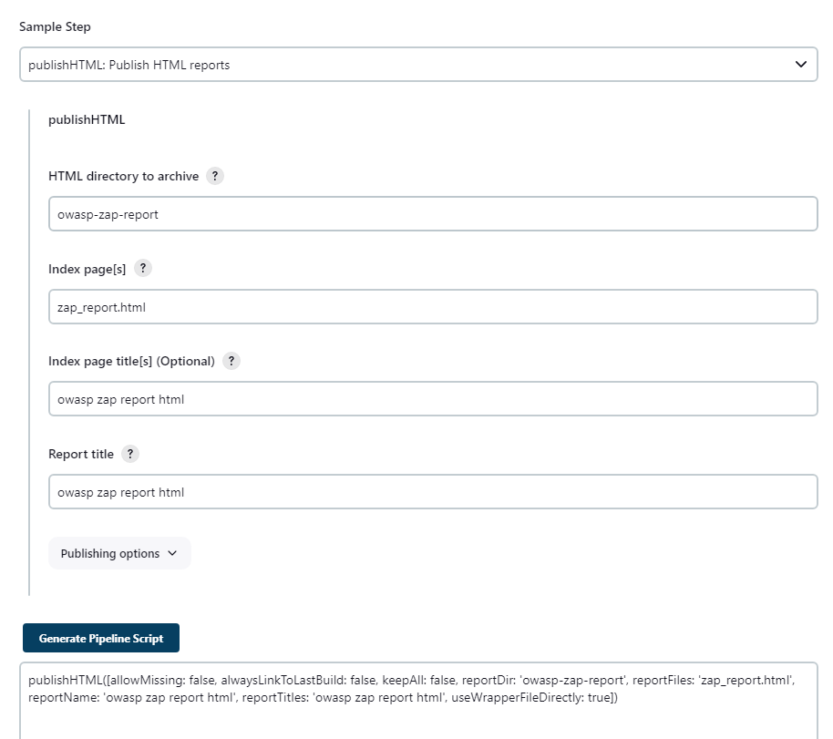

# DAST
springdoc-openapi java library helps to automate the generation of API documentation using spring boot projects. springdoc-openapi works by examining an application at runtime to infer API semantics based on spring configurations, class structure and various annotations.  
  
For the integration between spring-boot and swagger-ui, add the library to the list of your project dependencies (No additional configuration is needed).  
  
Adding springdoc-openapi-ui dependency in pom.xml  

```
\<dependency&gt;  
            \<groupId&gt;org.springdoc\</groupId&gt;  
            \<artifactId&gt;springdoc-openapi-ui\</artifactId&gt;  
            \<version&gt;1.7.0\</version&gt;  
 \</dependency&gt;
``` 
  
  
This will automatically deploy swagger-ui to a spring-boot application:  
- Documentation will be available in HTML format, using the official [swagger-ui jars]https://github.com/swagger-api/swagger-ui.git  
- The Swagger UI page will then be available at http://server:port/context-path/swagger-ui.html and the OpenAPI description will be available at the following url for json format: <a href="http://server:port/context-path/v3/api-docs">http://server:port/context-path/v3/api-docs</a>  
- server: The server name or IP  
- port: The server port  
- context-path: The context path of the application  
- Documentation can be available in yaml format as well, on the following path : /v3/api-docs.yaml  
  
Reference: https://springdoc.org/  
  
The Zap API Scan script can run automated security testing on this Endpoint.  

```
*#!/bin/bash*  
PORT=$(kubectl -n default get svc ${serviceName} -o json \| jq .spec.ports[].nodePort)  
*# first run this*  
chmod 777 $(pwd)  
echo $(id -u):$(id -g)  
docker run -v $(pwd):/zap/wrk/:rw -t owasp/zap2docker-weekly zap-api-scan.py -t $applicationURL:$PORT/v3/api-docs -f openapi -r zap_report.html  
exit_code=$?  
*# comment above cmd and uncomment below lines to run with CUSTOM RULES*  
*# docker run -v $(pwd):/zap/wrk/:rw -t owasp/zap2docker-weekly zap-api-scan.py -t $applicationURL:$PORT/v3/api-docs -f openapi -c zap-rules -w report.md -J json_report.json -r zap_report.html*  
*# HTML Report*  
 sudo mkdir -p owasp-zap-report  
 sudo mv zap_report.html owasp-zap-report  
  
echo "Exit Code : $exit_code"  
 if  ${exit_code} -ne 0 ];  then  
    echo "OWASP ZAP Report has either Low/Medium/High Risk. Please check the HTML Report"  
    exit 1;  
   else  
    echo "OWASP ZAP did not report any Risk"  
 fi;
``` 
  
  
The script uses Docker to run OWASP ZAP inside a container. It then scans an API endpoint for vulnerabilities using OWASP ZAP and generates an HTML report.  
  
Here is a step-by-step explanation of the script:  
  
 The first line `#!/bin/bash` is called a shebang and tells the system that this file is a bash shell script.  
  
2The second line gets the **nodePort** of a Kubernetes service named `${serviceName}` in the default namespace and assigns it to the variable `PORT`.  
Then, it changes the permissions of the current working directory to allow read and write access to all users. It prints the user and group IDs of the current user.  
  
 The third line changes the permission of the current directory to 777, which means that anyone can read, write, or execute files in this directory.  
  
The fourth line prints the user ID and group ID of the current user.  
The fifth line runs a Docker container using the `owasp/zap2docker-weekly` image. The container is mounted with the current working directory stored in the `/zap/wrk/` directory. The container is run with the `zap-api-scan.py` script, which performs an API scan. The `applicationURL` is the base URL of the API to scan, which is concatenated with the `nodePort` previously obtained. The `-f` flag indicates the format of the API definition, which is OpenAPI. The `-r` flag indicates the filename of the HTML report to be generated, which is `zap_report.html`.  
  
other options :  
• `-v $(pwd):/zap/wrk/:rw`: mounts the current working directory to the `/zap/wrk/` directory within the container with read/write permissions.  
• `-t $applicationURL:$PORT/v3/api-docs`: specifies the target URL to scan by concatenating the `applicationURL` environment variable with the `nodePort` value obtained earlier and the `/v3/api-docs` endpoint.  
  
The sixth line stores the exit code of the previous command in a variable named `exit_code`.  
The seventh line checks if `exit_code` is not equal to 0, which means that OWASP ZAP has found vulnerabilities in the API endpoint.  
If `exit_code` is not equal to 0, then it prints a message saying that OWASP ZAP has found vulnerabilities in the API endpoint and exits with status code 1.  
If `exit_code` is equal to 0, then it prints a message saying that OWASP ZAP did not find any vulnerabilities in the API endpoint.  
The script also contains commented-out code that can be used to run the scan with custom rules and generate a different set of reports.  
  
This command essentially runs an API scan on the specified target URL using OWASP ZAP within a Docker container. The results of the scan will be saved in the `zap_report.html` file in the current working directory.  
  
  
MANUAL PUBLISH HTML REPORT IN JENKINS  
Go to projects - select pipeline syntax  
  
  
  
  
select publish html.  
For html directory entry you need to enter your report directory. My project example is owasp-zap-report  
The index page is the name of the report file.  
The index page title is optional, you can enter the title you want.  
  
  
  
After all of the above click on generate pipeline script and copy the code into jenkins pipeline post.  

```
post {  
    always {  
      junit 'target/surefire-reports/*.xml'  
      jacoco execPattern: 'target/jacoco.exec'  
      dependencyCheckPublisher pattern: 'target/dependency-check-report.xml'  
      publishHTML(allowMissing: false, alwaysLinkToLastBuild: true, keepAll: true, reportDir: 'owasp-zap-report', reportFiles: 'zap_report.html', reportName: 'OWASP ZAP HTML Report', reportTitles: 'OWASP ZAP HTML Report', useWrapperFileDirectly: true)  
      *// Use sendNotifications.groovy from shared library and provide current build result as parameter    *  
      sendNotification currentBuild.result  
    }  
  }
``` 
  
  
  
Now you build the project and can get the report like below.  

```
WARN-NEW: X-Content-Type-Options Header Missing 10021 x 4  
        http://192.168.207.129:31242/increment/10 200  
        http://192.168.207.129:31242/compare/10 200  
        http://192.168.207.129:31242/ 200  
        http://192.168.207.129:31242/v3/api-docs 200
``` 
  

