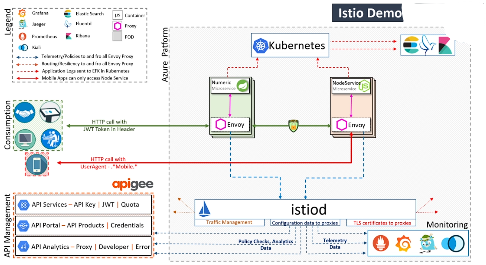
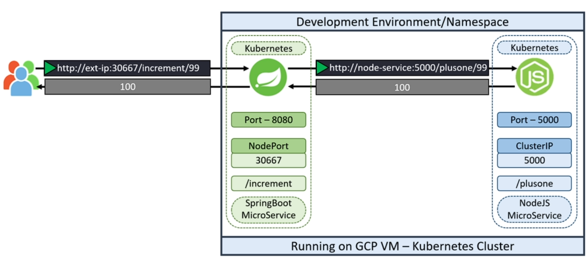
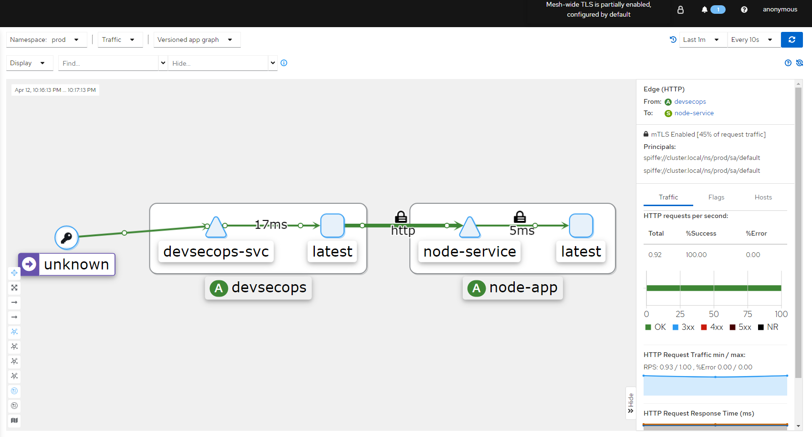
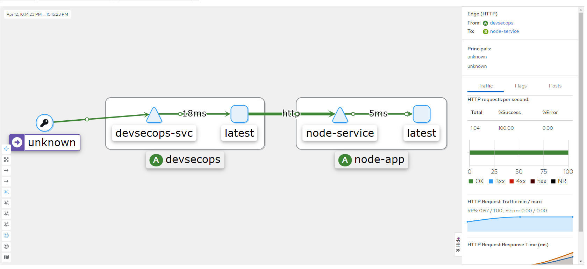
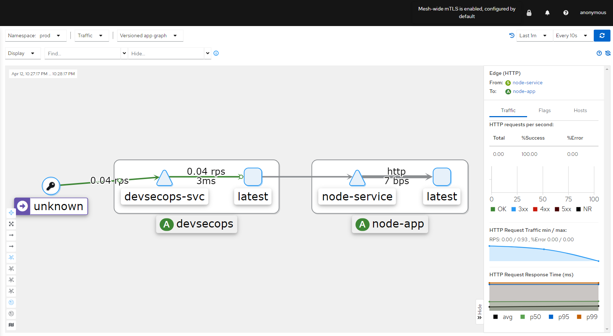
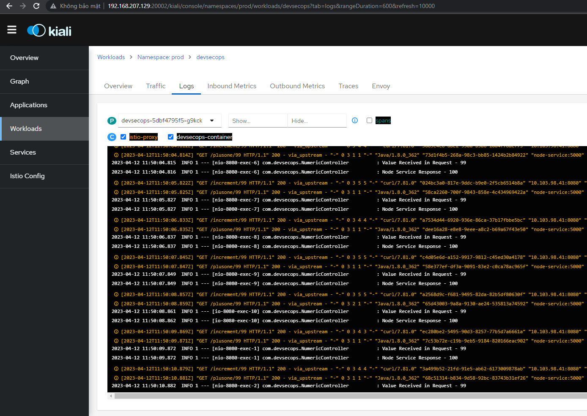
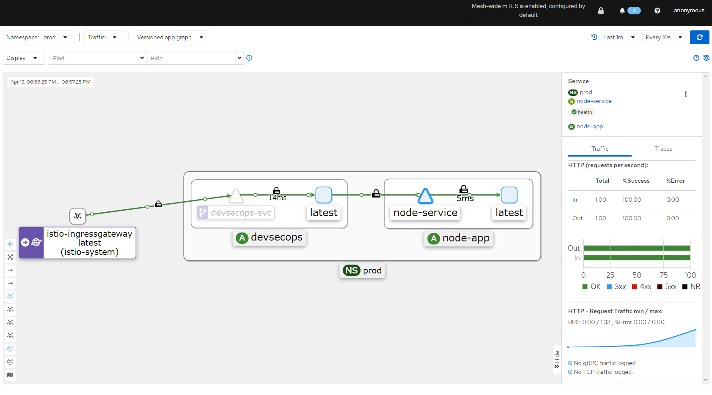

# Istio service mesh - Production deployment
# Istio architecture  
  
  
Overview:  
Istio is an open-source service mesh platform that provides a unified control plane for managing microservices. Istio enables developers to add advanced traffic management, security, and observability to their microservices without requiring changes to the application code.  
  
Reference:  
[Giới thiệu Istio - Istio là gì (devopsvn.tech)]https://devopsvn.tech/service-mesh-on-kubernetes/gioi-thieu-istio-istio-la-gi  
  
Application architecture:  
  
  
  
# Istio Installation  

```
curl -Ls https://istio.io/downloadIstio \| ISTIO_VERSION=1.17.2 sh -  
cd istio-1.17.2  
export PATH=$PWD/bin:$PATH  
istioctl install --set profile=demo -y &amp;&amp; kubectl apply -f samples/addons
``` 
  
  
Check all node,pod,svc in istio namespace:  

```
kubectl -n istio-system get all
``` 
  
  
  
You can access services inside istio using a web browser by modifying the svc in istio from clusterIP to nodeport with command below.  

```
kubectl -n istio-system edit svc kiali
``` 
  
  
However, this approach is not recommended in a practical environment.  
Another way is using port-forwarding. You can create script like below.  
  
port-forwarding.sh  

```
kubectl -n istio-system port-forward deploy/kiali 20001:20001 --address 192.168.207.129 &amp;  
kubectl -n istio-system port-forward deploy/grafana 3000:3000 --address 192.168.207.129 &amp;  
kubectl -n istio-system port-forward deploy/prometheus 9090:9090 --address 192.168.207.129 &amp;  
kubectl -n istio-system port-forward deploy/jaeger   16686:16686  --address 192.168.207.129 &amp;
``` 
  
  
Now, we create bash shell file to setup production enviroment  

```
*#!/bin/bash*  
*# Set the namespace name*  
namespace="prod"  
*# Check if the namespace exists*  
if kubectl get namespace "${namespace}" &gt; /dev/null 2&gt;&amp;1; then  
  *# Check if the namespace has the istio-injection label*  
  if ! kubectl get namespace "${namespace}" -o jsonpath='{.metadata.labels.istio-injection}' \| grep -q enabled; then  
    *# Add the istio-injection label to the namespace*  
    kubectl label namespace "${namespace}" istio-injection=enabled  
    *# Restart all deployments in the namespace to apply the label*  
    kubectl rollout restart deployment -n "${namespace}"  
  else  
    echo "namespace ${namespace} already has istio-injection label"  
  fi  
else  
  *# Create the namespace and add the istio-injection label*  
  kubectl create namespace "${namespace}"  
  kubectl label namespace "${namespace}" istio-injection=enabled  
fi  
*# Get the name and tag of the Docker image*  
image_info=$docker images --format '{{.Repository}}:{{.Tag}}' \| grep -i node-service  
if  -n "${image_info}" ; then  
  image_name=$(echo "${image_info}" \| cut -d ':' -f 1)  
  image_tag=$(echo "${image_info}" \| cut -d ':' -f 2)  
  *# Check if the deployment already exists*  
  if ! kubectl get deployment node-app -n "${namespace}" &gt; /dev/null 2&gt;&amp;1; then  
    *# Create the deployment with 2 replicas and the specified image*  
    kubectl create deployment node-app --image "${image_name}:${image_tag}" --replicas 2 -n "${namespace}"  
  else  
    echo "deployment node-app already exists"  
  fi  
  *# Check if the service already exists*  
  if ! kubectl get service node-service -n "${namespace}" &gt; /dev/null 2&gt;&amp;1; then  
    *# Create a service for the deployment on port 5000*  
    kubectl expose deployment node-app --name node-service --port 5000 -n "${namespace}"  
  else  
    echo "service node-service already exists"  
  fi  
else  
  echo "Docker image for node-service does not exist"  
fi
``` 
  
  
The source code below is a shell script that performs the following tasks:  
- It checks if the namespace prod exists in the Kubernetes cluster using the kubectl command. A namespace is a way to group and isolate resources within a cluster.  
- If the namespace prod exists, it checks if the label istio-injection=enabled exists in the namespace. A label is a key-value pair that can be attached to any resource for identification and selection. Istio is a service mesh that provides traffic management, security and observability for microservices. The label istio-injection=enabled enables automatic sidecar injection for the pods in the namespace. A sidecar is a container that runs alongside the main application container and provides additional functionality such as proxying, logging and monitoring.  
- If the label istio-injection=enabled does not exist in the namespace prod, it adds the label using the kubectl command.  
- If the namespace prod does not exist, it creates the namespace using the kubectl command and adds the label istio-injection=enabled to it.  
- It gets the name of the Docker image node-service using the docker command. A Docker image is a packaged version of an application and its dependencies that can run on any platform that supports Docker. Node-service is an example of a Node.js application that serves HTTP requests on port 5000.  
- It checks if the Docker image node-service exists by checking if the image name is not empty.  
- If the image exists, it gets the image tag using the docker command. A tag is a way to identify a specific version of an image.  
- It creates a deployment and a service for the image using the kubectl command. A deployment is a resource that manages a set of pods that run the same image and can be scaled up or down. A service is a resource that exposes a set of pods to other pods or external clients using a stable IP address and port number.  
- It specifies the namespace prod, the image name and tag, and the number of replicas (2) for the deployment. It also specifies the name (node-service), the port (5000) and the type (ClusterIP) for the service. ClusterIP means that the service is only accessible within the cluster.  
- If the image does not exist, it prints an message.  
  
You can manual check and apply istio-injection following below command:  

```
sudo kubectl get all -n prod  
sudo kubectl label ns prod istio-injection=enabled  
sudo kubectl get ns --show-labels  
kubectl rollout restart deployment node-app -n prod
``` 
  
  
Next. We create file  k8s_PROD-deployment_service.yaml to deploy application to production enviroment.  

```
apiVersion: apps/v1  
kind: Deployment  
metadata:  
  labels:  
    app: devsecops  
  name: devsecops  
spec:  
  replicas: 3  
  selector:  
    matchLabels:  
      app: devsecops  
  strategy: {}  
  template:  
    metadata:  
      labels:  
        app: devsecops  
    spec:  
      serviceAccountName: default  
      volumes:  
      - name: vol  
        emptyDir: {}  
      containers:  
      - image: replace  
        name: devsecops-container  
        volumeMounts:  
          - mountPath: /tmp  
            name: vol  
        securityContext:  
          capabilities:  
            drop:  
             - NET_RAW  
          runAsUser: 100  
          runAsNonRoot: true  
          readOnlyRootFilesystem: true  
          allowPrivilegeEscalation: false  
        resources:  
         requests:  
          memory: "256Mi"  
          cpu: "200m"  
         limits:  
          memory: "512Mi"  
          cpu: "500m"  
---  
apiVersion: v1  
kind: Service  
metadata:  
  labels:  
    app: devsecops  
  name: devsecops-svc  
spec:  
  ports:  
  - port: 8080  
    protocol: TCP  
    targetPort: 8080  
  selector:  
    app: devsecops  
  type: ClusterIP
``` 
  
  
The resources section in the YAML file specifies the resource requirements and limits for the container. In this case, the container has a request of 256Mi memory and 200m CPU. This means that Kubernetes will try to schedule the container on a node that has at least 256Mi memory and 200m CPU available. If there are no nodes with enough resources available, the container will remain in a pending state.  
The container also has a limit of 512Mi memory and 500m CPU. This means that the container will not be allowed to use more than 512Mi memory and 500m CPU even if more resources are available on the node.  
  
Setting requests and limits is important for a number of reasons. First, it helps to ensure that your containers don't over-consume resources and cause other containers to fail. Second, it can help to improve the performance of your applications by ensuring that they have the resources they need to run efficiently. Third, it can help to prevent your applications from being killed by Kubernetes if they try to use too many resources.  
  
A securityContext that takes away the NET_RAW capability from our application can help us avoid dns spoofing.  
Reference: https://blog.aquasec.com/dns-spoofing-kubernetes-clusters  
  
  
Next, Create file k8s-PROD-deployment-rollout-status.sh like  

```
*#!/bin/bash*  
sleep 60s  
if  $kubectl -n prod rollout status deploy ${deploymentName} --timeout 5s != *"successfully rolled out"* ];   
then       
    echo "Deployment ${deploymentName} Rollout has Failed"  
    kubectl -n prod rollout undo deploy ${deploymentName}  
    exit 1;  
else  
    echo "Deployment ${deploymentName} Rollout is Success"  
fi
``` 
  
  
Add k8s deployment production stage into Jenkins file  

```
stage('K8S Deployment - PROD') {  
      steps {  
        parallel(  
          "Deployment": {  
            withKubeConfig(credentialsId: 'kubeconfig') {  
              sh "sed -i 's#replace#${imageName}#g' k8s_PROD-deployment_service.yaml"  
              sh "kubectl -n prod apply -f k8s_PROD-deployment_service.yaml"  
            }  
          },  
          "Rollout Status": {  
            withKubeConfig(credentialsId: 'kubeconfig') {  
              sh "bash k8s-PROD-deployment-rollout-status.sh"  
            }  
          }  
        )  
      }  
    }
``` 
  
  
Run build. After build successful you can check connection like below.  
  
  
# Istio PeerAuthentication  
Next, we create PeerAuthentication  istio-system with yaml file below.  
  
peer-auth.yaml  

```
apiVersion: security.istio.io/v1beta1  
kind: PeerAuthentication  
metadata:  
  name: default  
  namespace: istio-system  
spec:  
  mtls:  
    mode: DISABLE
``` 
  
  
This YAML file is a configuration file for Istio's PeerAuthentication resource, which is used to configure mutual TLS (mTLS) authentication between services in an Istio service mesh. The file specifies the following:  
- apiVersion: The version of the Istio security API being used.  
- kind: The type of Istio resource being defined, which is PeerAuthentication in this case.  
- metadata: The metadata for the PeerAuthentication resource, which includes the name of the resource (default) and the namespace in which it is defined (istio-system).  
- spec: The specification for the PeerAuthentication resource, which includes the mtls field that specifies the mTLS mode.  
  
The mtls field specifies the mTLS mode for the PeerAuthentication resource, which is set to DISABLE in this case. This means that mTLS authentication is disabled for all services in the Istio service mesh.  
In general, there are three mTLS modes that can be set for a PeerAuthentication resource:  
- STRICT: All requests between services must use mTLS authentication.  
- PERMISSIVE: Requests between services can use either mTLS authentication or plaintext (non-encrypted) communication.  
- DISABLE: mTLS authentication is disabled for all services in the Istio service mesh.  
The PeerAuthentication resource can be used to configure mTLS authentication for specific services or for all services in the Istio service mesh.  
  
  
Run kubectl apply:  

```
kubectl apply -f peer-auth.yaml -n istio-system
``` 
  
  
Check mtls mode:  

```
sudo kubectl get pa -n istio-system  
NAME      MODE      AGE  
default   DISABLE   9s
``` 
  
  
You can change mtls mode with command below:  

```
kubectl edit pa -n istio-system  
spec:  
  mtls:  
    mode: STRICT # write mode you want
``` 
  
  
Reference: https://istio.io/latest/docs/reference/config/security/peer_authentication/  
  
We will run command below to test connection  

```
sudo kubectl -n prod get svc  
NAME            TYPE        CLUSTER-IP       EXTERNAL-IP   PORTS    AGE  
devsecops-svc   ClusterIP   10.103.98.41     \<none&gt;        8080/TCP   148m  
node-service    ClusterIP   10.110.155.212   \<none&gt;        5000/TCP   148m  
  
while true; do curl -s 10.103.98.41:8080/increment/99; echo; sleep 1; done
``` 
  
  
  
You can go to kiali dashboard, select graph to know how connection inside out application work.  
PERMISSIVE MODE -we can see at the top there is a partially enabled TLS text  
  
  
DISABLE MODE -when we change the mode to disabled, traffic including mtls will drop until all traffic is no longer encrypted  
  
  
  
STRICT MODE: all traffic is encrypted, authenticated and does not allow outside traffic to go inside  
  
  
And you can explore some more features of kiali like checking metrics, traffic, logs of each deployment in the namespace of your choice.  
  
  
  
  
  
# ISTIO INGRESS  
  
In Istio, an Ingress is a component that enables external traffic to access services within the mesh. Istio Ingress provides traffic management features such as load balancing, TLS termination, and routing. It allows you to define rules for routing traffic to specific services based on various criteria such as URL path, headers, and source IP address.  
  
A VirtualService, on the other hand, is a Kubernetes custom resource that is used to define rules for how traffic should be routed to a specific service within the Istio service mesh. It provides more advanced traffic management features than Ingress, such as traffic splitting, fault injection, and retries. With VirtualServices, you can define rules to send traffic to different versions of a service or to specific instances of a service based on various criteria such as HTTP headers or source IP addresses.  
  
In summary, Istio Ingress provides a way for external traffic to enter the service mesh and provides basic routing capabilities, while VirtualService provides more advanced traffic management features for routing traffic within the mesh.  
  
Reference: https://istio.io/latest/docs/tasks/traffic-management/ingress/ingress-control/  
https://istio.io/latest/docs/reference/config/networking/virtual-service/  
  
Now we go to create istio ingress and virtualService according to the yaml file below.  

```
apiVersion: networking.istio.io/v1alpha3 *# The API version for Istio resources*  
kind: Gateway *# The kind of resource*  
metadata: *# The metadata for the resource*  
  name: devsecopsgateway *# The name of the Gateway*  
  namespace: prod *# The namespace where the Gateway is deployed*  
spec: *# The specification for the Gateway*  
  selector: *# The selector for the Gateway*  
    istio: ingressgateway *# The label of the Istio ingress gateway pod*  
  servers: *# The list of servers for the Gateway*  
    - port: *# The port configuration for the server*  
      number: 80 *# The port number*  
      name: http *# The port name*  
      protocol: HTTP *# The port protocol*  
    hosts: *# The list of hosts for the server*  
    -  "*" *# A wildcard host that matches any domain*  
---  *# The separator for the next document*  
apiVersion: networking.istio.io/v1alpha3   
kind: VirtualService   
metadata:  
  name: devsecopsnumeric *# The name of the VirtualService*  
  namespace: prod  
spec:  *# The specification for the VirtualService*  
  hosts:   
  - '*'  
  gateways:  *# The list of gateways for the VirtualService*  
  - devsecopsgateway  *# The name of the Gateway from the first document*  
  http: *# The list of HTTP routes for the VirtualService*  
  - match: *# The list of match conditions for the route*  
    - uri: *# The URI match condition*  
        prefix: /increment *# The URI prefix to match*  
    - uri:  
        exact: /  *# The exact URI to match*  
    route: *# The list of destinations for the route*  
    - destination: *# The destination configuration*  
        host: devsecopssvc *# The host name of the destination service*  
        port:  
          number: 8080
``` 
  
  
This is a YAML file that contains two Kubernetes resources: a Gateway and a VirtualService.  
The Gateway resource is named devsecops-gateway and is of type networking.istio.io/v1alpha3. It has a selector that specifies the Istio ingress gateway as the default controller. It also has one server that listens on port 80 and accepts HTTP traffic from any host.  
The VirtualService resource is named devsecops-numeric and is also of type networking.istio.io/v1alpha3. It specifies that all hosts should be matched and that the gateway to use is devsecops-gateway. It also specifies an HTTP route that matches URIs with prefix /increment or exact URI / and sends traffic to a destination service named devsecops-svc listening on port 8080.  
  
URI prefix and exact URI are two different concepts in web development. A URI is a string of characters that identifies a name or a resource on the internet. A URI prefix is a matching method based on the prefix of the URL path separated by the slash character. The matching is case-sensitive and performed on each segment of the path. On the other hand, an exact URI is a matching method that matches the entire URL path, including the query parameters and the fragment identifier. In web development, these concepts are used in routing and URL mapping to direct incoming requests to the appropriate controller or handler. The difference between URI prefix and exact URI is that URI prefix matches the URL path based on the prefix of the path, while exact URI matches the entire URL path, including the query parameters and the fragment identifier.  
  

```
kubectl get vs,gateway -n prod  
NAME                                                   GATEWAYS                HOSTS   AGE  
virtualservice.networking.istio.io/devsecops-numeric   "devsecops-gateway"   "*"   6d23h  
NAME                                            AGE  
gateway.networking.istio.io/devsecops-gateway   6d23h  
  
kubectl -n istio-system get svc istio-ingressgateway  
NAME                            TYPE                   CLUSTER-IP        EXTERNAL-IP   PORT(S)  
istio-ingressgateway   LoadBalancer   10.99.213.128    \<pending&gt;     15021:30561/TCP,80:30886/TCP,443:32190/TCP,31400:32600/TCP,15443:30266/TCP
``` 
  
  
Now we try curl to test connection  

```
curl localhost:30886/increment/22  
23  
  
curl localhost:30886/  
Kubernetes DevSecOps
``` 
  
  
We can use bash below and open kiali to see connection inside  

```
while true; do curl -s localhost:30886/increment/22; echo; sleep 1; done
``` 
  
  
  
  
If we remove url  extract in virtualService  

```
- uri:  
        exact: /
``` 
  
  
  
By using kubectl edit vs -n prod  In  file and run curl localhost:30886/ to test connection again, we cannot receive response.  

