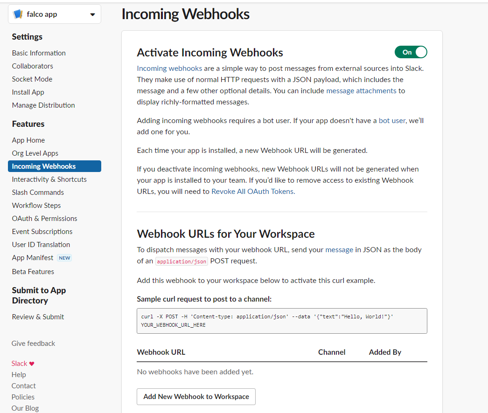
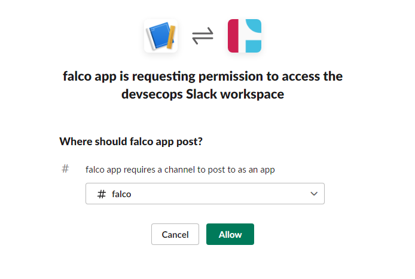
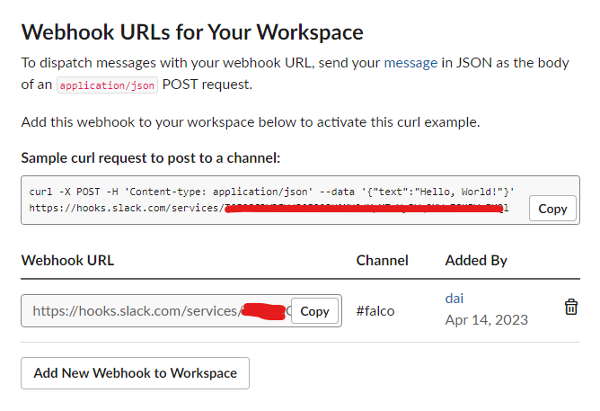
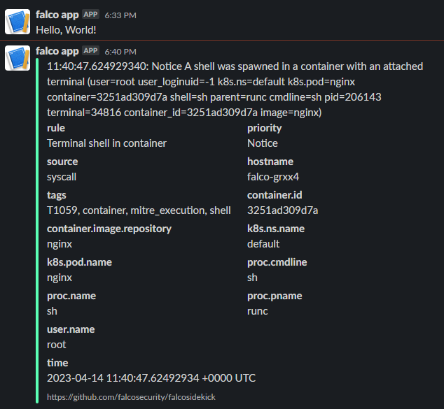

# Falco Slack Notifications
Go to https://api.slack.com/apps  
Select incoming webhooks  
  
  
Select add new webhook to workspace  
  
  
Select channel and allow  
  
  
We can copy sample curl to test connection and update webhook-url into falco.  

```
helm upgrade falco falcosecurity/falco \  
--set falcosidekick.enabled=true \  
--set falcosidekick.webui.enabled=true \  
--set falcosidekick.config.slack.webhookurl="https://hooks.slack.com/services/\<ID&gt;" \  
-n falco
``` 
  
  
Execute shell nginx to test notification:  

```
kubectl exec -it nginx -- sh
``` 
  
  
  
  

