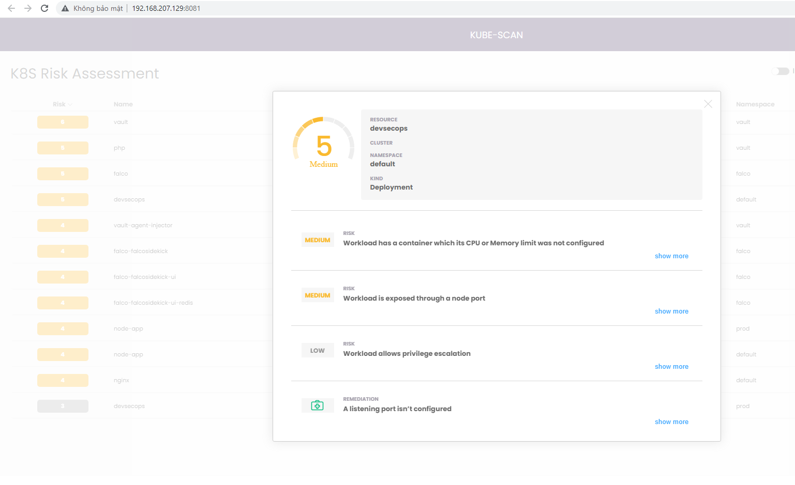

# Kubescan
Kubescan scans Kubernetes cluster objects such as deployments, services, pods, and secrets for security risks and vulnerabilities, and provides a comprehensive report of identified risks based on their level of severity.  It can detect misconfigured RBAC (Role-Based Access Control) settings, privileged containers, exposed services, and other issues that could compromise your cluster security. This allows security teams to detect security issues in the Kubernetes environment during development, deployment and runtime, and provides actionable recommendations to remediate the risks  
  
Kube-Scan gives a risk score, from 0 (no risk) to 10 (high risk) for each workload. The risk is based on the runtime configuration of each workload (currently 20+ settings). The exact rules and scoring formula are part of the open-source framework KCCSS, the Kubernetes Common Configuration Scoring System.  
  
KCCSS is similar to the Common Vulnerability Scoring System (CVSS), the industry-standard for rating vulnerabilities, but instead focuses on the configurations and security settings themselves. Vulnerabilities are always detrimental, but configuration settings can be insecure, neutral, or critical for protection or remediation. KCCSS scores both risks and remediations as separate rules, and allows users to calculate a risk for every runtime setting of a workload and then to calculate the total risk of the workload.  
  
Source:  
https://github.com/octarinesec/kube-scan  
  
  
Install kubesec in k8s:  

```
kubectl apply -f https://raw.githubusercontent.com/sidd-harth/kubernetes-devops-security/main/kube-scan.yaml  
   
kubectl -n kube-scan get all  
NAME                             READY   STATUS    RESTARTS   AGE  
pod/kube-scan-79d8f5cd7c-q6r4v   2/2     Running   10         5d23h  
NAME                   TYPE        CLUSTER-IP      EXTERNAL-IP   PORTS   AGE  
service/kube-scan-ui   ClusterIP   10.111.116.27   \<none&gt;        80/TCP    5d23h  
NAME                        READY   UP-TO-DATE   AVAILABLE   AGE  
deployment.apps/kube-scan   1/1     1            1           5d23h  
NAME                                   DESIRED   CURRENT   READY   AGE  
replicaset.apps/kube-scan-79d8f5cd7c   1         1         1       5d23h  
  
kubectl port-forward --namespace kube-scan svc/kube-scan-ui 8081:80
``` 
  
  
  
Go to dashboard and we can see RISK and REMEDIATION  
  
  

