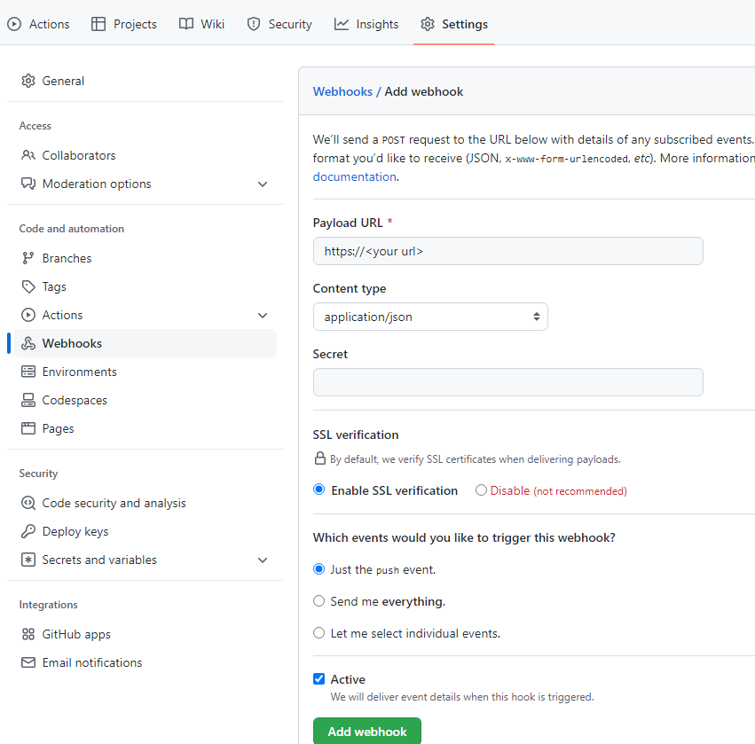
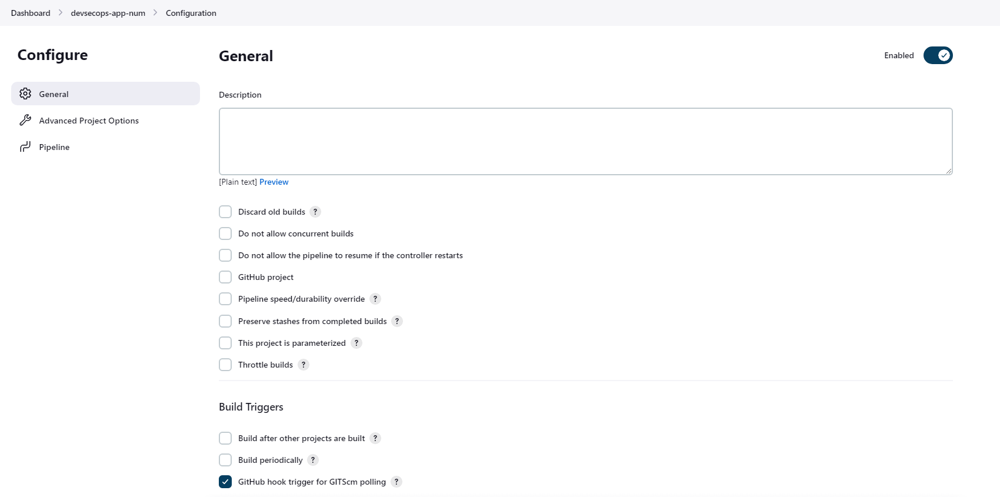
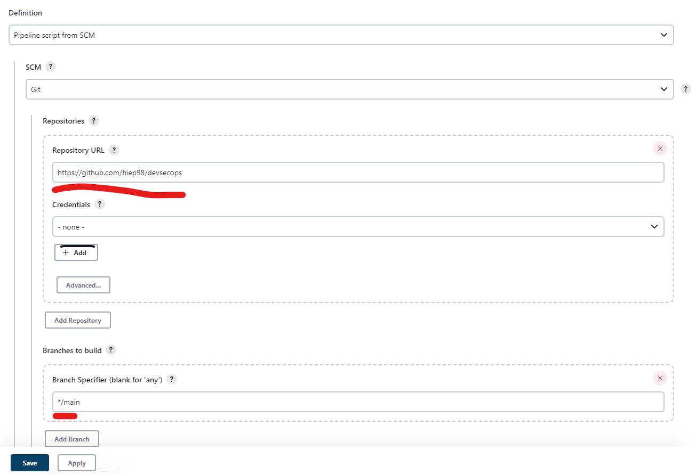

# Github intergrate + Maven build
Go to repo setting - webhooks:  
https://github.com/%3caccount%3e/%3crepo%3e/settings/hooks  
  
choose setting below:  

```
payload url: your url  
Content type: application/json  
if your url is https, choose enable ssl
``` 
  
  
Add webhook  
  
  
  
  
  
Create new pipeline and check "GitHub hook trigger for GITScm polling" it will  trigger git and automate build and trigger jenkins .  
  
  
  
  
Scrolldown and type your repo and branch. apply and build  
  
  
When you update code in git, git will call jenkins whenever a push event has been done.  
  
We have file source code below:  

```
pipeline {  
  agent any  
  stages {  
      stage('Build Artifact') {  
            steps {  
              sh "mvn clean package -DskipTests=true"  
              archive 'target/*.jar' *//so that they can be downloaded later*  
            }  
        }    
    }  
}
``` 
  
  
The Jenkins pipeline above is designed to create an artifact, or executable, in this case a *.jar file. First, it will run a command to execute the **`mvn clean package -DskipTests=true`** command, which cleans and packages the code. Then, it will store the built *.jar files in the **`target`** directory and archive them using the **`archive 'target/*.jar'`** command. This makes the files easier to share with other users and keeps them safe from accidental changes.  

