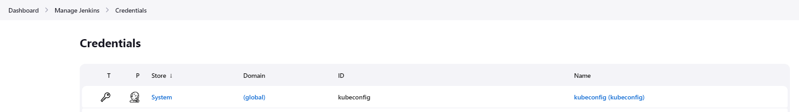
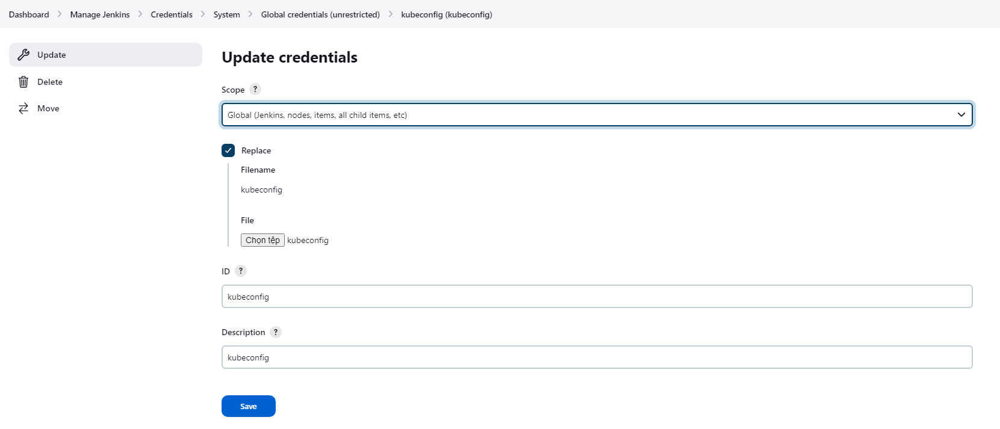

# Build - push stage
Create Dockerfile  

```
FROM openjdk:8-jdk-alpine  
EXPOSE *8080*  
ARG JAR_FILE=*target/*.jar*  
ADD ${JAR_FILE} *app.jar*  
ENTRYPOINT **"java"*,*"-jar"*,*"/app.jar"**
``` 
  
  
The dockerfile you provided will create a Docker container which uses an OpenJDK 8 JVM and exposes port 8080. The **`ARG`** statement allows you to specify an argument that can be used to customize the contents of the Docker container. In this case, the argument **`JAR_FILE`** can be used to specify which jar file should be added to the container. The **`ADD`** statement will then add the specified jar file to the container, and the **`ENTRYPOINT`** statement will set the command to be run when the container is launched. This will launch the jar file in the container, allowing your application to be executed.  
  
  
Update Jenkins file:  

```
pipeline {  
  agent any  
  stages {  
      stage('Build Artifact') {  
            steps {  
              sh "mvn clean package -DskipTests=true"  
              archive 'target/*.jar' *//so that they can be downloaded later*  
            }  
        }  
      stage('Unit Tests') {  
            steps {  
              sh "mvn test"  
            }  
            post {  
              always {  
                junit 'target/surefire-reports/*.xml'  
                jacoco execPattern: 'target/jacoco.exec'  
              }  
            }  
        }  
      stage('Docker Build and Push') {  
            steps {  
              withDockerRegistry(credentialsId: "docker-hub", url: "") {  
                sh 'printenv'  
                sh 'docker build -t nthiep1998/numeric-app:""$GIT_COMMIT"" .'  
                sh 'docker push nthiep1998/numeric-app:""$GIT_COMMIT""'  
              }  
            }      
        }    
  }  
}
``` 
  
  
In the Jenkins file, the **`stage('Build Artifact - Maven')`** stage is responsible for building the application code into a jar file, which is then archived. This step is typically achieved using the Maven build tool, hence the **`mvn clean package -DskipTests=true`** command to invoke the Maven build. The **`archive 'target/*.jar'`** step is then used to archive the built jar file.  
  
The Jenkins stage code you provided is defining a stage in a Jenkins build pipeline. This stage is responsible for building and pushing a Docker image to a Docker Registry. The **`withDockerRegistry`** step allows the user to login to the specified Docker Registry using the given credentials. The **`sh`** steps then build the Docker image, tagging it with the current git commit id, and then pushing the image to the registry.  
  
  
**k8s Credentical**  
  
cat /root/.kube/config  
Go to Manage Jenkins - Credentials System - Global credentials  
Create kubeconfig and add file config above  
  
  
  
  
  
**k8s deployment**  
Create file deployment  

```
apiVersion: apps/v1  
kind: Deployment  
metadata:  
  labels:  
    app: devsecops  
  name: devsecops  
spec:  
  replicas: 2  
  selector:  
    matchLabels:  
      app: devsecops  
  strategy: {}  
  template:  
    metadata:  
      labels:  
        app: devsecops  
    spec:  
      containers:  
      - image: replace  
        name: devsecops-container  
---  
apiVersion: v1  
kind: Service  
metadata:  
  labels:  
    app: devsecops  
  name: devsecops-svc  
spec:  
  ports:  
  - port: 8080  
    protocol: TCP  
    targetPort: 8080  
  selector:  
    app: devsecops  
  type: NodePort
``` 
  
  
The code above is a YAML (YAML Ain’t Markup Language) file that defines two Kubernetes objects: a Deployment and a Service.  
A Deployment is an object that can create and update a set of identical pods, which are units of work that run specific containers. A Service is an object that defines a logical set of pods and a policy by which to access them.  
  
Here is a line-by-line explanation of the code:  
>- apiVersion: apps/v1 specifies the API version for the Deployment object  
>- kind: Deployment specifies the type of object to create  
>- metadata: contains metadata about the object, such as its name and labels  
>- labels: assigns key-value pairs to identify the object  
>- app: devsecops assigns the label “app with the value “devsecops to the Deployment  
>- name: devsecops assigns the name “devsecops to the Deployment  
>- spec: contains the specification of the desired state of the object  
>- replicas: 2 specifies that two pods should be created and maintained by this Deployment  
>- selector: defines how to select pods that belong to this Deployment  
>- matchLabels: specifies that only pods with matching labels should be selected  
>- app: devsecops specifies that only pods with the label “app equal to “devsecops should be selected  
>- strategy: {} specifies an empty strategy for updating pods (the default is rolling update)  
>- template: defines what each pod should look like  
>- metadata: contains metadata about each pod, such as its labels  
>- labels: assigns key-value pairs to identify each pod  
>- app: devsecops assigns the label “app with the value “devsecops to each pod (this matches with the selector above)  
>- spec: contains the specification of each pod’s containers and volumes  
>- containers: defines one or more containers that run in each pod  
>- - image: replace specifies that this container should use an image named “replace  
>- name: devsecops-container assigns a name to this container  
  
  
The three dashes indicate a new document in YAML. The following lines define another Kubernetes object: a Service.  
>- apiVersion: v1 specifies the API version for the Service object (different from apps/v1 for Deployments)  
>- kind: Service specifies the type of object to create  
>- metadata: contains metadata about this Service, such as its name and labels  
  
  
The first code block defines a Kubernetes Deployment. **`apiVersion`** specifies what version of the Kubernetes API the configuration is for, in this case apps/v1. **`kind`** defines the type of extract, in this case a Deployment. **`metadata`** provides additional configuration such as labels and a name. **`spec`** defines parameters of the deployment such as the number of replicas, selector, and template. The template defines container details such as an image and a name.  
The second code block defines a Kubernetes Service. **`apiVersion`** specifies the version of the Kubernetes API the configuration is for, in this case v1. **`kind`** defines the type of resource, in this case a Service. **`metadata`** provides additional configuration such as labels and a name. **`spec`** defines parameters of the service such as the ports, protocol, targetPort, selector and type. The ports and targetPort define the port which the Service will be accessible on.  
  
The source code above creates a Deployment and a Service for an application named “devsecops. The Deployment ensures that two pods are always running with a container image named “replace. The Service exposes these pods to other pods or external clients using port 8080.  
  
The Deployment and the Service are linked by the label “app: devsecops, which means that only pods with this label will be selected by the Service. The Service uses a type of NodePort, which means that it assigns a port on each node in the cluster to forward traffic to the pods.  
  
This way, you can access your application from any node in the cluster using its IP address and the assigned port. For example, if one of your nodes has an IP address of 192.168.1.10 and the assigned port is 30000, you can access your application by visiting http://192.168.1.10:30000.  
  
  
Deploy Node-Service in Kubernetes Default Namespace:  

```
kubectl -n default create deploy node-app --image siddharth67/node-service:v1  
kubectl -n default expose deploy node-app --name node-service --port 5000
``` 
  
  
Using dedocker to reverse node-service image to dockerfile, we have dockerfile below:  

```
FROM siddharth67/node-service:v1  
ADD [file:43a95cc218d164ff589cb91519964373d53b607469f5ccce725631916392cd88](file://43a95cc218d164ff589cb91519964373d53b607469f5ccce725631916392cd88) in /  
ENV VERSION=v5.7.1 NPM_VERSION=3  
RUN /bin/sh -c apk add --update curl make gcc g++ python linux-headers paxctl libgcc libstdc++ binutils-gold \  
    &amp;&amp;       curl -sSL https://nodejs.org/dist/$%7bVERSION%7d/node-$%7bVERSION%7d.tar.gz \| tar -xz \  
    &amp;&amp;       cd /node-${VERSION} \  
    &amp;&amp;       ./configure --prefix=/usr --without-snapshot --fully-static \  
    &amp;&amp;       make -j$grep -c ^processor /proc/cpuinfo 2&gt;/dev/null \|\| 1 \  
    &amp;&amp;       make install \  
    &amp;&amp;       paxctl -cm /usr/bin/node \  
    &amp;&amp;       cd / \  
    &amp;&amp;       npm install -g npm@${NPM_VERSION} \  
    &amp;&amp;       find /usr/lib/node_modules/npm -name test -o -name .bin -type d \| xargs rm -rf;       apk del curl make gcc g++ python linux-headers paxctl binutils-gold \  
    &amp;&amp;       rm -rf /etc/ssl /node-${VERSION}       /usr/share/man /tmp/* /var/cache/apk/* /root/.npm /root/.node-gyp                             /usr/lib/node_modules/npm/man /usr/lib/node_modules/npm/doc /usr/lib/node_modules/npm/html  
RUN /bin/sh -c mkdir -p /usr/src/app  
WORKDIR /usr/src/app  
COPY dir:8980f5119de2a57a2d0613bbfb52aa57920330776afe6414fd673cb49c93f819 in /usr/src/app/  
RUN /bin/sh -c npm install  
EXPOSE 5000  
CMD "npm" "start"
``` 
  
  
Reference: https://raw.githubusercontent.com/mrhavens/Dedockify/master/dedockify.py  
  
Edit Source code application:  

```
\## Within /src/main/java/com/devsecops/NumericController.java  
\## use node-service:5000/plusone as baseURL and  
\## comment the localhost:5000  
private static final String baseURL = " http://node-service:5000/plusone";  
//private static final String baseURL = " http://localhost:5000/plusone";
``` 
  
  
Update  Jenkins file:  

```
stage'Kubernetes Deployment - DEV' {  
      steps {  
        withKubeConfig(credentialsId: 'kubeconfig') {  
          sh "sed -i 's#replace#repo/numeric-app:${GIT_COMMIT}#g' k8s_deployment_service.yaml"  
          sh "kubectl apply -f k8s_deployment_service.yaml"  
        }  
      }  
    }
``` 
  
  
  
  
  
  
  
  

