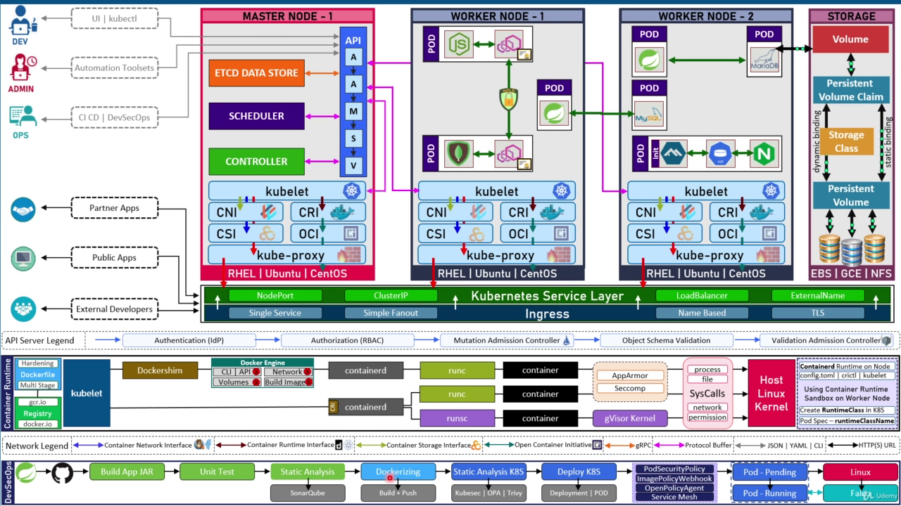

# Kubernetes Architecture
# Kubernetes Architecture  
  
  
Kubernetes is a container orchestration system that automates the deployment, scaling, and management of containerized applications. It is designed to be scalable and reliable, and to make it easy to deploy and manage containerized applications at scale.  
Kubernetes is a distributed system that consists of two main components: the control plane and the data plane.  
- The control plane is responsible for managing the cluster and ensuring that the desired state of the cluster is maintained. It consists of a number of components, including the API server, the scheduler, and the controllers.  
- The data plane is responsible for running the containers and providing the services that the applications need. It consists of a number of nodes, each of which runs a kubelet and a kube-proxy.  
The Control Plane  
The control plane is responsible for managing the cluster and ensuring that the desired state of the cluster is maintained. It consists of the following components:  
- **API Server**: This is the front-end of the control plane. It exposes the Kubernetes API, which is used by users, administrators, and other components to communicate with the cluster. The API server validates and processes requests and updates the cluster state in etcd.  
- **etcd**: This is a distributed key-value store that stores the cluster state and configuration data. It is the source of truth for the cluster and provides a consistent and reliable way to store data across multiple nodes.  
- **Scheduler**: This is responsible for assigning pods to nodes based on resource availability, constraints, policies, and other factors. It watches for new pods that have no node assigned and selects a suitable node for them.  
- **Controller Manager**: This runs several controllers that regulate the cluster state and handle routine tasks. For example, there are controllers for nodes, pods, endpoints, services, replication, etc. Each controller watches for changes in its domain and tries to reconcile the current state with the desired state.  
  
The Data Plane  
- **Data Plane**: This is composed of all the nodes in the cluster. A node is a physical or virtual machine that runs one or more pods. A pod is the smallest unit of deployment in Kubernetes and consists of one or more containers that share resources and network. The data plane components are:  
- **Kubelet**: This is an agent that runs on each node and communicates with the API server. It ensures that the pods assigned to its node are running and healthy. It also reports the node status and metrics to the API server.  
- **Kube-proxy**: This is a network proxy that runs on each node and maintains network rules for pods. It enables pod-to-pod, pod-to-service, and external-to-service communication by forwarding packets according to iptables rules.  
- **Container Runtime Interface (CRI)**: This is an interface that defines how kubelet interacts with different container runtimes such as Docker, containerd, CRI-O, etc. It allows kubelet to manage container lifecycle operations such as pulling images, creating containers, starting/stopping containers, etc.  
- **Container Network Interface (CNI)**: This is an interface that defines how different network plugins provide network connectivity for pods. It allows kubelet to configure network interfaces and routes for pods using various network plugins such as Calico, Flannel, Weave Net, etc.  
- **Container Storage Interface (CSI)**: This is an interface that defines how different storage plugins provide persistent storage for pods. It allows kubelet to attach/detach, mount/unmount, and format volumes for pods using various storage plugins such as AWS EBS, GCE PD, Ceph RBD, etc.  
- **Open Container Initiative (OCI)**: This is a set of specifications that define how containers should be packaged, run, and distributed. It includes two specifications: OCI Image Specification and OCI Runtime Specification. The former defines how container images should be stored and transferred, while the latter defines how container runtimes should execute containers.  
  
Above the nodes, there is the kubelet, which is responsible for managing pods (the smallest deployable units in Kubernetes) on the nodes. The kube-proxy is a network proxy that routes traffic to the appropriate pods and services. The CNI (Container Network Interface) provides an interface for networking plugins to integrate with Kubernetes.  
  
At the cluster level, the API server acts as the gateway for all API requests and provides a REST API for clients to interact with the cluster. The etcd data store stores the configuration data of the cluster. The scheduler assigns pods to nodes based on resource availability and other factors. The controller manager runs controllers that manage various aspects of the cluster, such as scaling and self-healing.  
  
  
The following diagram shows a simplified overview of the Kubernetes architecture and its components:  
+-----------------+      +-----------------+  
\|                 \|      \|                 \|  
\|  Control Plane  \|      \|   Data Plane    \|  
\|                 \|      \|                 \|  
+-----------------+      +-----------------+  
\|                 \|      \|                 \|  
\|  etcd datastore \|\<----&gt;\| kubelet         \|  
\|  api server     \|\<----&gt;\| CNI                \|  
\|  scheduler      \|      \| CRI                  \|  
\|  controller     \|      \| CSI                    \|  
\|  manager        \|      \| OCI              \|  
\|                 \|      \| kube-proxy       \|  
+-----------------+      +-----------------+  
       ^                         ^  
       \|                           \|  
       v                         v  
+-----------------+      +--------------------+  
\|                 \|        \|       \|                            \|  
\|   Master Node   \|      \|   Worker Node   \|  
\|                 \|        \|       \|                            \|  
+-----------------+      +--------------------+  
       ^                         ^  
       \|                         \|  
       v                         v  
+-----------------+      +-----------------+  
\|                 \|      \|                 \|  
\|    Pod          \|\<----&gt;\|    Pod          \|  
\|                 \|      \|                 \|  
+-----------------+      +-----------------+  
       ^                         ^  
       \|                         \|  
       v                         v  
+-----------------+      +-----------------+  
\|                 \|      \|                 \|  
\|  Container      \|\<----&gt;\|  Container      \|  
\|                 \|      \|                 \|  
+-----------------+      +-----------------+  
  
  
  
A Pod is the smallest and most basic unit of a Kubernetes application. It consists of one or more containers that share the same network namespace and storage volumes. A Pod can also have various add-on components, such as:  
- **Init Containers**: Containers that run before the main containers in a Pod and perform initialization tasks.  
- **Ephemeral Containers**: Containers that run temporarily in a Pod for debugging or troubleshooting purposes.  
- **Sidecar Containers**: Containers that run alongside the main containers in a Pod and provide additional functionality or services.  
Kubernetes also provides various services and resources to expose and manage Pods and their communication, such as:  
- **Service**: An abstraction that defines a logical set of Pods and a policy to access them. It can have different types, such as ClusterIP, NodePort, LoadBalancer, ExternalName, etc.  
- **Ingress**: An API object that defines rules to route external traffic to Services within the cluster. It can support features such as single service routing, simple fanout routing, name-based routing, TLS termination, etc.  
- **EndpointSlices**: An API object that stores information about the network endpoints of a Service. It improves scalability and performance of network communication within the cluster.  
- **DNS for Services and Pods**: A built-in service that provides DNS resolution for Services and Pods within the cluster.  
  
  
**Kubernetes Services Layer**: This is a layer of abstraction that provides a stable and consistent way to access pods. A service is a logical grouping of pods that perform a common function. A service has a unique name and IP address within the cluster and acts as a load balancer for its pods.  
The Kubernetes cluster addon components include nodeport, clusterip, load balancer, and external name, which provide different ways of exposing services to users outside the cluster. The ingress controller provides a way to route external traffic to the appropriate services within the cluster.  
- **ClusterIP**: This is the default type of service. It assigns a virtual IP address to the service within the cluster and allows internal communication between pods or between services.  
- **NodePort**: This type of service exposes a port on each node that forwards  
- ClusterIP: A clusterIP service exposes the service on a unique IP address in the cluster.  
- LoadBalancer: A load balancer service exposes the service to the internet using a load balancer.  
- ExternalName: An externalName service resolves to a hostname or IP address outside of the cluster.  
Kubernetes provides a number of cluster add-on components that can be used to extend the functionality of the cluster. These components include:  
- Dashboard: The dashboard is a web-based UI that can be used to manage the cluster.  
- Logging: The logging component provides a way to collect and store logs from the pods in the cluster.  
- Monitoring: The monitoring component provides a way to collect and store metrics from the pods in the cluster.  
  
  
Authentication  
- **IdP (Identity Provider)**: This is a component that authenticates users and issues tokens for accessing the Kubernetes API. Kubernetes supports various IdPs, such as OIDC, LDAP, Webhook, etc.  
- **RBAC (Role-Based Access Control)**: This is a mechanism that controls what actions users and service accounts can perform on Kubernetes resources based on their roles and permissions.  
- **Admission Controllers**: These are plugins that intercept requests to the Kubernetes API and perform validation or mutation before they are processed by the kube-apiserver. Kubernetes has several built-in admission controllers, such as PodSecurityPolicy, ResourceQuota, LimitRanger, etc.  
- **Object Schema Validation**: This is a feature that ensures that the objects created or updated via the Kubernetes API conform to their specifications and schemas. It uses OpenAPI validation rules to check for errors or inconsistencies.  
  
Dockerfile  
A Dockerfile is a text file that contains instructions for building a Docker image. A Docker image is a lightweight, standalone, executable package of software that includes everything needed to run an application: code, runtime, system tools, system libraries, and settings.  
Registry  
A registry is a repository for storing Docker images. The most popular registries are Docker Hub and Quay.io.  
  
Containerd component  
At the bottom of the hierarchy, there is the host kernel and the Docker engine, which are responsible for running containers on the nodes. The containerd component (which includes runsc, runc, apparmor, seccomp, and gvisor) manages containers and container images in a secure and efficient manner.  
Runc: It is a lightweight container runtime that provides a minimal namespace and isolation for each container.  
Runsc: It is an experimental container runtime that uses gVisor to provide a virtualized environment for each container.  
AppArmor and Seccomp: They are used to configure the security profile for each container.  
Gvisor: It is a user-space kernel that provides a sandboxed environment for each container.  
Kernel Syscall and Host Linux Kernel: They provide the underlying system call support and resource management for each container.  
Dockershim and Docker Engine: These are container runtimes that exist in Kubernetes for backward compatibility with Docker-based applications.  
  
Kubernetes architecture reference:  
https://devopscube.com/kubernetes-architecture-explained/  
https://www.clickittech.com/devops/kubernetes-architecture-diagram/  
https://platform9.com/blog/kubernetes-enterprise-chapter-2-kubernetes-architecture-concepts/  
https://phoenixnap.com/kb/understanding-kubernetes-architecture-diagrams  
[Diagram Guide \| Kubernetes]https://kubernetes.io/docs/contribute/style/diagram-guide/#example-3-k8s-system-flow  
[A sysadmin's guide to basic Kubernetes components \| Enable Sysadmin redhat.com]https://www.redhat.com/sysadmin/kubernetes-components  
[Kubernetes Components \| Kubernetes]https://kubernetes.io/docs/concepts/overview/components/  
  
  
# How the Components Work and Interact with Each Other ?  
SHORT VERSION:  
The control plane and the data plane work together to orchestrate the running of your applications. The control plane makes decisions about where to run your pods and how to manage their resources. The data plane then executes those decisions by running the pods on the nodes and providing them with the resources they need.  
For example, let's say you want to deploy a web application to Kubernetes. You would first create a deployment resource that specifies the number of pods you want to run and the image that you want to use. The control plane would then create those pods and assign them to nodes. The data plane would then start the pods on the nodes and provide them with the resources they need.  
The control plane and the data plane are constantly communicating with each other. The control plane monitors the state of the cluster and makes changes as needed. The data plane reports the status of the pods to the control plane.  
This communication allows the control plane and the data plane to work together to ensure that your applications are running smoothly.  
The components of Kubernetes work together to manage the cluster and provide services to the applications. The following is a brief overview of how they work and interact with each other:  
- The API server is the front-end for Kubernetes. It provides a RESTful API that can be used to manage the cluster.  
- The scheduler is responsible for assigning pods to nodes. It takes into account the resources available on each node and the requirements of the pods when making its decisions.  
- The controllers are responsible for ensuring that the desired state of the cluster is maintained. For example, the replication controller is responsible for ensuring that a certain number of replicas of each pod are running in the cluster.  
- The kubelet is a process that runs on each node in the cluster. It is responsible for starting, stopping, and managing containers on the node.  
- The kube-proxy is a process that runs on each node in the cluster. It is responsible for providing network services to the pods on the node.  
  
**  
  
LONG VERSION:  
  
Kubernetes is an open-source orchestration system designed for containerized applications. It automates deployment, scaling, and management of containerized applications.  
The Kubernetes architecture is divided into two main components: Control Plane often referred to as the "Master node" and Data Plane often referred to as "Worker node".  
The Control Plane includes etcd datastore, API server, Scheduler, Controller, Kubelet, CNI, CRI, CSI, OCI, and kube-proxy.  
The etcd datastore is a distributed key-value store that stores the configuration data and state of the entire Kubernetes cluster. The API server is responsible for validating and processing RESTful requests and updating the etcd datastore with cluster state changes.  
The Scheduler schedules the placement of containers on worker nodes based on the available resources.  
The Controller is responsible for monitoring the state of the cluster and making the necessary changes to maintain the desired state.  
The Kubelet is responsible for managing individual worker nodes and ensuring that the containers on each node are running as expected.  
The Container Network Interface CNI provides network connectivity for containers in a Kubernetes cluster, while the Container Runtime Interface CRI provides the interface for managing containers.  
The Container Storage Interface CSI provides storage for containers, while the Open Container Initiative OCI provides a standard for container image formats. The kube-proxy is a network proxy that manages the network traffic between services.  
  
The Data Plane includes the nodes where the containers are deployed. Each worker node comprises the pod, Kubelet, CNI, CRI, CSI, OCI, and kube-proxy.  
The pod is the smallest and simplest unit of deployment in Kubernetes. It contains one or more containers that share the same network namespace and storage volumes.  
The Kubelet runs on each worker node and is responsible for managing the state of the containers on that node. The CNI, CRI, CSI, and OCI are responsible for providing network, storage, and container runtime interfaces.  
The kube-proxy runs on each worker node and forwards network traffic to the correct container.  
The Kubernetes Services Layer provides different types of load balancing mechanism for Kubernetes services: NodePort, ClusterIP, and Load Balancer.  
NodePort exposes the service on a static port on each worker node.  
ClusterIP exposes the service on a cluster-internal IP address.  
Load Balancer exposes the service outside the cluster and transfers traffic to the worker nodes.  
The Ingress is responsible for routing external traffic to the appropriate Service in the cluster. It provides different routing rules based on the HTTP/HTTPS requests received by the service, including Single Service, Simple Fanout, Name-Based and TLS.  
The API Server performs Identity Provider IdP authentication and Role-Based Access RBA control.  
Mutation Admission Controllers validate and add/update/delete resources in the API server, while Object Schema Validation checks if the object schema is correct before it is created or updated.  
Validation Admission Controllers validate objects against its schema before it is created in the API server.  
  
The container runtime is responsible for running containers. It includes Dockerfile for hardening and multigate, registry for storing container images such as gcr.io and docker.io, kubelet that directly interacts with containers, dockershim that acts as a bridge between the kubelet and the Docker engine, and containerd that provides a runtime and a set of low-level APIs for managing containers.  
Runc and Runsc run containers in a sandboxed environment while AppArmor and Seccomp provide security measures for containing containers.  
Gvisor kernel, Syscall, and Host Linux Kernel provide the interface between the container runtime and the host operating system.  
  
In summary, Kubernetes architecture is designed to provide a scalable and reliable platform for deploying, managing, and scaling containerized applications. The components work together to ensure that the applications are running efficiently and securely.  

